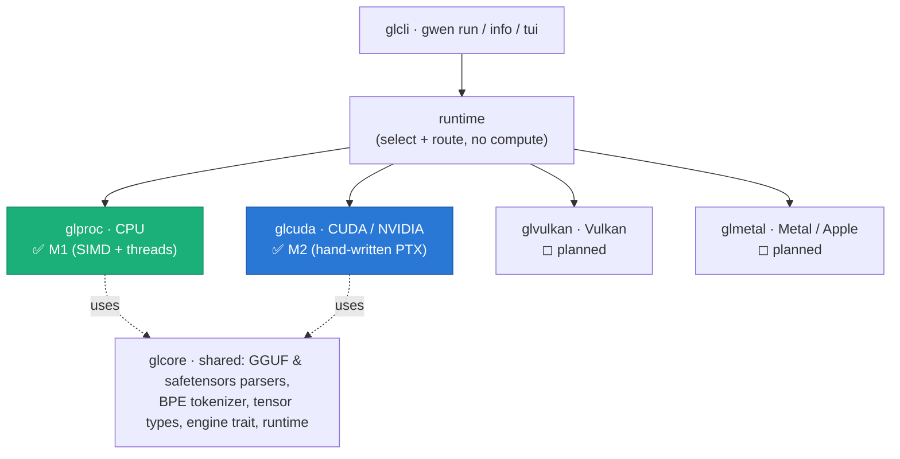

<div align="center">

# GwenLand

**Inference First — LLM inference in pure Rust, correct on whatever hardware you have.**

[](https://github.com/gwenland-org/gwenland-ai/actions/workflows/ci.yml)
[](LICENSE)
[](https://rustup.rs)

</div>

No Python, no CUDA toolkit, no `nvcc`, no vendor SDKs at build time — one Cargo
workspace that loads GGUF / safetensors models and runs them on your CPU or GPU.
The GPU backends ship hand-written kernels (PTX for CUDA) and load the driver at
runtime, so the same tree builds on a machine with no GPU at all.

GwenLand targets modest hardware — the reference CPU box is an 11th-gen i3 with
8 GB of RAM — with an mmap-based loader that streams model weights without
blowing the RAM budget. A GPU is optional.

> **Status: pre-1.0.** The CPU engine (`glproc`) runs models end-to-end today.
> The CUDA engine (`glcuda`) has **passed its M2 milestone** — validated on real
> hardware (see below). Vulkan and Metal backends are scaffolded but not yet
> implemented.

## Highlights

- **From-scratch everything** — GGUF and safetensors parsers, BPE tokenizer,
  attention, KV cache, sampler. No `llama.cpp` bindings, no candle, no torch.
- **Tokenizer validated against reference data** — `glcore::tokenizer` scores
  **14 vocabulary families exact** against llama.cpp's own reference vectors
  (not against another implementation), enforced on every build. A family this
  crate cannot express is refused at load time, never silently approximated.
  Architecture: [`glcore/src/tokenizer/README.md`](glcore/src/tokenizer/README.md).
- **Precision measured against llama.cpp, not assumed** — on identical GGUF
  weights, `glproc` at native Q4_K sits at perplexity **24.19** against
  llama.cpp's **24.78 ± 3.69** (WikiText-2, teacher-forced) — inside its own
  error bar. The production default (Q4_K→Q8_0 repack) is ~7.5% behind; that
  gap is the documented repack trade, not an unexplained defect.
- **Runs on small machines** — mmap zero-copy weight loading keeps the working
  set inside an 8 GB RAM budget.
- **Hand-authored GPU kernels** — `glcuda` talks to the CUDA *driver* directly
  over FFI and ships its kernels as PTX text; nothing to install beyond the
  NVIDIA driver you already have.
- **CPU engine as ground truth** — every GPU kernel is validated
  tensor-by-tensor against `glproc` within an explicit per-operation tolerance.
- **Built-in profiler** — `glbench` pulls engine telemetry (per-bucket timings,
  roofline, anomaly detection) and behavioral signals from raw logits.
- **Private by construction** — inference runs entirely on your machine; the
  engines make no network calls. See [PRIVACY.md](PRIVACY.md).

## Architecture: the "gl-stack"

Every backend is an independent engine implementing one shared trait
(`glcore::engine_trait`). A thin runtime selects an engine and routes requests —
it owns no compute logic — so engines never depend on each other and can be
added without touching the runtime.



| Crate | Role | Status |
|-------|------|--------|
| `glcore` | Shared: GGUF/safetensors parsers (from scratch, mmap zero-copy), BPE tokenizer, `Tensor` types, the engine trait, the runtime | ✅ |
| `glproc` | CPU engine — SIMD + threaded matmul, attention, KV cache, sampler; the numerical ground truth | ✅ M1 |
| `glcuda` | CUDA engine — CUDA Driver FFI, hand-written PTX kernels (SIMT), VRAM bump allocator, CUDA-graph decode | ✅ **M2** |
| `glvulkan` | Vulkan compute backend (cross-vendor) | ◻ planned |
| `glmetal` | Metal backend (Apple Silicon) | ◻ planned |
| `glbench` | Profiler & benchmark harness — engine telemetry, roofline, A/B runs | ✅ |
| `glcli` | The `gwen` command-line interface | ✅ |
| `glictus-caliburni` | The `.gllm` package format + GLLM runtime (Pridwen quantization research: GQ4A/GQ2A). Separate from the GGUF path `gwen run` uses — see `architecture/Pridwen-proposal-v5.md` | 🧪 experimental |
| `gljax` | Pure-Rust StableHLO/PJRT client — emits IR, owns no kernels, hands it to a dynamically loaded PJRT plugin | ✅ 284 tests |
| `glserve` | HTTP serving CLI on `gljax` (`--fake` mode needs no model or plugin) | ✅ |

The training crate sits outside this workspace on purpose, declaring its own
`[workspace]` table so `cargo build --workspace` at the root never resolves
its dependencies: `gltrain/` (Stummañ, GwenLand's from-scratch training
framework, built on `glcore`/`glproc` — see below). A second, candle-backed
training crate previously occupied that path and was deleted on 2026-08-20; it
had no live consumers. `packages/` now holds just
`packages/mcp`, an MCP server. `gltui` (the former terminal UI) was retired to
`.abandoned/gltui/` on 2026-07-18 — it never called the GL engines — and is no
longer a workspace member.

## Stummañ: the training arm (M1 complete)

[`gltrain/`](gltrain/) is GwenLand's from-scratch training framework — a
define-by-run autograd engine built on `glcore`/`glproc` instead of candle,
the same "from-scratch, fully understood" standard the inference engines hold
themselves to. **M1, the minimal autograd engine, is complete**: a generic
`Tensor<B>` over a `Backend` trait, a tape that records the forward pass and
replays it in reverse, backward functions for every op the trait exposes, and
a gradient check that verifies each one against an independent scalar
reference backend rather than trusting the math by inspection.

No optimizer, no LoRA layer, no GPU backend yet — that's M2 and later. Start
at [`gltrain/README_AUTOGRAD.md`](gltrain/README_AUTOGRAD.md) for the API and
a runnable example, or [`gltrain/KNOWN_ISSUES.md`](gltrain/KNOWN_ISSUES.md)
for the constraints that are deliberate rather than missing.

## gljax: a pure-Rust XLA/PJRT client

[`gljax/`](gljax/) emits StableHLO MLIR text and hands it to a dynamically
loaded PJRT plugin — it owns no kernels of its own (no CUDA, no PTX, no
hand-rolled matmul); what the backend does with the IR is the backend's
decision, and gljax's job is to state the computation portably and then
measure what actually happened. **284 tests** exercise the StableHLO emitter
and the surrounding modules (matrix/arch/oracle/tokenizer/sampler/grammar)
without needing a plugin at all.

Actually executing against a real plugin can't happen on this project's
Windows dev machine — there is no PJRT plugin for Windows — so that path is
verified on Linux CI instead:
[`.github/workflows/gljax-pjrt.yml`](.github/workflows/gljax-pjrt.yml)
downloads a pinned PJRT CPU plugin and a pinned Qwen2-0.5B checkpoint, then
runs Gate A5 (real weights, real tokenizer, coherence checked on the
generated text) plus a KV-cache parity and throughput check against an
unchanged recompute oracle. Consistently green over the last several runs.

[`glserve/`](glserve/) is an HTTP serving CLI built on top of it —
`glserve --model <hf-dir> --plugin <pjrt.so> --port N`, or `--fake` to try
the API with no model or plugin at all.

The 17-document architecture series that designed all of this is still there
for the "why," starting at
[`Overall-Architecture.md`](gljax/architecture/Overall-Architecture.md). Not
every wave gate in it has been executed yet — where a document reports a
number and it isn't one of the ones above, it came from published research or
a *different* GwenLand engine, not from a gljax run.

[`gljax/probes/`](gljax/probes/) is a separate, standalone exception: three
small, reproducible Python scripts (`python <script>.py`, no gljax code
required) that settled real questions about what a PJRT CPU plugin actually
does with quantized weights before any Rust code existed — e.g. that
dequantised weights get fully materialised per call unless the dot is tiled
over the contracting dimension, at which point quantization goes from a 4.6×
slowdown to a ~30% tax in decode (and is nearly free in prefill). Full
write-up:
[`ARTX10-quantized-runtime-architecture.md`](gljax/architecture/ARTX10-quantized-runtime-architecture.md).

## Building

Needs a recent Rust toolchain ([rustup](https://rustup.rs), 1.85+). From the
workspace root:

```bash
cargo build --release -p glcli      # builds the `gwen` binary
```

The binary lands at `target/release/gwen`. No CUDA toolkit is required to
build — `glcuda` loads `libcuda.so.1` at runtime and ships its kernels as PTX.
`Cargo.lock` is committed; build with `--locked` for reproducible deps.

## Running

```bash
# one-shot inference on a local GGUF
gwen run model.gguf --prompt "Explain what a GPU is in one sentence."

# interactive REPL (omit --prompt)
gwen run model.gguf

# model metadata
gwen info model.gguf
```

`gwen run` flags: `--prompt`, `--max-tokens` (256), `--temperature` (0.8),
`--top-k` (40), `--top-p` (0.95), `--repeat-penalty` (1.1), `--raw` (skip the
chat template). The CLI currently runs on the CPU engine; the CUDA engine is
validated standalone (see the notebook below) and is being wired into the
runtime's fallback chain.

**Model support:** GGUF models in the Llama and Qwen2/Qwen3 families (GQA and
NeoX-style RoPE included), Q8_0 and Q4_K quantizations. Qwen3 MoE support is
experimental.

## glcuda — the CUDA backend (M2 ✅)

`glcuda` is a from-scratch CUDA SIMT inference engine with **hand-authored PTX
kernels** — no `nvcc`, no cuBLAS. It has passed every criterion of its M2
Definition of Done on a **Tesla T4** (sm_75): full forward pass with coherent
output, tensor-by-tensor numerical parity against the CPU engine (14/14 tests),
backend-buffer reuse (zero `cudaMalloc` after init), mmap loading, no VRAM
leaks.

Measured on the T4 (Qwen2.5-7B-Q8_0):

- **decode 29.2 tok/s** — 88 % of the card's memory bandwidth (bandwidth-bound,
  as expected for weight-streaming decode)
- **prefill 73 tok/s** via batched GEMM
- coherent output, parity with the CPU reference within spec ε

Full write-up, charts, and the Definition-of-Done table:
[`docs/ArchGLCuda/ArchGLML_Done.md`](docs/ArchGLCuda/ArchGLML_Done.md).
Benchmark methodology:
[`docs/ArchGLCuda/BENCHMARK_ArchGLCuda.md`](docs/ArchGLCuda/BENCHMARK_ArchGLCuda.md).
The whole validation is reproducible on a free Colab T4 via
[`notebooks/glcuda_t4_validation.ipynb`](notebooks/glcuda_t4_validation.ipynb).

## Development

```bash
cargo build --workspace
cargo test  -p glcore -p glproc
cargo test  -p glictus-caliburni --features converter,glproc-backend

cargo fmt --all
cargo clippy --workspace --all-targets -- -D warnings

# glcuda's host tests run without a GPU; its parity/forward tests skip cleanly
# when no CUDA device is present, and are meaningful on GPU hardware:
cargo test  -p glcuda --lib
cargo test  -p glcuda --test parity  -- --test-threads=1
```

The architecture specs live in [`architecture/`](architecture/) (e.g.
`ArchGLML_X2.md` is the glcuda M2 ground truth), the roadmap in
[`ROADMAP.md`](ROADMAP.md), and per-session engineering notes in
[`changelog/`](changelog/).

## Contributing & community

- **[CONTRIBUTING.md](CONTRIBUTING.md)** — how to build, test, and send a
  change (branch naming, commit prefixes, changelog notes).
- **[CODE_OF_CONDUCT.md](CODE_OF_CONDUCT.md)** — we follow the Contributor
  Covenant v2.1.
- **[SECURITY.md](SECURITY.md)** — how to report a vulnerability privately.
  Please don't open public issues for security problems.
- **Bugs & feature requests** — use the issue templates; they ask for the
  model, quantization, and hardware details we need to reproduce.

## Privacy

Inference runs entirely on your machine. The engines make no network calls.
Details: [PRIVACY.md](PRIVACY.md).

## License

**MIT + Commons Clause** — see [LICENSE](LICENSE). Free for personal, research,
and internal use; modification and forking allowed. Selling GwenLand as a
product or a substantially-unchanged hosted service requires a separate
commercial agreement. Enquiries: jinxsuperdev@gmail.com
