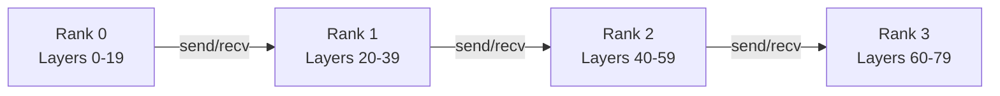

# ARTX10 — Distributed Runtime

## Architecture Specification

**Document Name:** ARTX10_Distributed_Runtime.md  
**Codename:** Mensa Rotunda  
**Tagline:** Designed for the Impossible.  
**Version:** 1.0.0-draft  
**Date:** 2026-07-10  
**Status:** Draft  

---

## Revision History

| Version | Date | Author | Description |
|---------|------|--------|-------------|
| 1.0.0-draft | 2026-07-10 | GLLM Core Team | Extracted from ArchGLLMFormat.md master document |

---

## Table of Contents

- [Distributed Runtime](#distributed-runtime)
  - [Distributed Device Map](#distributed-device-map)
  - [Communication Backend](#communication-backend)
  - [Pipeline Parallelism](#pipeline-parallelism)
  - [Tensor Parallelism](#tensor-parallelism)
  - [Failure Recovery](#failure-recovery)
- [Related Documents](#related-documents)

---

# Distributed Runtime

The distributed runtime supports model parallelism across multiple hosts or processes. It extends the device map to include remote devices.

## Distributed Device Map

```json
{
  "device_map": {
    "layers": {
      "0-19": "rank:0/cuda:0",
      "20-39": "rank:1/cuda:0",
      "40-59": "rank:2/cuda:0",
      "60-79": "rank:3/cuda:0"
    }
  }
}
```

## Communication Backend

The distributed runtime uses NCCL (NVIDIA), RCCL (AMD), or Gloo (CPU) for inter-rank communication. The runtime initializes the communication backend during startup and maintains persistent connections.

## Pipeline Parallelism

In pipeline parallelism, each rank holds a contiguous set of layers. Activations are sent from rank N to rank N+1 using `send`/`recv` operations.



## Tensor Parallelism

In tensor parallelism, individual layers are split across ranks. The runtime supports tensor parallelism for attention and feed-forward layers via all-gather and reduce-scatter operations. Tensor parallelism requires synchronized execution across ranks.

## Failure Recovery

The distributed runtime implements checkpoint-based recovery:

1. **Layer Checkpoints:** Each rank periodically saves its KV cache and activation buffers.
2. **Rank Failure Detection:** Heartbeat monitoring detects failed ranks.
3. **Recovery:** A spare rank loads the checkpoint and resumes execution.

> **Note:** Full failure recovery is a future work item. The current distributed runtime assumes fail-stop behavior with manual restart.

For device mapping and memory model details, see ARTX6: Memory Model, Section 6. For runtime execution model, see ARTX5: Runtime Architecture, Section 1.

---

## Related Documents

| Document | Title | Description |
|----------|-------|-------------|
| ARTX1 | GLLM Overview | Entry-point overview of the GLLM format, vision, and ecosystem |
| ARTX2 | Package Specification | Physical and logical package structure, archive format, execution units |
| ARTX3 | Manifest Specification | gllm.json schema, metadata, versioning, and extension registry |
| ARTX4 | Layer Specification | Binary layer file format, tensor layouts, and extension layer types |
| ARTX5 | Runtime Architecture | Execution model, scheduler, CPU/GPU/hybrid runtime, and failure recovery |
| ARTX6 | Memory Model | Address space layout, memory lifecycle, prefetch strategy, and KV cache |
| ARTX7 | Converter Architecture | Conversion pipeline, parsers, validation, and error handling |
| ARTX8 | Extension System | Plugin architecture, MLA, Mamba, MoE, and custom layer types |
| ARTX9 | Compatibility & Versioning | Format versioning, source compatibility, and known limitations |
| **ARTX10** | **Distributed Runtime** | **This document** |
| ARTX11 | Benchmarks | Benchmark suite, methodology, and measurement standards |

---

*This document is part of the GLLM Architecture Specification Series. The master document is ArchGLLMFormat.md.*
