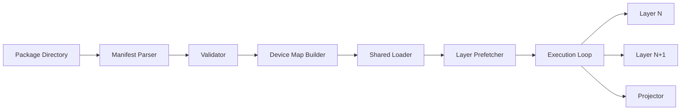

# ARTX1 — GLLM Overview

## Architecture Specification

**Document Name:** ARTX1_—_GLLM_Overview.md  
**Codename:** Mensa Rotunda  
**Tagline:** Designed for the Impossible.  
**Version:** 1.0.0-draft  
**Date:** 2026-07-10  
**Status:** Draft  

---

## Revision History

| Version | Date | Author | Description |
|---------|------|--------|-------------|
| 1.0.0-draft | 2026-07-10 | GLLM Core Team | Extracted from ArchGLLMFormat.md master document |

---

## Table of Contents

- [Introduction](#introduction)
  - [Vision](#vision)
  - [Background](#background)
  - [Motivation](#motivation)
  - [Problem Statement](#problem-statement)
  - [Limitations of Existing Formats](#limitations-of-existing-formats)
  - [Why GLLM](#why-gllm)
  - [Goals](#goals)
  - [Non-Goals](#non-goals)
  - [Design Philosophy](#design-philosophy)
  - [Core Principles](#core-principles)
  - [Terminology](#terminology)
- [High-Level Architecture](#high-level-architecture)
- [Roadmap Summary](#roadmap-summary)
- [Appendix](#appendix)
  - [Glossary](#glossary)
  - [References](#references)
  - [Acknowledgements](#acknowledgements)
- [Related Documents](#related-documents)

---

# Introduction

## Vision

GLLM (GwenLand Language Model Format) is a binary packaging and runtime format designed for large language model inference. It prioritizes sequential loading, memory-mapped execution, and minimal runtime overhead. GLLM treats the model not as a monolithic tensor dump, but as a structured execution package composed of discrete, self-describing layers.

The format is designed to support transformer variants, state-space models, mixture-of-experts architectures, and future architectures not yet conceived. It is target-agnostic at the package level and execution-aware at the runtime level.

## Background

Current model formats fall into two categories: universal exchange formats (ONNX, Safetensors) and runtime-optimized containers (GGUF). Exchange formats prioritize interoperability; runtime containers prioritize inference efficiency. GLLM occupies a third space: a runtime-native format that remains structurally transparent and extensible.

The design of GLLM is informed by the following observations:

1. **Memory bandwidth is the bottleneck.** Loading a 70B parameter model from NVMe to GPU memory consumes measurable wall-clock time. Any format that requires deserialization, byte-order conversion, or tensor reconstruction adds latency to cold-start scenarios.

2. **Layer-level execution is the dominant pattern.** Transformer inference proceeds layer by layer. Attention, feed-forward, and normalization blocks execute sequentially. A format that aligns storage boundaries with execution boundaries enables natural memory mapping and prefetching.

3. **Metadata must be first-class.** Model architecture, quantization scheme, rope parameters, and tokenizer configuration are not afterthoughts. They are prerequisites for correct execution. GLLM embeds this metadata in a structured manifest that is parseable without loading tensors.

## Motivation

Existing formats force a trade-off between loading speed and structural clarity:

- **GGUF** stores tensors in a single file with a key-value metadata header. It is efficient for mmap but conflates all tensors into one namespace, making layer-level isolation difficult.
- **Safetensors** provides fast tensor loading via memory mapping but lacks architecture metadata, requiring external configuration files.
- **ONNX** is graph-oriented and general-purpose, introducing significant overhead for static transformer graphs.

GLLM was created to eliminate this trade-off. It provides:

- Layer-level file isolation for granular memory management
- A mandatory manifest describing architecture and execution topology
- Native support for multi-file packages enabling distributed storage
- Extensible layer types without format revision
- Checksum coverage for every execution unit

## Problem Statement

Given a language model with N parameters, quantized to Q bits, targeting a device with D memory, how do we:

1. Package the model so that cold-start loading time is minimized?
2. Enable layer-level memory mapping so that working set size approaches the size of a single layer?
3. Validate package integrity without loading the entire file?
4. Support new layer types (MLA, Mamba, MoE) without revising the core format?
5. Permit distributed execution across heterogeneous devices?

## Limitations of Existing Formats

### GGUF

GGUF stores all tensors in a single binary file preceded by a metadata header. While this enables `mmap` on the entire file, it has the following structural limitations:

- **No layer boundaries.** Tensors are named (`blk.0.attn_q.weight`) but not grouped. Runtimes must infer layer boundaries from naming conventions.
- **Single file constraint.** Large models (>100GB) exceed practical file system limits and require manual splitting.
- **Metadata flatness.** Key-value metadata is unstructured; nested configuration (e.g., per-expert MoE parameters) requires ad-hoc encoding.
- **No integrity verification.** There is no standard checksum mechanism for tensors or metadata.

### Safetensors

Safetensors uses a JSON header followed by raw tensor buffers. It is safe (no pickle) and fast but lacks:

- **Architecture metadata.** The header contains only tensor names, shapes, dtypes, and offsets. Model architecture, tokenizer, and hyperparameters must be provided externally.
- **No execution topology.** There is no concept of layers, execution order, or device placement.
- **No quantization metadata.** Quantization parameters (scales, zero points, block sizes) are not standardized in the format.

### ONNX

ONNX represents models as computation graphs. For LLMs, this introduces:

- **Graph verbosity.** A 70B transformer produces an ONNX graph with thousands of nodes, making the file large and parsing slow.
- **Runtime mismatch.** ONNX is designed for general-purpose inference. LLM-specific optimizations (KV-cache management, rope fusion, flash attention) are not expressible in standard ONNX.
- **No mmap-friendly layout.** Tensor data is interleaved with graph structure, preventing efficient memory mapping.

## Why GLLM

GLLM addresses the limitations above through five structural decisions:

1. **Layer Files:** Each layer is stored in a separate file. This enables the runtime to map only the layers currently executing, reducing working set size.
2. **Manifest:** A single JSON manifest describes the entire package, including architecture, layer topology, tensor metadata, and checksums. The manifest is parseable without reading layer files.
3. **Shared Components:** Common tensors (token embeddings, output head, normalization constants) are stored in a separate shared file, eliminating duplication.
4. **Extension System:** Layer types are identified by a URI scheme. New layer types are registered in the manifest; runtimes load the appropriate plugin.
5. **Multi-Package Execution:** The manifest supports references to external packages, enabling model parallelism across devices and hosts.

## Goals

| ID | Goal | Priority |
|----|------|----------|
| G1 | Minimize cold-start loading time for inference | P0 |
| G2 | Enable layer-level memory mapping | P0 |
| G3 | Support models from 1B to 1T+ parameters | P0 |
| G4 | Provide structural integrity verification | P0 |
| G5 | Support CPU, GPU, and hybrid execution | P0 |
| G6 | Support distributed inference across multiple hosts | P1 |
| G7 | Enable plugin-based layer types without format revision | P1 |
| G8 | Maintain human-readable metadata and diagnostics | P2 |
| G9 | Support quantization schemes (Q4_0, Q8_0, FP16, BF16, FP8) | P0 |
| G10 | Permit incremental package updates (LoRA, adapter layers) | P2 |

## Non-Goals

| ID | Non-Goal | Rationale |
|----|----------|-----------|
| NG1 | Training checkpoint format | GLLM is inference-only. Training checkpoints require optimizer state, gradient history, and mutable tensors. |
| NG2 | General-purpose graph format | GLLM is specialized for LLM layer sequences. General computation graphs are better served by ONNX or MLIR. |
| NG3 | Real-time streaming inference | GLLM targets batch and interactive inference, not sub-10ms real-time constraints. |
| NG4 | Universal hardware support | GLLM targets CPU (x86_64, ARM64) and GPU (CUDA, ROCm, Metal). Exotic accelerators are supported via plugins, not core format. |
| NG5 | Backward compatibility with GGUF or Safetensors | Conversion is one-way. GLLM is a native format, not a wrapper. |

## Design Philosophy

### Storage Follows Execution

The physical layout of a GLLM package mirrors the logical execution flow. If a model executes layers 0 through 79 sequentially, the package stores them as `GLLMTensorLayer-0000.gllm` through `GLLMTensorLayer-0079.gllm`. This alignment enables the runtime to prefetch layer N+1 while executing layer N.

### Metadata Is Executable

The manifest is not documentation. It is a machine-readable contract between the package and the runtime. A runtime that reads the manifest must be able to construct the execution graph, allocate memory, and verify integrity without inspecting tensor data.

### Extensibility Over Generality

GLLM does not attempt to describe every possible neural network. It describes language model layers and provides an extension mechanism for new layer types. This narrow focus permits aggressive optimization.

### Fail Fast, Fail Loud

Every execution unit (layer file, shared component, manifest) carries a checksum. The runtime verifies checksums before mapping memory. A corrupted package is detected at load time, not during inference.

## Core Principles

1. **Immutability.** GLLM packages are read-only after creation. There are no in-place updates. Adapters and LoRA are stored as separate layer files referenced by the manifest.
2. **Locality.** Tensors within a layer file are stored in execution order. The runtime reads them sequentially, maximizing prefetcher efficiency.
3. **Transparency.** All metadata is JSON. All tensor offsets are explicit. A package can be inspected and debugged with standard tools.
4. **Minimalism.** The format contains no redundant information. If a value can be derived, it is not stored.
5. **Stability.** The core format (manifest schema, layer file header, checksum algorithm) is versioned independently of layer type extensions.

## Terminology

| Term | Definition |
|------|------------|
| **Package** | A complete GLLM model consisting of a manifest, shared components, and layer files. |
| **Manifest** | The JSON file `gllm.json` at the root of the package. The single source of truth for package structure. |
| **Layer** | A logical execution unit (e.g., transformer block, Mamba block, MoE layer). |
| **Layer File** | A binary file containing the tensors and metadata for a single layer. |
| **Shared Component** | A tensor or set of tensors used by multiple layers (e.g., token embeddings). |
| **Execution Unit** | A layer file or shared component that can be loaded and executed independently. |
| **Tensor** | A multi-dimensional array of numerical values with a defined shape, dtype, and quantization scheme. |
| **Projector** | A tensor mapping layer outputs to vocabulary logits or multimodal embeddings. |
| **Extension** | A registered layer type identified by a URI, enabling plugin-based runtime support. |
| **Runtime** | The software system that loads a GLLM package and executes inference. |
| **Converter** | The tool that transforms models from source formats (GGUF, Safetensors, PyTorch) into GLLM. |
| **Working Set** | The set of memory pages currently mapped into the process address space. |
| **Prefetch** | The act of mapping a layer file into memory before it is required for execution. |
| **Device Map** | A manifest-defined mapping of layers to physical devices (CPU, GPU 0, GPU 1, etc.). |

---

# High-Level Architecture

A GLLM package is a directory or archive containing:

- `gllm.json` — The manifest
- `GLLMTokenizer.gllm` — Tokenizer tables (vocabulary, merges, chat template)
- `GLLMShared.gllm` — Shared components (embeddings, output head, norms)
- `GLLMTensorLayer-NNNN.gllm` — Layer files, one per layer
- `GLLMProj.gllm` — Optional multimodal projector
- `checksums.sha256` — Optional aggregated checksums

The runtime interacts with the package through the following pipeline:

```
Manifest Parse -> Validation -> Device Map Construction ->
Shared Component Load -> Layer Prefetch -> Execution Loop
```



For detailed package structure, see ARTX2: Package Specification. For manifest details, see ARTX3: Manifest Specification. For layer file format details, see ARTX4: Layer Specification. For runtime details, see ARTX5: Runtime Architecture.

---

# Roadmap Summary

## Current State

GLLM is currently at version 1.0.0-draft. The following components are implemented:

| Component | Status | Notes |
|-----------|--------|-------|
| Manifest Schema | Stable | JSON schema frozen for v1.0 |
| Layer File Format | Stable | Binary format frozen for v1.0 |
| GGUF Converter | Beta | Supports Llama, Mistral, Qwen architectures |
| CPU Runtime | Alpha | Sequential loading, Q4_0, Q8_0, FP16 |
| GPU Runtime | Alpha | CUDA support, sequential loading |
| Checksum System | Stable | SHA-256 per file |
| Extension System | Design | Plugin API defined, no implementations |

## Future Versions

### v1.1 (Target: Q4 2026)

- **Multi-modal support:** Image and audio projector extensions.
- **LoRA adapters:** Adapter layer files and runtime merging.
- **Streaming manifest:** Partial manifest loading for extremely large models.
- **Compression:** Optional ZSTD compression for layer files (trade-off: CPU decompression vs. storage size).

### v1.2 (Target: Q1 2027)

- **Distributed runtime:** Full pipeline and tensor parallelism with automatic recovery.
- **Dynamic quantization:** Runtime quantization type switching (e.g., FP16 for first layer, Q4 for others).
- **Memory-mapped KV cache:** Persistent KV cache across sessions.

### v2.0 (Target: 2028)

- **Format revision:** Potential manifest schema changes based on v1.x learnings.
- **Hardware plugins:** Vendor-specific plugins for TPUs, NPUs, and custom accelerators.
- **Graph optimization:** Layer fusion and kernel autotuning integrated into the runtime.

## Open Questions

The following questions remain unresolved and require community input or implementation experience:

1. **Compression Trade-off:** Should layer files support optional compression? If so, which algorithm (ZSTD, LZ4)? How does this interact with mmap?
2. **KV Cache Format:** Should the KV cache be stored in GLLM format for session persistence? What is the migration strategy for context window changes?
3. ~~**Tokenizer Packaging**~~ — **RESOLVED (2026-07-20).** The tokenizer is
   **embedded, as its own execution unit** `GLLMTokenizer.gllm`. See ARTX2:
   Package Specification, "Tokenizer Unit".

   The size objection did not survive measurement: on Qwen2.5-0.5B the full
   tokenizer payload (151 936 vocabulary entries, BPE merges, token types,
   chat template) is **~7.4 MB against a 463 MB package — 1.6 %**, versus
   227 MB for shared components alone. There is no meaningful size trade-off
   to weigh against portability.

   External references were rejected outright: they reproduce the exact defect
   Design Principle 3 criticises GGUF and safetensors for — a model file that
   cannot be executed without a second, separately-sourced artifact.

   Inlining into the manifest was rejected because ARTX3 requires the manifest
   be parseable without loading tensors; a 152 000-entry vocabulary makes every
   `open()` pay for it. As a unit, the tokenizer instead inherits the weights'
   integrity path: per-file checksum, `checksums.sha256`, mmap.
4. **Multi-Package References:** How should the manifest reference external packages (e.g., for pipeline parallelism)? By file path, URL, or content hash?
5. **Security Model:** Should GLLM packages support code signing? What is the threat model for model distribution?

## Known Limitations

1. **Single-Threaded Layer Execution:** The current runtime executes layers sequentially within a single thread. Inter-layer parallelism is not supported.
2. **Limited GPU Kernel Fusion:** Only basic fusion (norm+GEMM) is implemented. Full attention fusion is pending.
3. **No Dynamic Batching:** The runtime processes one sequence at a time. Batch inference requires multiple runtime instances.
4. **Converter Coverage:** The converter only supports GGUF as a primary source. Safetensors and PyTorch support require manual metadata specification.
5. **Windows Support:** The runtime is developed and tested on Linux. Windows support is untested.

## Future Work

### Short Term (6 months)

- Implement MLA, Mamba, and MoE runtime plugins.
- Implement Safetensors and PyTorch converters with automatic architecture detection.
- Add comprehensive benchmark suite with reproducible results.
- Implement Windows mmap and path handling.

### Medium Term (12 months)

- Design and implement the distributed runtime with NCCL integration.
- Implement LoRA adapter loading and runtime merging.
- Add multi-modal projector extensions (CLIP, Whisper).
- Implement dynamic batching and speculative decoding.

### Long Term (24+ months)

- Explore hardware-accelerated checksum verification (GPU SHA-256).
- Investigate persistent memory (Intel Optane, CXL) for layer caching.
- Design v2.0 format based on production experience.
- Standardize GLLM as an open specification with independent implementations.

---

# Appendix

## Glossary

| Term | Definition |
|------|------------|
| **Autoregressive Generation** | The process of generating tokens one at a time, using previously generated tokens as input. |
| **CXL** | Compute Express Link, a high-speed interconnect for memory expansion. |
| **DMA** | Direct Memory Access, a feature that allows hardware to access memory without CPU intervention. |
| **GEMM** | General Matrix Multiply, the core operation in neural network layers. |
| **GQA** | Grouped Query Attention, an attention mechanism that shares key/value heads across query heads. |
| **KV Cache** | A cache of key and value tensors from previous tokens, used to avoid recomputation in attention. |
| **LoRA** | Low-Rank Adaptation, a parameter-efficient fine-tuning method. |
| **Mamba** | A state-space model architecture that uses selective state spaces for sequence modeling. |
| **MLA** | Multi-Head Latent Attention, an attention mechanism with compressed key-value representations. |
| **MoE** | Mixture of Experts, an architecture that routes tokens to specialized sub-networks. |
| **mmap** | Memory mapping, a mechanism that maps files into the process address space. |
| **NCCL** | NVIDIA Collective Communications Library, used for multi-GPU communication. |
| **RoPE** | Rotary Positional Embedding, a positional encoding method used in modern transformers. |
| **TTFT** | Time to First Token, the latency from input to the first generated token. |
| **Working Set** | The set of memory pages actively used by a process. |

## References

1. **GGUF Specification.** GGML Project. https://github.com/ggerganov/ggml/blob/master/docs/gguf.md
2. **Safetensors Format.** Hugging Face. https://huggingface.co/docs/safetensors/index
3. **ONNX Specification.** ONNX Runtime. https://onnx.ai/onnx/intro/
4. **LLaMA Architecture.** Touvron et al., 2023. arXiv:2302.13971.
5. **Mamba.** Gu and Dao, 2023. arXiv:2312.00752.
6. **DeepSeek-V2 MLA.** DeepSeek-AI, 2024. arXiv:2405.04434.
7. **Mixtral 8x7B.** Mistral AI, 2023. arXiv:2401.04088.
8. **Memory Mapping in Linux.** Linux Kernel Documentation. https://www.kernel.org/doc/html/latest/mm/index.html
9. **CUDA Programming Guide.** NVIDIA. https://docs.nvidia.com/cuda/cuda-c-programming-guide/
10. **Zstandard Compression.** Facebook. https://facebook.github.io/zstd/

## Acknowledgements

GLLM was designed by the GwenLand Core Team with input from the open-source inference community. The format draws inspiration from GGUF (Georgi Gerganov), Safetensors (Nicolas Patry), and ONNX. The sequential loading model was influenced by research on memory-bounded inference by Kwon et al. and the vLLM project.

Special thanks to the contributors of llama.cpp, vLLM, and TensorRT-LLM for advancing the state of LLM inference and informing the design requirements of GLLM.

---

## Related Documents

| Document | Title | Description |
|----------|-------|-------------|
| **ARTX1** | **GLLM Overview** | **This document** |
| ARTX2 | Package Specification | Physical and logical package structure, archive format, execution units |
| ARTX3 | Manifest Specification | gllm.json schema, metadata, versioning, and extension registry |
| ARTX4 | Layer Specification | Binary layer file format, tensor layouts, and extension layer types |
| ARTX5 | Runtime Architecture | Execution model, scheduler, CPU/GPU/hybrid runtime, and failure recovery |
| ARTX6 | Memory Model | Address space layout, memory lifecycle, prefetch strategy, and KV cache |
| ARTX7 | Converter Architecture | Conversion pipeline, parsers, validation, and error handling |
| ARTX8 | Extension System | Plugin architecture, MLA, Mamba, MoE, and custom layer types |
| ARTX9 | Compatibility & Versioning | Format versioning, source compatibility, and known limitations |
| ARTX10 | Distributed Runtime | Multi-node execution, pipeline/tensor parallelism, and recovery |
| ARTX11 | Benchmarks | Benchmark suite, methodology, and measurement standards |

---

*This document is part of the GLLM Architecture Specification Series. The master document is ArchGLLMFormat.md.*
