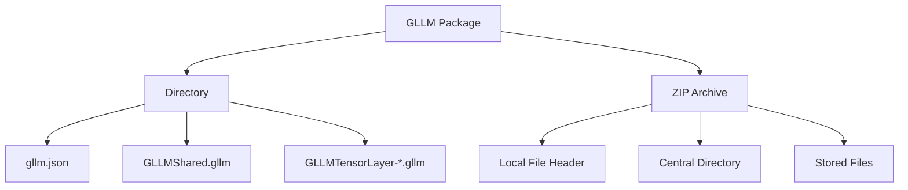
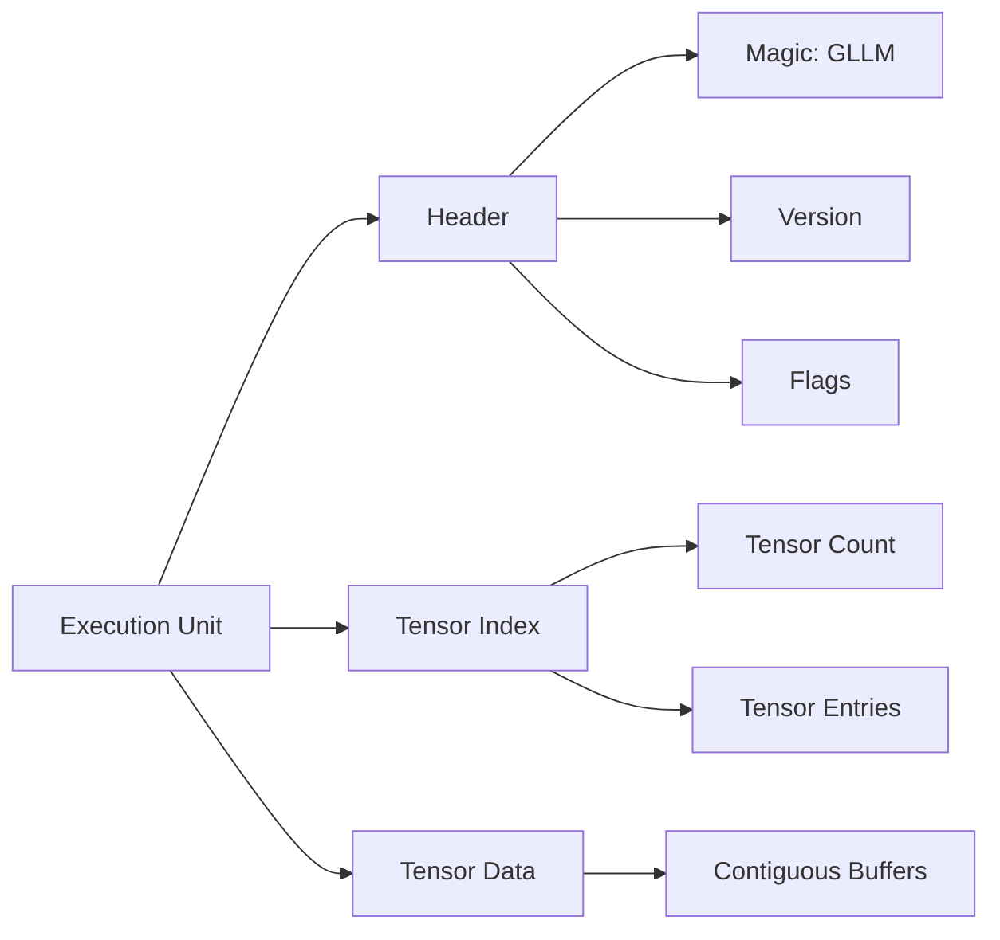
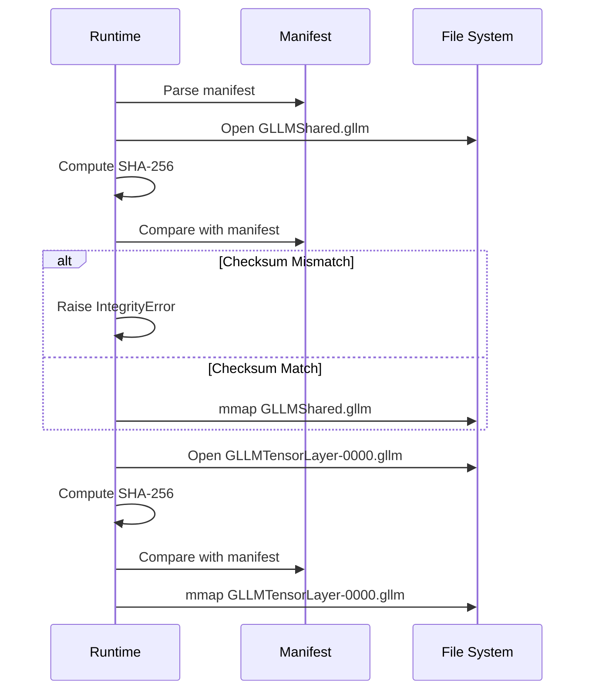

# ARTX2 — Package Specification

## Architecture Specification

**Document Name:** ARTX2_—_Package_Specification.md  
**Codename:** Mensa Rotunda  
**Tagline:** Designed for the Impossible.  
**Version:** 1.0.0-draft  
**Date:** 2026-07-10  
**Status:** Draft  

---

## Revision History

| Version | Date | Author | Description |
|---------|------|--------|-------------|
| 1.0.0-draft | 2026-07-10 | GLLM Core Team | Extracted from ArchGLLMFormat.md master document |

---

## Table of Contents

- [Package Structure](#package-structure)
  - [Directory Layout](#directory-layout)
  - [Archive Format](#archive-format)
- [Execution Units](#execution-units)
- [Shared Components](#shared-components)
  - [Typical Shared Tensors](#typical-shared-tensors)
- [Checksums](#checksums)
  - [Integrity Model](#integrity-model)
  - [Verification Flow](#verification-flow)
- [Related Documents](#related-documents)

---

# Package Structure

## Directory Layout

```
model.gllm/
├── gllm.json
├── GLLMShared.gllm
├── GLLMTensorLayer-0000.gllm
├── GLLMTensorLayer-0001.gllm
├── ...
├── GLLMTensorLayer-0079.gllm
├── GLLMProj.gllm
└── checksums.sha256
```

## File Naming

| Unit | Filename |
|------|----------|
| Manifest | `gllm.json` |
| Shared components | `GLLMShared.gllm` |
| Layer *N* | `GLLMTensorLayer-NNNN.gllm` |
| Projector (optional) | `GLLMProj.gllm` |
| Checksums | `checksums.sha256` |

Layer indices are zero-padded to **four** digits, so a lexical sort of the
directory matches execution order for any model up to 10 000 layers. An index
beyond that is written in full rather than truncated — two layers must never
resolve to one filename.

Every execution unit ends in `.gllm`. The `.zip` extension never appears on a
member file: archiving applies to the package *directory* as a whole (see
Archive Format below), never to the units inside it.

> **Revision (2026-07-20):** this replaces the original scheme of
> `shared` / `layer_NNN` / `projector` (three-digit padding, lowercase, no
> prefix). The `GLLM` prefix makes package members self-identifying when they
> are extracted or copied next to unrelated files, and the wider padding
> removes the 1 000-layer ordering cliff. Packages written under the old
> scheme are **not** readable by the current runtime and must be re-converted.

## Archive Format

GLLM packages may be distributed as uncompressed ZIP archives (`.gllm` extension) or as directories. The ZIP format is used for portability; the directory format is used for runtime execution. The runtime extracts the manifest and checksums from the ZIP header without decompressing layer files.

> **Rationale:** ZIP stores file offsets in the central directory, allowing the runtime to locate `gllm.json` and individual layer files via `seek`. Uncompressed stored files within the ZIP are directly mmap-able.



For manifest schema details, see ARTX3: Manifest Specification. For layer file binary format, see ARTX4: Layer Specification. For runtime loading behavior, see ARTX5: Runtime Architecture and ARTX6: Memory Model.

---

# Execution Units

An execution unit is any file that the runtime can load, verify, and map independently. This includes:

- `GLLMShared.gllm`
- `GLLMTensorLayer-NNNN.gllm`
- `GLLMProj.gllm`
- Adapter layer files (future)

Each execution unit has:

- A file path (relative to manifest)
- A SHA-256 checksum
- A layer type URI (for layer files)
- A tensor index (names, shapes, offsets, dtypes)



---

# Shared Components

Shared components are tensors used by multiple layers or the final output projection. They are stored in `GLLMShared.gllm`.

## Typical Shared Tensors

| Tensor | Shape | Purpose |
|--------|-------|---------|
| `token_embeddings` | [V, D] | Input embedding lookup |
| `output_norm.weight` | [D] | Final layer normalization |
| `output_head.weight` | [V, D] | Logit projection (often tied to embeddings) |
| `rope_cos` | [C, R] | Precomputed RoPE cosine table |
| `rope_sin` | [C, R] | Precomputed RoPE sine table |

> **Rationale:** Separating shared components prevents duplication in layer files and enables the runtime to keep them permanently mapped while layers are swapped.

---

# Checksums

## Integrity Model

GLLM uses SHA-256 for all integrity verification. Checksums are applied at three levels:

1. **Per-File Checksum:** Every execution unit file has a SHA-256 checksum in the manifest.
2. **Manifest Checksum:** The manifest itself may be accompanied by a `gllm.json.sha256` file.
3. **Aggregated Checksums:** The optional `checksums.sha256` file contains all file checksums for offline verification.

## Verification Flow



> **Rationale:** Per-file checksums enable the runtime to detect corruption at the granularity of execution units. A corrupted layer file does not invalidate the entire package.

---

## Related Documents

| Document | Title | Description |
|----------|-------|-------------|
| ARTX1 | GLLM Overview | Entry-point overview of the GLLM format, vision, and ecosystem |
| **ARTX2** | **Package Specification** | **This document** |
| ARTX3 | Manifest Specification | gllm.json schema, metadata, versioning, and extension registry |
| ARTX4 | Layer Specification | Binary layer file format, tensor layouts, and extension layer types |
| ARTX5 | Runtime Architecture | Execution model, scheduler, CPU/GPU/hybrid runtime, and failure recovery |
| ARTX6 | Memory Model | Address space layout, memory lifecycle, prefetch strategy, and KV cache |
| ARTX7 | Converter Architecture | Conversion pipeline, parsers, validation, and error handling |
| ARTX8 | Extension System | Plugin architecture, MLA, Mamba, MoE, and custom layer types |
| ARTX9 | Compatibility & Versioning | Format versioning, source compatibility, and known limitations |
| ARTX10 | Distributed Runtime | Multi-node execution, pipeline/tensor parallelism, and recovery |
| ARTX11 | Benchmarks | Benchmark suite, methodology, and measurement standards |

---

*This document is part of the GLLM Architecture Specification Series. The master document is ArchGLLMFormat.md.*
