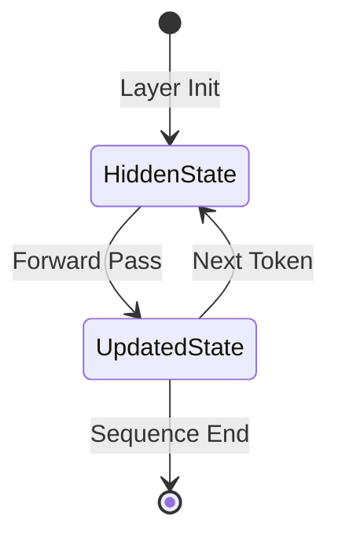
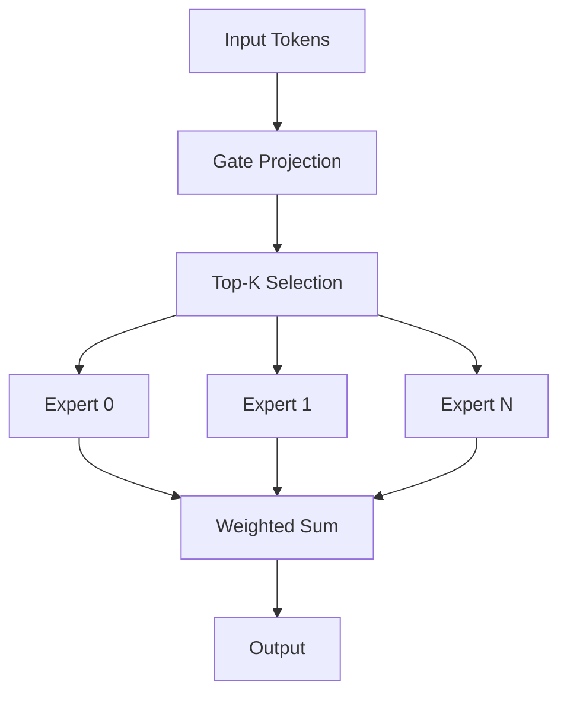

# ARTX4 — Layer Specification

## Architecture Specification

**Document Name:** ARTX4_—_Layer_Specification.md  
**Codename:** Mensa Rotunda  
**Tagline:** Designed for the Impossible.  
**Version:** 1.0.0-draft  
**Date:** 2026-07-10  
**Status:** Draft  

---

## Revision History

| Version | Date | Author | Description |
|---------|------|--------|-------------|
| 1.0.0-draft | 2026-07-10 | GLLM Core Team | Extracted from ArchGLLMFormat.md master document |

---

## Table of Contents

- [Layer Files](#layer-files)
  - [Tensor Index Entry](#tensor-index-entry)
  - [Data Type Codes](#data-type-codes)
- [Tensor Organization](#tensor-organization)
  - [Storage Order](#storage-order)
  - [Quantization Layout](#quantization-layout)
- [Projectors](#projectors)
- [Extension Layer Types](#extension-layer-types)
  - [MLA (Multi-Head Latent Attention)](#mla-multi-head-latent-attention)
  - [Mamba](#mamba)
  - [MoE (Mixture of Experts)](#moe-mixture-of-experts)
- [Future Architectures](#future-architectures)
- [Custom Layer Types](#custom-layer-types)
- [Related Documents](#related-documents)

---

# Layer Files

A layer file is a self-contained binary file with the following structure:

| Offset | Size | Content |
|--------|------|---------|
| 0 | 4 | Magic: `0x474C4C4D` ("GLLM") |
| 4 | 2 | Format version (major, minor) |
| 6 | 2 | Flags (endianness, compression) |
| 8 | 4 | Tensor count |
| 12 | N | Tensor index entries |
| 12 + N | M | Tensor data (aligned to 64 bytes) |

## Tensor Index Entry

| Field | Size | Description |
|-------|------|-------------|
| `name_len` | 2 | Length of tensor name |
| `name` | `name_len` | UTF-8 tensor name |
| `shape_len` | 1 | Number of dimensions |
| `shape` | `shape_len * 4` | Dimension values (uint32) |
| `dtype` | 2 | Data type code |
| `offset` | 8 | Offset to tensor data in file (uint64) |
| `size` | 8 | Size of tensor data in bytes (uint64) |

## Data Type Codes

| Code | Name | Description |
|------|------|-------------|
| 0x0001 | FP32 | 32-bit IEEE 754 float |
| 0x0002 | FP16 | 16-bit IEEE 754 float |
| 0x0003 | BF16 | 16-bit brain float |
| 0x0004 | FP8_E4M3 | 8-bit float (E4M3) |
| 0x0005 | FP8_E5M2 | 8-bit float (E5M2) |
| 0x0010 | Q4_0 | 4-bit quantization, block 32 |
| 0x0011 | Q4_1 | 4-bit quantization, block 32, with min |
| 0x0012 | Q4_K | 4-bit K-quantization |
| 0x0013 | Q4_K_M | 4-bit K-quantization, medium |
| 0x0014 | Q4_K_S | 4-bit K-quantization, small |
| 0x0020 | Q8_0 | 8-bit quantization, block 32 |
| 0x0021 | Q8_K | 8-bit K-quantization |
| 0x0030 | I32 | 32-bit signed integer |

> **Rationale:** The layer file header is fixed-size and parseable in a single read. The tensor index enables the runtime to locate specific tensors without scanning the entire file. The 64-byte alignment ensures optimal DMA transfer to GPU.

---

# Tensor Organization

## Storage Order

Tensors within a layer file are stored in the order they are accessed during forward pass. For a standard transformer layer, this is:

1. `input_norm.weight`
2. `attn_q.weight`, `attn_q.bias`
3. `attn_k.weight`, `attn_k.bias`
4. `attn_v.weight`, `attn_v.bias`
5. `attn_o.weight`
6. `post_attn_norm.weight`
7. `ffn_gate.weight`
8. `ffn_up.weight`
9. `ffn_down.weight`

> **Rationale:** Sequential storage matches execution order, maximizing cache and prefetch efficiency during memory-mapped loading.

## Quantization Layout

Quantized tensors store scales and zero-points alongside the quantized weights. The layout is:

```
[quantized_weights][scales][zero_points][optional_mins]
```

The exact block size and scale format are defined by the dtype code. The runtime plugin for each dtype knows how to interpret the layout.

---

# Projectors

A projector is a tensor or set of tensors that maps layer outputs to a different representation space. Common projectors include:

- **Language Modeling Head:** Maps hidden states to vocabulary logits.
- **Multimodal Projector:** Maps vision encoder outputs to the language model's embedding space.
- **Classifier Head:** Maps hidden states to class probabilities.

Projectors are stored in `projector.gllm` and referenced by the manifest. They follow the same layer file format but use a distinct layer type URI (e.g., `gllm:projector/linear@v1`).

For manifest projector references, see ARTX3: Manifest Specification. For package structure, see ARTX2: Package Specification.

---

# Extension Layer Types

## MLA (Multi-Head Latent Attention)

### MLA Layer Type

MLA is an attention mechanism that compresses key and value states into a latent representation. The GLLM extension for MLA is identified by:

```
gllm:transformer/mla@v1
```

### MLA Tensor Layout

An MLA layer file contains the following tensors:

| Tensor | Shape | Description |
|--------|-------|-------------|
| `input_norm.weight` | [D] | Pre-attention normalization |
| `attn_q.weight` | [D, D] | Query projection |
| `attn_kv_latent.weight` | [D, L] | Key-value latent compression |
| `attn_o.weight` | [D, D] | Output projection |
| `post_attn_norm.weight` | [D] | Post-attention normalization |

Where `L` is the latent dimension, typically `L < D`.

### MLA Runtime Support

The MLA plugin implements:

- Latent compression during the forward pass
- Decompression for KV cache storage (optional)
- Fused MLA kernels for GPU execution

For plugin system details, see ARTX8: Extension System. For runtime execution, see ARTX5: Runtime Architecture.

## Mamba

### Mamba Layer Type

Mamba is a state-space model layer. The GLLM extension is:

```
gllm:mamba/standard@v1
```

### Mamba Tensor Layout

| Tensor | Shape | Description |
|--------|-------|-------------|
| `in_proj.weight` | [ED, D] | Input projection (expands to ED) |
| `conv1d.weight` | [ED, K] | 1D convolution weights |
| `x_proj.weight` | [SS, ED] | X projection (delta, B, C) |
| `dt_proj.weight` | [ED, SS] | Delta projection |
| `A_log` | [ED] | Discretized state matrix parameter |
| `D` | [ED] | Skip connection parameter |
| `out_proj.weight` | [D, ED] | Output projection |

Where `E` is the expansion factor, `K` is the convolution kernel size, and `SS` is the state space dimension.

### Mamba State Management

Unlike transformer layers, Mamba layers maintain a recurrent state. The runtime manages this state in the scratch region:



For memory model details, see ARTX6: Memory Model. For runtime state management, see ARTX5: Runtime Architecture.

## MoE (Mixture of Experts)

### MoE Layer Type

MoE layers route tokens to a subset of expert feed-forward networks. The GLLM extension is:

```
gllm:transformer/moe@v1
```

### MoE Tensor Layout

| Tensor | Shape | Description |
|--------|-------|-------------|
| `input_norm.weight` | [D] | Pre-MoE normalization |
| `gate.weight` | [N, D] | Router gate projection |
| `expert_0.ffn_gate.weight` | [H, D] | Expert 0 gate projection |
| `expert_0.ffn_up.weight` | [H, D] | Expert 0 up projection |
| `expert_0.ffn_down.weight` | [D, H] | Expert 0 down projection |
| `expert_N.ffn_*.weight` | ... | Expert N projections |

Where `N` is the number of experts and `H` is the expert hidden dimension.

### MoE Execution Strategy

The MoE plugin implements:

- **Top-K Routing:** Selects K experts per token.
- **Expert Parallelism:** Distributes experts across devices (future).
- **Sparse Execution:** Only loads expert weights for the selected experts.



### MoE Memory Optimization

For large MoE models (e.g., 8x22B), loading all expert weights simultaneously is impractical. The MoE plugin supports on-demand expert loading:

1. Load gate weights (permanent).
2. For each token batch:
   a. Compute routing.
   b. Load selected expert weights.
   c. Execute experts.
   d. Unload expert weights.

For distributed MoE execution, see ARTX10: Distributed Runtime. For memory model, see ARTX6: Memory Model.

---

# Future Architectures

The extension system is designed to accommodate architectures not yet invented. The requirements for a new architecture extension are:

1. Define a URI for the layer type.
2. Specify the tensor layout and naming convention.
3. Implement a runtime plugin with parser, allocator, and execution kernels.
4. Update the converter to recognize the architecture in source formats.

For plugin interface details, see ARTX8: Extension System. For converter architecture, see ARTX7: Converter Architecture.

---

# Custom Layer Types

Users may define custom layer types for research or proprietary architectures. The process is:

1. Define the layer type URI (e.g., `myorg:custom/fused@v1`).
2. Implement the plugin interface.
3. Convert the model using a custom converter plugin.
4. Reference the custom URI in the manifest.

For plugin interface definition, see ARTX8: Extension System. For manifest extension registration, see ARTX3: Manifest Specification.

---

## Related Documents

| Document | Title | Description |
|----------|-------|-------------|
| ARTX1 | GLLM Overview | Entry-point overview of the GLLM format, vision, and ecosystem |
| ARTX2 | Package Specification | Physical and logical package structure, archive format, execution units |
| ARTX3 | Manifest Specification | gllm.json schema, metadata, versioning, and extension registry |
| **ARTX4** | **Layer Specification** | **This document** |
| ARTX5 | Runtime Architecture | Execution model, scheduler, CPU/GPU/hybrid runtime, and failure recovery |
| ARTX6 | Memory Model | Address space layout, memory lifecycle, prefetch strategy, and KV cache |
| ARTX7 | Converter Architecture | Conversion pipeline, parsers, validation, and error handling |
| ARTX8 | Extension System | Plugin architecture, MLA, Mamba, MoE, and custom layer types |
| ARTX9 | Compatibility & Versioning | Format versioning, source compatibility, and known limitations |
| ARTX10 | Distributed Runtime | Multi-node execution, pipeline/tensor parallelism, and recovery |
| ARTX11 | Benchmarks | Benchmark suite, methodology, and measurement standards |

---

*This document is part of the GLLM Architecture Specification Series. The master document is ArchGLLMFormat.md.*
