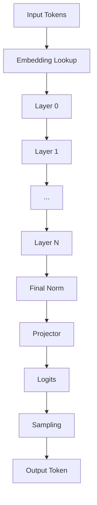
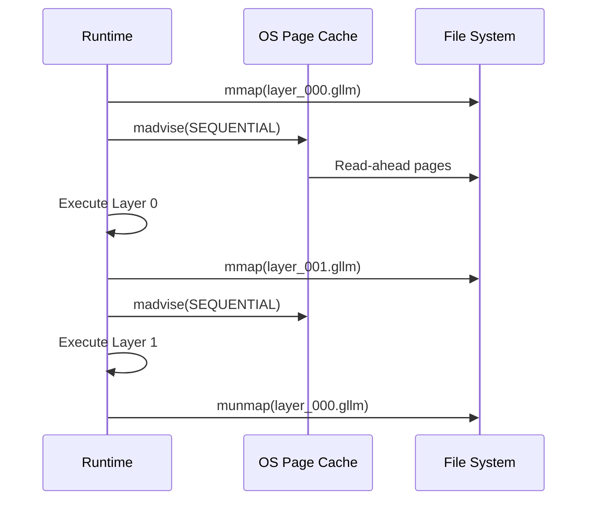
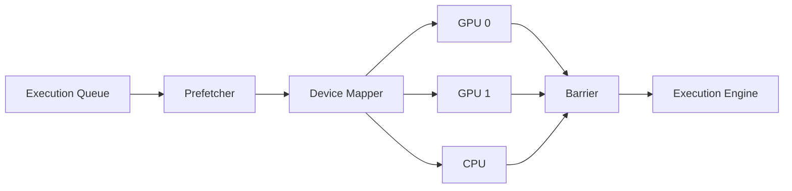
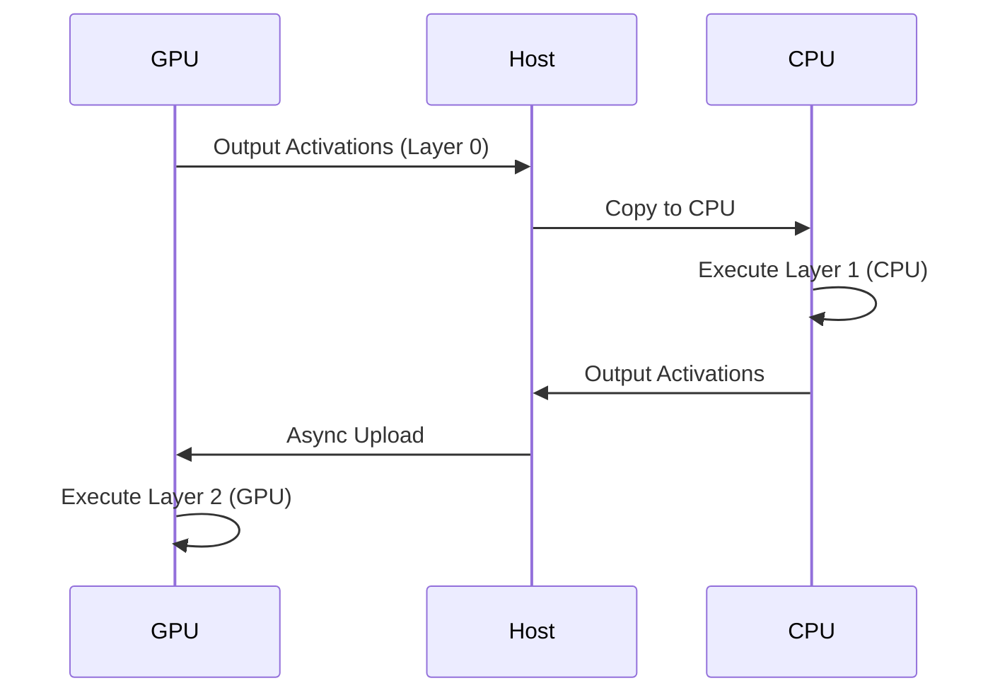

# ARTX5 — Runtime Architecture

## Architecture Specification

**Document Name:** ARTX5_—_Runtime_Architecture.md  
**Codename:** Mensa Rotunda  
**Tagline:** Designed for the Impossible.  
**Version:** 1.0.0-draft  
**Date:** 2026-07-10  
**Status:** Draft  

---

## Revision History

| Version | Date | Author | Description |
|---------|------|--------|-------------|
| 1.0.0-draft | 2026-07-10 | GLLM Core Team | Extracted from ArchGLLMFormat.md master document |

---

## Table of Contents

- [Execution Model](#execution-model)
- [Sequential Loading](#sequential-loading)
  - [Loading Sequence](#loading-sequence)
  - [Memory Mapping Strategy](#memory-mapping-strategy)
- [Runtime Scheduler](#runtime-scheduler)
  - [Scheduler Components](#scheduler-components)
  - [Scheduler Pipeline](#scheduler-pipeline)
  - [Prefetch Window](#prefetch-window)
- [CPU Runtime](#cpu-runtime)
  - [CPU Execution Strategy](#cpu-execution-strategy)
  - [Threading Model](#threading-model)
  - [Memory Mapping on CPU](#memory-mapping-on-cpu)
- [GPU Runtime](#gpu-runtime)
  - [GPU Execution Strategy](#gpu-execution-strategy)
  - [CUDA Stream Management](#cuda-stream-management)
  - [Kernel Fusion](#kernel-fusion)
- [Hybrid Runtime](#hybrid-runtime)
  - [Hybrid Scheduling](#hybrid-scheduling)
  - [Transfer Optimization](#transfer-optimization)
- [Failure Recovery](#failure-recovery)
  - [Failure Modes](#failure-modes)
  - [Error Handling Strategy](#error-handling-strategy)
  - [Logging and Diagnostics](#logging-and-diagnostics)
- [Related Documents](#related-documents)

---

# Execution Model

GLLM runtime operates on a layer-sequential execution model. For a standard transformer, the execution graph is a linear chain:

```
Input -> Shared.Embedding -> Layer 0 -> Layer 1 -> ... -> Layer N -> Shared.Norm -> Projector -> Output
```

The runtime maintains the following state during execution:

- **KV Cache:** A per-layer cache of key and value tensors, allocated according to the memory model.
- **Activation Buffers:** Temporary buffers for layer outputs, reused across layers.
- **Device Contexts:** GPU streams, CPU thread pools, and synchronization primitives.



For memory model details, see ARTX6: Memory Model. For distributed execution, see ARTX10: Distributed Runtime.

---

# Sequential Loading

Sequential loading is the core optimization of GLLM. Instead of loading the entire model into memory, the runtime maps layers on demand and unmaps them after execution.

## Loading Sequence

1. Parse manifest.
2. Map shared components (permanent).
3. For each layer in execution order:
   a. Map layer file.
   b. Execute layer.
   c. Unmap layer file (optional, depending on memory pressure).

## Memory Mapping Strategy

The runtime uses `mmap` (POSIX) or `CreateFileMapping` (Windows) to map layer files into the process address space. The operating system's page cache handles the actual disk I/O. The runtime advises the kernel using `madvise(MADV_SEQUENTIAL)` to optimize read-ahead.



> **Rationale:** Sequential loading reduces the working set size to approximately one layer plus shared components. For a 70B model quantized to Q4, this is ~4GB instead of ~40GB.

For memory lifecycle details, see ARTX6: Memory Model. For package structure, see ARTX2: Package Specification.

---

# Runtime Scheduler

The runtime scheduler coordinates layer execution, prefetching, and device transfers.

## Scheduler Components

| Component | Responsibility |
|-----------|--------------|
| **Execution Queue** | Ordered list of layers to execute |
| **Prefetch Queue** | Layers scheduled for memory mapping |
| **Device Queue** | Layers assigned to specific devices |
| **Synchronization Barrier** | Ensures layer N-1 completes before layer N starts |

## Scheduler Pipeline



## Prefetch Window

The scheduler maintains a prefetch window of size W. While layer N is executing, layers N+1 through N+W are prefetched into memory. The window size W is determined by:

- Available system memory
- Device transfer bandwidth (for GPU execution)
- Layer execution time (estimated from tensor sizes)

```python
# Pseudocode for prefetch window calculation
def compute_prefetch_window(available_memory, layer_size, bandwidth, layer_time):
    max_layers = available_memory // layer_size
    transfer_time = layer_size / bandwidth
    overlap_ratio = transfer_time / layer_time
    return min(max_layers, int(overlap_ratio) + 2)
```

For adaptive prefetching details, see ARTX6: Memory Model, Section 5.1.

---

# CPU Runtime

## CPU Execution Strategy

The CPU runtime executes layers using optimized kernels:

- **GEMM:** BLAS (OpenBLAS, MKL) or custom quantized GEMM kernels.
- **Attention:** Custom CPU attention kernels with cache-friendly KV cache traversal.
- **Activation Functions:** Vectorized implementations (AVX-512, NEON).

## Threading Model

The CPU runtime uses a thread pool with one thread per physical core. Layer execution is single-threaded at the layer level (to preserve sequential semantics), but individual kernels may use internal parallelism.

## Memory Mapping on CPU

The CPU runtime relies entirely on OS `mmap` and page cache. No explicit tensor copies are made unless required by alignment or format conversion.

---

# GPU Runtime

## GPU Execution Strategy

The GPU runtime uploads layer tensors to device memory before execution. The execution strategy depends on available GPU memory:

- **Full Model Fit:** All layers are uploaded once and remain in GPU memory. No sequential loading.
- **Partial Model Fit:** Layers are uploaded on demand and evicted after execution (sequential loading).
- **Single Layer Fit:** Only one layer fits in GPU memory. The runtime uses pinned host memory and async upload/download.

## CUDA Stream Management

The GPU runtime uses three CUDA streams per device:

1. **Compute Stream:** Executes kernels.
2. **H2D Stream:** Uploads layer tensors from host to device.
3. **D2H Stream:** Downloads results (rarely used in inference).


## Kernel Fusion

The GPU runtime fuses operations where possible to reduce kernel launch overhead:

- **Rope + Attention:** Fuses RoPE application with attention score computation.
- **Norm + GEMM:** Fuses layer normalization with the following matrix multiplication.
- **Activation + GEMM:** Fuses SiLU/ReLU with feed-forward GEMMs.

Fusion is implemented in the runtime plugin for each layer type. For plugin details, see ARTX8: Extension System.

---

# Hybrid Runtime

The hybrid runtime distributes layers across CPU and GPU. This is useful when GPU memory is insufficient for the full model but sufficient for a subset of layers.

## Hybrid Scheduling

1. Assign hot layers (early layers, large layers) to GPU.
2. Assign cold layers to CPU.
3. Transfer activations between CPU and GPU at layer boundaries.

## Transfer Optimization

The hybrid runtime uses pinned host memory for CPU-side buffers to enable async DMA transfers. The runtime overlaps CPU computation of layer N with GPU transfer of layer N+1.



For device mapping details, see ARTX6: Memory Model, Section 6.

---

# Failure Recovery

## Failure Modes

| Failure | Detection | Recovery |
|---------|-----------|----------|
| Corrupted layer file | Checksum mismatch | Abort load, report error |
| Missing layer file | File not found | Abort load, report error |
| GPU out of memory | CUDA OOM | Fallback to CPU, or reduce batch size |
| Kernel execution error | CUDA error | Abort inference, report error |
| Distributed rank failure | Heartbeat timeout | Abort distributed execution (future: automatic recovery) |

## Error Handling Strategy

The runtime uses a two-tier error handling strategy:

1. **Fatal Errors:** Corruption, missing files, unsupported versions. These abort execution immediately.
2. **Recoverable Errors:** GPU OOM, transient device errors. These trigger fallback strategies (CPU fallback, reduced batch size, reduced prefetch window).

## Logging and Diagnostics

The runtime provides structured logging at four levels:

- **ERROR:** Fatal or recoverable errors.
- **WARN:** Suboptimal configurations (e.g., CPU fallback, mismatched plugin version).
- **INFO:** Load progress, layer execution timing, memory usage.
- **DEBUG:** Tensor shapes, kernel launch parameters, memory addresses.

For distributed failure recovery, see ARTX10: Distributed Runtime, Section 5.

---

## Related Documents

| Document | Title | Description |
|----------|-------|-------------|
| ARTX1 | GLLM Overview | Entry-point overview of the GLLM format, vision, and ecosystem |
| ARTX2 | Package Specification | Physical and logical package structure, archive format, execution units |
| ARTX3 | Manifest Specification | gllm.json schema, metadata, versioning, and extension registry |
| ARTX4 | Layer Specification | Binary layer file format, tensor layouts, and extension layer types |
| **ARTX5** | **Runtime Architecture** | **This document** |
| ARTX6 | Memory Model | Address space layout, memory lifecycle, prefetch strategy, and KV cache |
| ARTX7 | Converter Architecture | Conversion pipeline, parsers, validation, and error handling |
| ARTX8 | Extension System | Plugin architecture, MLA, Mamba, MoE, and custom layer types |
| ARTX9 | Compatibility & Versioning | Format versioning, source compatibility, and known limitations |
| ARTX10 | Distributed Runtime | Multi-node execution, pipeline/tensor parallelism, and recovery |
| ARTX11 | Benchmarks | Benchmark suite, methodology, and measurement standards |

---

*This document is part of the GLLM Architecture Specification Series. The master document is ArchGLLMFormat.md.*
