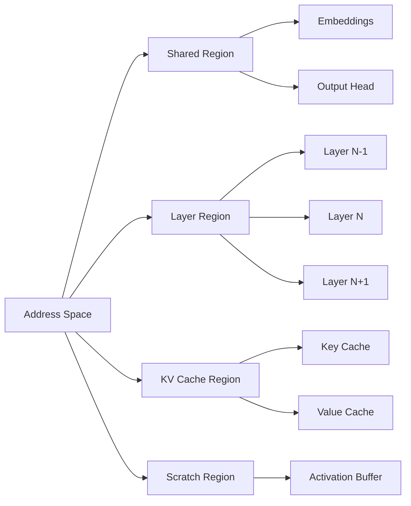
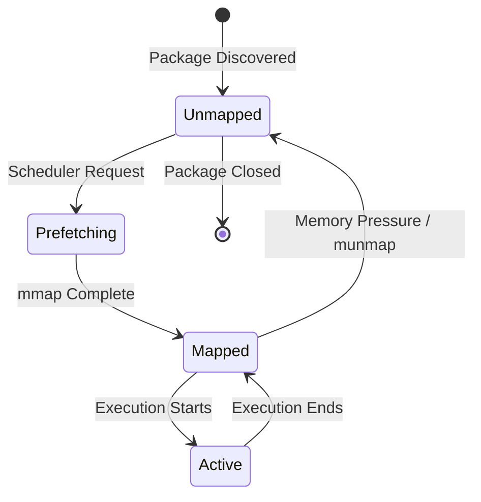
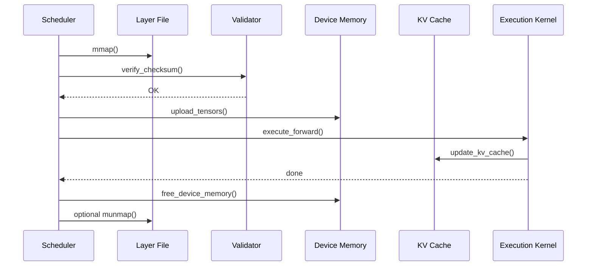
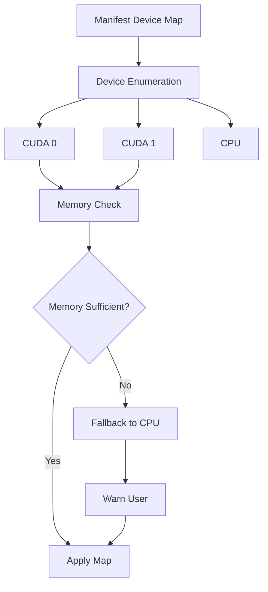

# ARTX6 — Memory Model

## Architecture Specification

**Document Name:** ARTX6_—_Memory_Model.md  
**Codename:** Mensa Rotunda  
**Tagline:** Designed for the Impossible.  
**Version:** 1.0.0-draft  
**Date:** 2026-07-10  
**Status:** Draft  

---

## Revision History

| Version | Date | Author | Description |
|---------|------|--------|-------------|
| 1.0.0-draft | 2026-07-10 | GLLM Core Team | Extracted from ArchGLLMFormat.md master document |

---

## Table of Contents

- [Memory Model](#memory-model)
  - [Address Space Layout](#address-space-layout)
  - [Memory Alignment](#memory-alignment)
  - [Quantization and Memory](#quantization-and-memory)
- [Memory Lifecycle](#memory-lifecycle)
  - [Lifecycle States](#lifecycle-states)
  - [State Transitions](#state-transitions)
- [Layer Lifecycle](#layer-lifecycle)
  - [Layer Execution Stages](#layer-execution-stages)
  - [KV Cache Management](#kv-cache-management)
- [Prefetch Strategy](#prefetch-strategy)
  - [Adaptive Prefetching](#adaptive-prefetching)
  - [Prefetcher Pseudocode](#prefetcher-pseudocode)
- [Device Mapping](#device-mapping)
  - [Device Map Specification](#device-map-specification)
  - [Device Map Resolution](#device-map-resolution)
  - [Cross-Device Execution](#cross-device-execution)
- [Related Documents](#related-documents)

---

# Memory Model

## Address Space Layout

The GLLM runtime divides the address space into four regions:

1. **Shared Region:** Permanently mapped shared components.
2. **Layer Region:** Rotating mapping of current and prefetched layers.
3. **KV Cache Region:** Dynamically allocated cache for attention keys and values.
4. **Scratch Region:** Temporary buffers for activations, reused across layers.



## Memory Alignment

All tensor data in layer files is aligned to 64-byte boundaries. This ensures:

- Cache line alignment for CPU execution
- DMA alignment for GPU transfer
- Vector instruction alignment (AVX-512, NEON)

## Quantization and Memory

Quantized tensors are stored in their native quantized layout. The runtime does not dequantize into FP32 buffers unless required by the execution kernel. For Q4_K quantized layers, the working memory for a single layer is approximately:

```
layer_memory = sum(tensor_size for tensor in layer.tensors)
```

This is typically 1/4 to 1/8 of the FP32 equivalent.

For layer file format details, see ARTX4: Layer Specification. For package structure, see ARTX2: Package Specification.

---

# Memory Lifecycle

## Lifecycle States

An execution unit transitions through the following states:



## State Transitions

| Transition | Trigger | Action |
|------------|---------|--------|
| Unmapped -> Prefetching | Scheduler adds layer to prefetch queue | File opened, mmap initiated |
| Prefetching -> Mapped | OS page fault completes | Tensor pointers become valid |
| Mapped -> Active | Execution engine begins layer forward pass | GPU upload initiated (if needed) |
| Active -> Mapped | Layer execution completes | GPU buffers released, CPU mapping retained |
| Mapped -> Unmapped | Memory pressure or scheduler decision | munmap called, pages returned to OS |

For runtime scheduler details, see ARTX5: Runtime Architecture, Section 3.

---

# Layer Lifecycle

## Layer Execution Stages

A layer progresses through the following stages during inference:

1. **Load:** Memory map the layer file.
2. **Validate:** Verify checksum.
3. **Upload:** Copy tensors to device memory (GPU).
4. **Execute:** Run the forward pass kernel.
5. **Cache Update:** Append KV tensors to the KV cache.
6. **Release:** Free device memory, optionally unmap host memory.



## KV Cache Management

The KV cache is allocated as a contiguous block per layer or as a single large block for all layers. The allocation strategy depends on the execution device:

- **CPU:** Per-layer KV cache, allocated on demand.
- **GPU:** Single large KV cache, pre-allocated to avoid CUDA malloc overhead during inference.

The KV cache size for a layer is:

```
kv_cache_size = 2 * num_kv_heads * head_dim * seq_len * dtype_size
```

Where `seq_len` grows during the generation process. The runtime over-allocates the KV cache to the maximum context length to avoid reallocation.

For runtime execution details, see ARTX5: Runtime Architecture. For distributed KV cache, see ARTX10: Distributed Runtime.

---

# Prefetch Strategy

## Adaptive Prefetching

The runtime implements an adaptive prefetcher that adjusts the prefetch window based on real-time measurements:

- **Layer Load Time:** Measured from `mmap` to first tensor access.
- **Layer Execution Time:** Measured from kernel launch to kernel completion.
- **Device Transfer Time:** Measured from host-to-device copy start to finish.

If the measured layer load time exceeds the execution time of the previous layer, the prefetcher increases the window size. If memory pressure is detected, the prefetcher decreases the window size.

## Prefetcher Pseudocode

```rust
struct Prefetcher {
    window_size: usize,
    max_window: usize,
    layer_load_times: Vec<Duration>,
    layer_exec_times: Vec<Duration>,
}

impl Prefetcher {
    fn adjust_window(&mut self) {
        let avg_load = self.layer_load_times.iter().sum() / self.layer_load_times.len();
        let avg_exec = self.layer_exec_times.iter().sum() / self.layer_exec_times.len();

        if avg_load > avg_exec * 1.2 {
            self.window_size = min(self.window_size + 1, self.max_window);
        } else if avg_load < avg_exec * 0.5 {
            self.window_size = max(self.window_size - 1, 1);
        }
    }
}
```

For scheduler integration, see ARTX5: Runtime Architecture, Section 3.

---

# Device Mapping

## Device Map Specification

The manifest may specify a default device map. The runtime may override this based on available hardware. The device map assigns each layer to a device:

```json
{
  "device_map": {
    "default": "cuda:0",
    "layers": {
      "0-39": "cuda:0",
      "40-79": "cuda:1"
    }
  }
}
```

## Device Map Resolution

The runtime resolves the device map during initialization:

1. Parse manifest device map.
2. Enumerate available devices (CUDA devices, CPU).
3. Validate that assigned devices exist.
4. Compute memory requirements per device.
5. If memory is insufficient, fall back to CPU or raise an error.



## Cross-Device Execution

For pipeline parallelism across multiple GPUs, the runtime manages inter-device transfers:

- **Layer N on GPU 0** outputs activations.
- **Runtime copies activations to GPU 1** via peer-to-peer or host staging.
- **Layer N+1 on GPU 1** receives the activations.

The runtime overlaps computation and transfer where possible using CUDA streams or equivalent async APIs.

For distributed multi-node execution, see ARTX10: Distributed Runtime. For manifest device map syntax, see ARTX3: Manifest Specification.

---

## Related Documents

| Document | Title | Description |
|----------|-------|-------------|
| ARTX1 | GLLM Overview | Entry-point overview of the GLLM format, vision, and ecosystem |
| ARTX2 | Package Specification | Physical and logical package structure, archive format, execution units |
| ARTX3 | Manifest Specification | gllm.json schema, metadata, versioning, and extension registry |
| ARTX4 | Layer Specification | Binary layer file format, tensor layouts, and extension layer types |
| ARTX5 | Runtime Architecture | Execution model, scheduler, CPU/GPU/hybrid runtime, and failure recovery |
| **ARTX6** | **Memory Model** | **This document** |
| ARTX7 | Converter Architecture | Conversion pipeline, parsers, validation, and error handling |
| ARTX8 | Extension System | Plugin architecture, MLA, Mamba, MoE, and custom layer types |
| ARTX9 | Compatibility & Versioning | Format versioning, source compatibility, and known limitations |
| ARTX10 | Distributed Runtime | Multi-node execution, pipeline/tensor parallelism, and recovery |
| ARTX11 | Benchmarks | Benchmark suite, methodology, and measurement standards |

---

*This document is part of the GLLM Architecture Specification Series. The master document is ArchGLLMFormat.md.*
