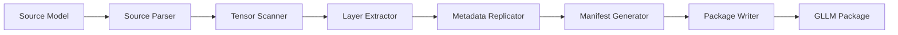
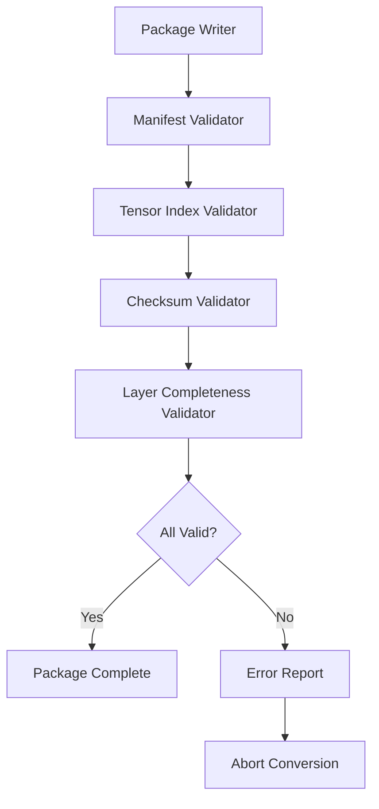

# ARTX7 — Converter Architecture

## Architecture Specification

**Document Name:** ARTX7_—_Converter_Architecture.md  
**Codename:** Mensa Rotunda  
**Tagline:** Designed for the Impossible.  
**Version:** 1.0.0-draft  
**Date:** 2026-07-10  
**Status:** Draft  

---

## Revision History

| Version | Date | Author | Description |
|---------|------|--------|-------------|
| 1.0.0-draft | 2026-07-10 | GLLM Core Team | Extracted from ArchGLLMFormat.md master document |

---

## Table of Contents

- [Converter Architecture](#converter-architecture)
- [GGUF Parser](#gguf-parser)
  - [Parsing Strategy](#parsing-strategy)
  - [Tensor Name Mapping](#tensor-name-mapping)
  - [Metadata Extraction](#metadata-extraction)
- [Tensor Scanner](#tensor-scanner)
  - [Scanning Phase](#scanning-phase)
  - [Quantization Detection](#quantization-detection)
- [Layer Extraction](#layer-extraction)
  - [Layer Grouping](#layer-grouping)
  - [Layer File Construction](#layer-file-construction)
  - [Shared Component Extraction](#shared-component-extraction)
- [Metadata Replication](#metadata-replication)
  - [Metadata Mapping](#metadata-mapping)
  - [Custom Metadata Preservation](#custom-metadata-preservation)
- [Manifest Generator](#manifest-generator)
  - [Manifest Construction](#manifest-construction)
  - [Checksum Computation](#checksum-computation)
- [Validation](#validation)
  - [Converter Validation](#converter-validation)
  - [Validation Pipeline](#validation-pipeline)
- [Error Handling](#error-handling)
  - [Converter Error Types](#converter-error-types)
  - [Error Reporting](#error-reporting)
- [Compatibility](#compatibility)
  - [Source Format Versions](#source-format-versions)
  - [Target Format Versions](#target-format-versions)
- [Related Documents](#related-documents)

---

# Converter Architecture

The GLLM converter transforms models from source formats (GGUF, Safetensors, PyTorch) into GLLM packages. It is a command-line tool with a pipeline architecture.



---

# GGUF Parser

## Parsing Strategy

The GGUF parser reads the GGUF metadata header and tensor index. It maps GGUF tensor names to GLLM layer structures using naming convention heuristics.

## Tensor Name Mapping

GGUF tensor names follow the pattern `blk.N.tensor_name`. The parser extracts the layer index `N` and maps the tensor to the corresponding GLLM layer file.

| GGUF Name | GLLM Layer | GLLM Tensor |
|-----------|------------|-------------|
| `token_embd.weight` | `shared` | `token_embeddings` |
| `output_norm.weight` | `shared` | `output_norm.weight` |
| `output.weight` | `shared` | `output_head.weight` |
| `blk.0.attn_q.weight` | `layer_000` | `attn_q.weight` |
| `blk.0.attn_k.weight` | `layer_000` | `attn_k.weight` |
| `blk.0.ffn_gate.weight` | `layer_000` | `ffn_gate.weight` |

## Metadata Extraction

The GGUF parser extracts the following metadata into the GLLM manifest:

- `general.architecture` -> `architecture`
- `general.name` -> `model_id`
- `llama.context_length` -> `metadata.context_length`
- `llama.embedding_length` -> `metadata.embedding_length`
- `llama.block_count` -> `metadata.num_layers`
- `llama.attention.head_count` -> `metadata.num_heads`
- `llama.attention.head_count_kv` -> `metadata.head_count_kv`
- `llama.rope.freq_base` -> `metadata.rope_freq_base`

For manifest schema details, see ARTX3: Manifest Specification.

---

# Tensor Scanner

## Scanning Phase

The tensor scanner iterates over all tensors in the source model and collects:

- Tensor name
- Shape
- Data type
- Quantization parameters (if applicable)
- Raw data offset and size

## Quantization Detection

The scanner detects the quantization scheme from the source format:

- **GGUF:** Quantization type is stored in the tensor metadata (`ggml_type`).
- **Safetensors:** Quantization is not native; the scanner requires external metadata or assumes FP16/FP32.
- **PyTorch:** The scanner inspects tensor dtypes and custom quantization attributes.

For data type codes, see ARTX4: Layer Specification, Section 2.3.

---

# Layer Extraction

## Layer Grouping

The layer extractor groups tensors into layers based on naming conventions. For transformer models, the grouping rule is:

```python
def extract_layer(tensor_name, num_layers):
    if tensor_name.startswith("blk."):
        layer_idx = int(tensor_name.split(".")[1])
        return f"layer_{layer_idx:03d}"
    elif tensor_name in SHARED_TENSORS:
        return "shared"
    else:
        return "projector"
```

## Layer File Construction

For each layer, the extractor:

1. Creates a new layer file.
2. Writes the GLLM header.
3. Writes the tensor index.
4. Writes the tensor data in execution order.
5. Computes the layer file checksum.

## Shared Component Extraction

Shared tensors are collected into `GLLMShared.gllm`. The extractor ensures that tied weights (e.g., input and output embeddings) are not duplicated.

For layer file binary format, see ARTX4: Layer Specification. For shared components, see ARTX2: Package Specification.

---

# Metadata Replication

## Metadata Mapping

The metadata replicator translates source format metadata into the GLLM manifest schema. It handles:

- **Architecture-specific metadata:** RoPE parameters, attention bias, sliding window.
- **Quantization metadata:** Global quantization type, per-tensor quantization overrides.
- **Tokenizer metadata:** Vocabulary size, special tokens, tokenizer model type.

## Custom Metadata Preservation

The replicator preserves unknown metadata keys in the `custom_metadata` object. This ensures that no information is lost during conversion.

For manifest metadata schema, see ARTX3: Manifest Specification, Section 2.

---

# Manifest Generator

## Manifest Construction

The manifest generator assembles the final `gllm.json` from the extracted layers, shared components, and metadata. It performs the following steps:

1. Set `gllm_version` to the current format version.
2. Set `model_id` from source metadata or user input.
3. Populate `metadata` from the metadata replicator.
4. Add `shared` entry with file path, checksum, and tensor index.
5. Add `layers` array with entries for each layer.
6. Add `projector` entry if present.
7. Collect `extensions` from layer types used.
8. Write `gllm.json`.

## Checksum Computation

The manifest generator computes SHA-256 checksums for all generated files using a streaming hash to minimize memory usage:

```rust
use sha2::{Sha256, Digest};

fn compute_checksum(path: &Path) -> Result<String, io::Error> {
    let mut file = File::open(path)?;
    let mut hasher = Sha256::new();
    let mut buffer = [0u8; 8192];

    loop {
        let n = file.read(&mut buffer)?;
        if n == 0 { break; }
        hasher.update(&buffer[..n]);
    }

    Ok(format!("sha256:{:x}", hasher.finalize()))
}
```

For checksum system details, see ARTX2: Package Specification, Section 4.

---

# Validation

## Converter Validation

The converter validates the generated package before completion:

1. **Manifest Schema Validation:** Verify that `gllm.json` conforms to the JSON schema.
2. **Tensor Index Consistency:** Verify that tensor offsets and sizes match the actual file sizes.
3. **Checksum Verification:** Re-compute checksums and verify against manifest entries.
4. **Layer Completeness:** Verify that all layers referenced in the manifest exist as files.
5. **Metadata Completeness:** Verify that required metadata fields are present.

## Validation Pipeline



---

# Error Handling

## Converter Error Types

| Error Code | Description | Recovery |
|------------|-------------|----------|
| `E001` | Unsupported source format | Abort |
| `E002` | Missing required metadata | Abort or prompt user |
| `E003` | Tensor shape mismatch | Abort |
| `E004` | Unknown quantization type | Abort or default to FP16 |
| `E005` | Disk write failure | Abort |
| `E006` | Checksum mismatch during validation | Abort and clean up |

## Error Reporting

The converter reports errors in a structured format:

```json
{
  "error_code": "E004",
  "message": "Unknown quantization type: Q5_K_M",
  "tensor": "blk.0.attn_q.weight",
  "suggestion": "Use --fallback-quantization Q4_K_M or convert to FP16"
}
```

---

# Compatibility

## Source Format Versions

The converter supports the following source format versions:

| Source Format | Supported Versions | Notes |
|---------------|-------------------|-------|
| GGUF | 3.0+ | Full support for all GGML quantization types |
| Safetensors | All | Requires external metadata for architecture info |
| PyTorch | 1.9+ | Requires `torch.load` compatibility |
| ONNX | 1.10+ | Limited to static transformer graphs |

## Target Format Versions

The converter generates packages conforming to the GLLM format version specified by the `--format-version` flag. The default is the latest stable version.

For format versioning rules, see ARTX9: Compatibility & Versioning.

---

## Related Documents

| Document | Title | Description |
|----------|-------|-------------|
| ARTX1 | GLLM Overview | Entry-point overview of the GLLM format, vision, and ecosystem |
| ARTX2 | Package Specification | Physical and logical package structure, archive format, execution units |
| ARTX3 | Manifest Specification | gllm.json schema, metadata, versioning, and extension registry |
| ARTX4 | Layer Specification | Binary layer file format, tensor layouts, and extension layer types |
| ARTX5 | Runtime Architecture | Execution model, scheduler, CPU/GPU/hybrid runtime, and failure recovery |
| ARTX6 | Memory Model | Address space layout, memory lifecycle, prefetch strategy, and KV cache |
| **ARTX7** | **Converter Architecture** | **This document** |
| ARTX8 | Extension System | Plugin architecture, MLA, Mamba, MoE, and custom layer types |
| ARTX9 | Compatibility & Versioning | Format versioning, source compatibility, and known limitations |
| ARTX10 | Distributed Runtime | Multi-node execution, pipeline/tensor parallelism, and recovery |
| ARTX11 | Benchmarks | Benchmark suite, methodology, and measurement standards |

---

*This document is part of the GLLM Architecture Specification Series. The master document is ArchGLLMFormat.md.*
