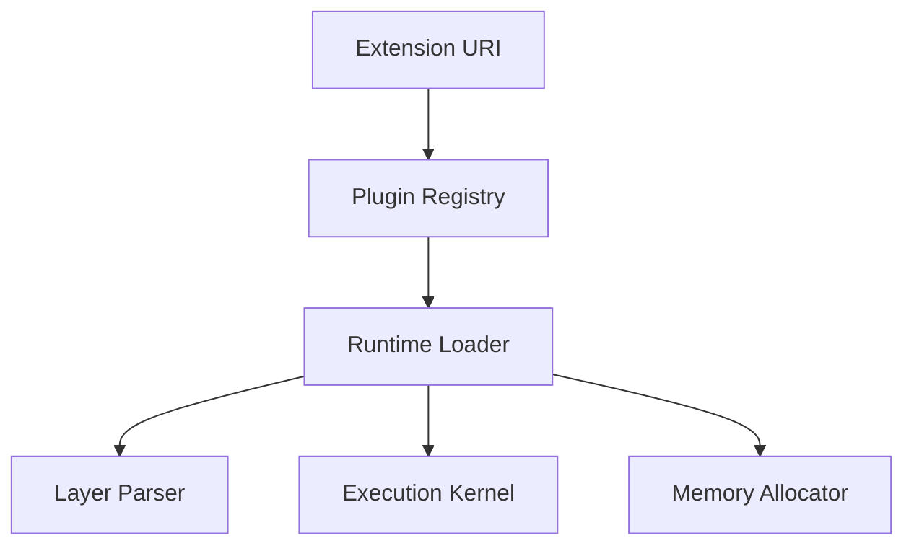
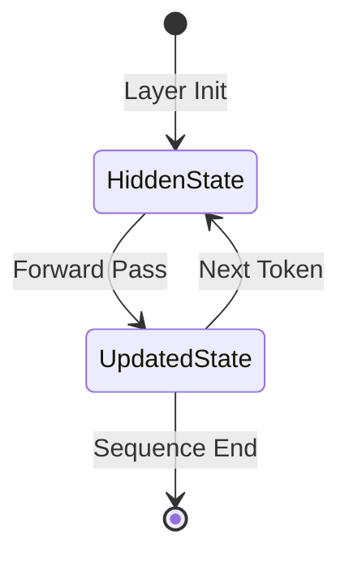
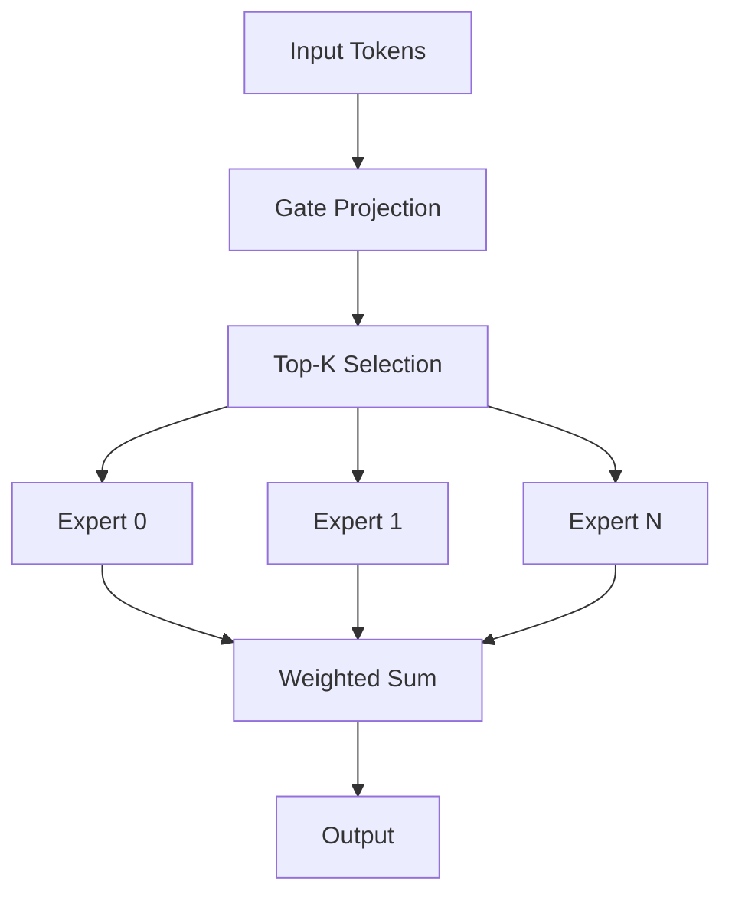

# ARTX8 — Extension System

## Architecture Specification

**Document Name:** ARTX8_—_Extension_System.md  
**Codename:** Mensa Rotunda  
**Tagline:** Designed for the Impossible.  
**Version:** 1.0.0-draft  
**Date:** 2026-07-10  
**Status:** Draft  

---

## Revision History

| Version | Date | Author | Description |
|---------|------|--------|-------------|
| 1.0.0-draft | 2026-07-10 | GLLM Core Team | Extracted from ArchGLLMFormat.md master document |

---

## Table of Contents

- [Extension System Overview](#extension-system-overview)
- [MLA (Multi-Head Latent Attention)](#mla-multi-head-latent-attention)
  - [MLA Layer Type](#mla-layer-type)
  - [MLA Tensor Layout](#mla-tensor-layout)
  - [MLA Runtime Support](#mla-runtime-support)
- [Mamba](#mamba)
  - [Mamba Layer Type](#mamba-layer-type)
  - [Mamba Tensor Layout](#mamba-tensor-layout)
  - [Mamba State Management](#mamba-state-management)
- [MoE (Mixture of Experts)](#moe-mixture-of-experts)
  - [MoE Layer Type](#moe-layer-type)
  - [MoE Tensor Layout](#moe-tensor-layout)
  - [MoE Execution Strategy](#moe-execution-strategy)
  - [MoE Memory Optimization](#moe-memory-optimization)
- [Future Architectures](#future-architectures)
- [Plugin System](#plugin-system)
  - [Plugin Interface](#plugin-interface)
  - [Plugin Loading](#plugin-loading)
  - [Plugin Versioning](#plugin-versioning)
- [Custom Layer Types](#custom-layer-types)
- [Future Metadata](#future-metadata)
- [Related Documents](#related-documents)

---

# Extension System Overview

GLLM extensions are plugins that extend the format and runtime with new layer types, projectors, and metadata schemas. Extensions are identified by URIs and registered in the manifest.



For extension URI scheme and manifest registration, see ARTX3: Manifest Specification, Section 5. For layer file format, see ARTX4: Layer Specification.

---

# MLA (Multi-Head Latent Attention)

## MLA Layer Type

MLA is an attention mechanism that compresses key and value states into a latent representation. The GLLM extension for MLA is identified by:

```
gllm:transformer/mla@v1
```

## MLA Tensor Layout

An MLA layer file contains the following tensors:

| Tensor | Shape | Description |
|--------|-------|-------------|
| `input_norm.weight` | [D] | Pre-attention normalization |
| `attn_q.weight` | [D, D] | Query projection |
| `attn_kv_latent.weight` | [D, L] | Key-value latent compression |
| `attn_o.weight` | [D, D] | Output projection |
| `post_attn_norm.weight` | [D] | Post-attention normalization |

Where `L` is the latent dimension, typically `L < D`.

## MLA Runtime Support

The MLA plugin implements:

- Latent compression during the forward pass
- Decompression for KV cache storage (optional)
- Fused MLA kernels for GPU execution

For runtime architecture, see ARTX5: Runtime Architecture. For memory model, see ARTX6: Memory Model.

---

# Mamba

## Mamba Layer Type

Mamba is a state-space model layer. The GLLM extension is:

```
gllm:mamba/standard@v1
```

## Mamba Tensor Layout

| Tensor | Shape | Description |
|--------|-------|-------------|
| `in_proj.weight` | [ED, D] | Input projection (expands to ED) |
| `conv1d.weight` | [ED, K] | 1D convolution weights |
| `x_proj.weight` | [SS, ED] | X projection (delta, B, C) |
| `dt_proj.weight` | [ED, SS] | Delta projection |
| `A_log` | [ED] | Discretized state matrix parameter |
| `D` | [ED] | Skip connection parameter |
| `out_proj.weight` | [D, ED] | Output projection |

Where `E` is the expansion factor, `K` is the convolution kernel size, and `SS` is the state space dimension.

## Mamba State Management

Unlike transformer layers, Mamba layers maintain a recurrent state. The runtime manages this state in the scratch region:



For memory model details, see ARTX6: Memory Model. For runtime execution, see ARTX5: Runtime Architecture.

---

# MoE (Mixture of Experts)

## MoE Layer Type

MoE layers route tokens to a subset of expert feed-forward networks. The GLLM extension is:

```
gllm:transformer/moe@v1
```

## MoE Tensor Layout

| Tensor | Shape | Description |
|--------|-------|-------------|
| `input_norm.weight` | [D] | Pre-MoE normalization |
| `gate.weight` | [N, D] | Router gate projection |
| `expert_0.ffn_gate.weight` | [H, D] | Expert 0 gate projection |
| `expert_0.ffn_up.weight` | [H, D] | Expert 0 up projection |
| `expert_0.ffn_down.weight` | [D, H] | Expert 0 down projection |
| `expert_N.ffn_*.weight` | ... | Expert N projections |

Where `N` is the number of experts and `H` is the expert hidden dimension.

## MoE Execution Strategy

The MoE plugin implements:

- **Top-K Routing:** Selects K experts per token.
- **Expert Parallelism:** Distributes experts across devices (future).
- **Sparse Execution:** Only loads expert weights for the selected experts.



## MoE Memory Optimization

For large MoE models (e.g., 8x22B), loading all expert weights simultaneously is impractical. The MoE plugin supports on-demand expert loading:

1. Load gate weights (permanent).
2. For each token batch:
   a. Compute routing.
   b. Load selected expert weights.
   c. Execute experts.
   d. Unload expert weights.

For distributed MoE execution, see ARTX10: Distributed Runtime. For memory model, see ARTX6: Memory Model.

---

# Future Architectures

The extension system is designed to accommodate architectures not yet invented. The requirements for a new architecture extension are:

1. Define a URI for the layer type.
2. Specify the tensor layout and naming convention.
3. Implement a runtime plugin with parser, allocator, and execution kernels.
4. Update the converter to recognize the architecture in source formats.

For converter architecture, see ARTX7: Converter Architecture. For runtime architecture, see ARTX5: Runtime Architecture.

---

# Plugin System

## Plugin Interface

Runtime plugins implement the following interface (Rust pseudocode):

```rust
trait LayerPlugin {
    fn parse_tensors(&self, index: &TensorIndex) -> Result<LayerSpec, Error>;
    fn allocate_memory(&self, spec: &LayerSpec, device: &Device) -> Result<MemoryPlan, Error>;
    fn execute(&self, inputs: &TensorMap, outputs: &mut TensorMap, ctx: &ExecutionContext) -> Result<(), Error>;
    fn supports_dtype(&self, dtype: DType) -> bool;
}
```

## Plugin Loading

Plugins are loaded dynamically at runtime:

1. The runtime reads the `extensions` array from the manifest.
2. For each URI, the runtime searches the plugin path (default: `/usr/lib/gllm/plugins/`).
3. The runtime loads the shared library and calls the registration function.
4. The plugin registers itself with the runtime's plugin registry.

```rust
#[no_mangle]
pub extern "C" fn gllm_register_plugin(registry: &mut PluginRegistry) {
    registry.register(
        "gllm:transformer/moe@v1",
        Box::new(MoeLayerPlugin::new())
    );
}
```

## Plugin Versioning

Plugins are versioned independently of the GLLM format. The runtime requires an exact version match for layer type URIs. A plugin supporting `v2` of a layer type does not automatically support `v1`.

For layer type versioning rules, see ARTX9: Compatibility & Versioning.

---

# Custom Layer Types

Users may define custom layer types for research or proprietary architectures. The process is:

1. Define the layer type URI (e.g., `myorg:custom/fused@v1`).
2. Implement the plugin interface.
3. Convert the model using a custom converter plugin.
4. Reference the custom URI in the manifest.

For manifest extension registration, see ARTX3: Manifest Specification, Section 5. For converter details, see ARTX7: Converter Architecture.

---

# Future Metadata

Future versions of GLLM may extend the manifest metadata schema to support:

- **Multi-modal inputs:** Image encoder metadata, audio encoder metadata.
- **Tool use:** Function calling schema, tool definitions.
- **Safety filters:** Content moderation metadata, refusal triggers.
- **Provenance:** Training data fingerprints, license information.

These extensions will be added as optional manifest fields to maintain backward compatibility. For manifest metadata schema, see ARTX3: Manifest Specification, Section 2.

---

## Related Documents

| Document | Title | Description |
|----------|-------|-------------|
| ARTX1 | GLLM Overview | Entry-point overview of the GLLM format, vision, and ecosystem |
| ARTX2 | Package Specification | Physical and logical package structure, archive format, execution units |
| ARTX3 | Manifest Specification | gllm.json schema, metadata, versioning, and extension registry |
| ARTX4 | Layer Specification | Binary layer file format, tensor layouts, and extension layer types |
| ARTX5 | Runtime Architecture | Execution model, scheduler, CPU/GPU/hybrid runtime, and failure recovery |
| ARTX6 | Memory Model | Address space layout, memory lifecycle, prefetch strategy, and KV cache |
| ARTX7 | Converter Architecture | Conversion pipeline, parsers, validation, and error handling |
| **ARTX8** | **Extension System** | **This document** |
| ARTX9 | Compatibility & Versioning | Format versioning, source compatibility, and known limitations |
| ARTX10 | Distributed Runtime | Multi-node execution, pipeline/tensor parallelism, and recovery |
| ARTX11 | Benchmarks | Benchmark suite, methodology, and measurement standards |

---

*This document is part of the GLLM Architecture Specification Series. The master document is ArchGLLMFormat.md.*
