# GwenLand Language Model Format (GLLM)

## Architecture Specification

**Document Name:** ArchGLLMFormat.md  
**Codename:** Mensa Rotunda  
**Tagline:** Designed for the Impossible.  
**Version:** 1.0.0-draft  
**Date:** 2026-07-10  
**Status:** Draft  

---

## Revision History

| Version | Date | Author | Description |
|---------|------|--------|-------------|
| 0.1.0 | 2026-06-15 | GLLM Core Team | Initial draft structure |
| 0.2.0 | 2026-06-28 | GLLM Core Team | Runtime and memory model sections |
| 0.3.0 | 2026-07-05 | GLLM Core Team | Converter and extension system |
| 1.0.0-draft | 2026-07-10 | GLLM Core Team | Master architecture document consolidation |

---

## Table of Contents

- [PART I: Introduction](#part-i-introduction)
  - [Vision](#vision)
  - [Background](#background)
  - [Motivation](#motivation)
  - [Problem Statement](#problem-statement)
  - [Limitations of Existing Formats](#limitations-of-existing-formats)
  - [Why GLLM](#why-gllm)
  - [Goals](#goals)
  - [Non-Goals](#non-goals)
  - [Design Philosophy](#design-philosophy)
  - [Core Principles](#core-principles)
  - [Terminology](#terminology)
- [PART II: Overall Architecture](#part-ii-overall-architecture)
  - [High-Level Architecture](#high-level-architecture)
  - [Package Structure](#package-structure)
  - [Manifest](#manifest)
  - [Shared Components](#shared-components)
  - [Execution Units](#execution-units)
  - [Layer Files](#layer-files)
  - [Tensor Organization](#tensor-organization)
  - [Projectors](#projectors)
  - [Metadata](#metadata)
  - [Checksums](#checksums)
  - [Versioning](#versioning)
  - [Extension Points](#extension-points)
- [PART III: Runtime](#part-iii-runtime)
  - [Execution Model](#execution-model)
  - [Sequential Loading](#sequential-loading)
  - [Runtime Scheduler](#runtime-scheduler)
  - [Memory Model](#memory-model)
  - [Memory Lifecycle](#memory-lifecycle)
  - [Layer Lifecycle](#layer-lifecycle)
  - [Prefetch Strategy](#prefetch-strategy)
  - [Device Mapping](#device-mapping)
  - [CPU Runtime](#cpu-runtime)
  - [GPU Runtime](#gpu-runtime)
  - [Hybrid Runtime](#hybrid-runtime)
  - [Distributed Runtime](#distributed-runtime)
  - [Failure Recovery](#failure-recovery)
- [PART IV: Converter](#part-iv-converter)
  - [GGUF Parser](#gguf-parser)
  - [Tensor Scanner](#tensor-scanner)
  - [Layer Extraction](#layer-extraction)
  - [Metadata Replication](#metadata-replication)
  - [Manifest Generator](#manifest-generator)
  - [Validation](#validation)
  - [Error Handling](#error-handling)
  - [Compatibility](#compatibility)
- [PART V: Extensions](#part-v-extensions)
  - [MLA](#mla)
  - [Mamba](#mamba)
  - [MoE](#moe)
  - [Future Architectures](#future-architectures)
  - [Plugin System](#plugin-system)
  - [Custom Layer Types](#custom-layer-types)
  - [Future Metadata](#future-metadata)
- [PART VI: Benchmarks](#part-vi-benchmarks)
  - [Memory](#memory)
  - [Runtime](#runtime)
  - [Loading](#loading)
  - [Package Size](#package-size)
  - [Sequential Loading](#sequential-loading-1)
  - [Storage Comparison](#storage-comparison)
  - [Benchmark Methodology](#benchmark-methodology)
- [PART VII: Roadmap](#part-vii-roadmap)
  - [Current State](#current-state)
  - [Future Versions](#future-versions)
  - [Open Questions](#open-questions)
  - [Known Limitations](#known-limitations)
  - [Future Work](#future-work)
- [Appendix](#appendix)
  - [Glossary](#glossary)
  - [References](#references)
  - [Acknowledgements](#acknowledgements)
- [AI Refactoring Instructions](#ai-refactoring-instructions)

---

# PART I: Introduction

## Vision

GLLM (GwenLand Language Model Format) is a binary packaging and runtime format designed for large language model inference. It prioritizes sequential loading, memory-mapped execution, and minimal runtime overhead. GLLM treats the model not as a monolithic tensor dump, but as a structured execution package composed of discrete, self-describing layers.

The format is designed to support transformer variants, state-space models, mixture-of-experts architectures, and future architectures not yet conceived. It is target-agnostic at the package level and execution-aware at the runtime level.

## Background

Current model formats fall into two categories: universal exchange formats (ONNX, Safetensors) and runtime-optimized containers (GGUF). Exchange formats prioritize interoperability; runtime containers prioritize inference efficiency. GLLM occupies a third space: a runtime-native format that remains structurally transparent and extensible.

The design of GLLM is informed by the following observations:

1. **Memory bandwidth is the bottleneck.** Loading a 70B parameter model from NVMe to GPU memory consumes measurable wall-clock time. Any format that requires deserialization, byte-order conversion, or tensor reconstruction adds latency to cold-start scenarios.

2. **Layer-level execution is the dominant pattern.** Transformer inference proceeds layer by layer. Attention, feed-forward, and normalization blocks execute sequentially. A format that aligns storage boundaries with execution boundaries enables natural memory mapping and prefetching.

3. **Metadata must be first-class.** Model architecture, quantization scheme, rope parameters, and tokenizer configuration are not afterthoughts. They are prerequisites for correct execution. GLLM embeds this metadata in a structured manifest that is parseable without loading tensors.

## Motivation

Existing formats force a trade-off between loading speed and structural clarity:

- **GGUF** stores tensors in a single file with a key-value metadata header. It is efficient for mmap but conflates all tensors into one namespace, making layer-level isolation difficult.
- **Safetensors** provides fast tensor loading via memory mapping but lacks architecture metadata, requiring external configuration files.
- **ONNX** is graph-oriented and general-purpose, introducing significant overhead for static transformer graphs.

GLLM was created to eliminate this trade-off. It provides:

- Layer-level file isolation for granular memory management
- A mandatory manifest describing architecture and execution topology
- Native support for multi-file packages enabling distributed storage
- Extensible layer types without format revision
- Checksum coverage for every execution unit

## Problem Statement

Given a language model with N parameters, quantized to Q bits, targeting a device with D memory, how do we:

1. Package the model so that cold-start loading time is minimized?
2. Enable layer-level memory mapping so that working set size approaches the size of a single layer?
3. Validate package integrity without loading the entire file?
4. Support new layer types (MLA, Mamba, MoE) without revising the core format?
5. Permit distributed execution across heterogeneous devices?

## Limitations of Existing Formats

### GGUF

GGUF stores all tensors in a single binary file preceded by a metadata header. While this enables `mmap` on the entire file, it has the following structural limitations:

- **No layer boundaries.** Tensors are named (`blk.0.attn_q.weight`) but not grouped. Runtimes must infer layer boundaries from naming conventions.
- **Single file constraint.** Large models (>100GB) exceed practical file system limits and require manual splitting.
- **Metadata flatness.** Key-value metadata is unstructured; nested configuration (e.g., per-expert MoE parameters) requires ad-hoc encoding.
- **No integrity verification.** There is no standard checksum mechanism for tensors or metadata.

### Safetensors

Safetensors uses a JSON header followed by raw tensor buffers. It is safe (no pickle) and fast but lacks:

- **Architecture metadata.** The header contains only tensor names, shapes, dtypes, and offsets. Model architecture, tokenizer, and hyperparameters must be provided externally.
- **No execution topology.** There is no concept of layers, execution order, or device placement.
- **No quantization metadata.** Quantization parameters (scales, zero points, block sizes) are not standardized in the format.

### ONNX

ONNX represents models as computation graphs. For LLMs, this introduces:

- **Graph verbosity.** A 70B transformer produces an ONNX graph with thousands of nodes, making the file large and parsing slow.
- **Runtime mismatch.** ONNX is designed for general-purpose inference. LLM-specific optimizations (KV-cache management, rope fusion, flash attention) are not expressible in standard ONNX.
- **No mmap-friendly layout.** Tensor data is interleaved with graph structure, preventing efficient memory mapping.

## Why GLLM

GLLM addresses the limitations above through five structural decisions:

1. **Layer Files:** Each layer is stored in a separate file. This enables the runtime to map only the layers currently executing, reducing working set size.
2. **Manifest:** A single JSON manifest describes the entire package, including architecture, layer topology, tensor metadata, and checksums. The manifest is parseable without reading layer files.
3. **Shared Components:** Common tensors (token embeddings, output head, normalization constants) are stored in a separate shared file, eliminating duplication.
4. **Extension System:** Layer types are identified by a URI scheme. New layer types are registered in the manifest; runtimes load the appropriate plugin.
5. **Multi-Package Execution:** The manifest supports references to external packages, enabling model parallelism across devices and hosts.

## Goals

| ID | Goal | Priority |
|----|------|----------|
| G1 | Minimize cold-start loading time for inference | P0 |
| G2 | Enable layer-level memory mapping | P0 |
| G3 | Support models from 1B to 1T+ parameters | P0 |
| G4 | Provide structural integrity verification | P0 |
| G5 | Support CPU, GPU, and hybrid execution | P0 |
| G6 | Support distributed inference across multiple hosts | P1 |
| G7 | Enable plugin-based layer types without format revision | P1 |
| G8 | Maintain human-readable metadata and diagnostics | P2 |
| G9 | Support quantization schemes (Q4_0, Q8_0, FP16, BF16, FP8) | P0 |
| G10 | Permit incremental package updates (LoRA, adapter layers) | P2 |

## Non-Goals

| ID | Non-Goal | Rationale |
|----|----------|-----------|
| NG1 | Training checkpoint format | GLLM is inference-only. Training checkpoints require optimizer state, gradient history, and mutable tensors. |
| NG2 | General-purpose graph format | GLLM is specialized for LLM layer sequences. General computation graphs are better served by ONNX or MLIR. |
| NG3 | Real-time streaming inference | GLLM targets batch and interactive inference, not sub-10ms real-time constraints. |
| NG4 | Universal hardware support | GLLM targets CPU (x86_64, ARM64) and GPU (CUDA, ROCm, Metal). Exotic accelerators are supported via plugins, not core format. |
| NG5 | Backward compatibility with GGUF or Safetensors | Conversion is one-way. GLLM is a native format, not a wrapper. |

## Design Philosophy

### Storage Follows Execution

The physical layout of a GLLM package mirrors the logical execution flow. If a model executes layers 0 through 79 sequentially, the package stores them as `GLLMTensorLayer-0000.gllm` through `GLLMTensorLayer-0079.gllm`. This alignment enables the runtime to prefetch layer N+1 while executing layer N.

### Metadata Is Executable

The manifest is not documentation. It is a machine-readable contract between the package and the runtime. A runtime that reads the manifest must be able to construct the execution graph, allocate memory, and verify integrity without inspecting tensor data.

### Extensibility Over Generality

GLLM does not attempt to describe every possible neural network. It describes language model layers and provides an extension mechanism for new layer types. This narrow focus permits aggressive optimization.

### Fail Fast, Fail Loud

Every execution unit (layer file, shared component, manifest) carries a checksum. The runtime verifies checksums before mapping memory. A corrupted package is detected at load time, not during inference.

## Core Principles

1. **Immutability.** GLLM packages are read-only after creation. There are no in-place updates. Adapters and LoRA are stored as separate layer files referenced by the manifest.
2. **Locality.** Tensors within a layer file are stored in execution order. The runtime reads them sequentially, maximizing prefetcher efficiency.
3. **Transparency.** All metadata is JSON. All tensor offsets are explicit. A package can be inspected and debugged with standard tools.
4. **Minimalism.** The format contains no redundant information. If a value can be derived, it is not stored.
5. **Stability.** The core format (manifest schema, layer file header, checksum algorithm) is versioned independently of layer type extensions.

## Terminology

| Term | Definition |
|------|------------|
| **Package** | A complete GLLM model consisting of a manifest, shared components, and layer files. |
| **Manifest** | The JSON file `gllm.json` at the root of the package. The single source of truth for package structure. |
| **Layer** | A logical execution unit (e.g., transformer block, Mamba block, MoE layer). |
| **Layer File** | A binary file containing the tensors and metadata for a single layer. |
| **Shared Component** | A tensor or set of tensors used by multiple layers (e.g., token embeddings). |
| **Execution Unit** | A layer file or shared component that can be loaded and executed independently. |
| **Tensor** | A multi-dimensional array of numerical values with a defined shape, dtype, and quantization scheme. |
| **Projector** | A tensor mapping layer outputs to vocabulary logits or multimodal embeddings. |
| **Extension** | A registered layer type identified by a URI, enabling plugin-based runtime support. |
| **Runtime** | The software system that loads a GLLM package and executes inference. |
| **Converter** | The tool that transforms models from source formats (GGUF, Safetensors, PyTorch) into GLLM. |
| **Working Set** | The set of memory pages currently mapped into the process address space. |
| **Prefetch** | The act of mapping a layer file into memory before it is required for execution. |
| **Device Map** | A manifest-defined mapping of layers to physical devices (CPU, GPU 0, GPU 1, etc.). |

---

# PART II: Overall Architecture

## High-Level Architecture

A GLLM package is a directory or archive containing:

- `gllm.json` — The manifest
- `GLLMShared.gllm` — Shared components (embeddings, output head, norms)
- `GLLMTensorLayer-NNNN.gllm` — Layer files, one per layer
- `GLLMProj.gllm` — Optional multimodal projector
- `checksums.sha256` — Optional aggregated checksums

The runtime interacts with the package through the following pipeline:

```
Manifest Parse -> Validation -> Device Map Construction ->
Shared Component Load -> Layer Prefetch -> Execution Loop
```

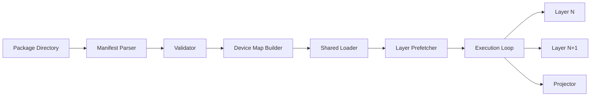

## Package Structure

### Directory Layout

```
model.gllm/
├── gllm.json
├── GLLMShared.gllm
├── GLLMTensorLayer-0000.gllm
├── GLLMTensorLayer-0001.gllm
├── ...
├── GLLMTensorLayer-0079.gllm
├── GLLMProj.gllm
└── checksums.sha256
```

### Archive Format

GLLM packages may be distributed as uncompressed ZIP archives (`.gllm` extension) or as directories. The ZIP format is used for portability; the directory format is used for runtime execution. The runtime extracts the manifest and checksums from the ZIP header without decompressing layer files.

> **Rationale:** ZIP stores file offsets in the central directory, allowing the runtime to locate `gllm.json` and individual layer files via `seek`. Uncompressed stored files within the ZIP are directly mmap-able.

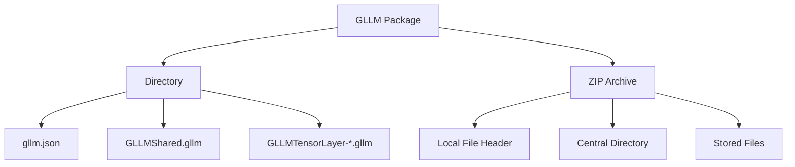

## Manifest

The manifest is a JSON document with a strict schema. It is the only file the runtime must parse before loading any tensors.

### Schema Overview

```json
{
  "gllm_version": "1.0.0",
  "model_id": "org.gwenland.mensa-rotunda-70b",
  "architecture": "transformer",
  "parameters": 70000000000,
  "quantization": "Q4_K_M",
  "metadata": {
    "vocab_size": 32000,
    "context_length": 8192,
    "embedding_length": 8192,
    "num_layers": 80,
    "num_heads": 64,
    "head_count_kv": 8,
    "rope_dims": 128,
    "rope_freq_base": 10000.0
  },
  "shared": {
    "file": "GLLMShared.gllm",
    "checksum": "sha256:abc123...",
    "tensors": [
      {
        "name": "token_embeddings",
        "shape": [32000, 8192],
        "dtype": "Q4_K",
        "offset": 0,
        "size": 131072000
      }
    ]
  },
  "layers": [
    {
      "index": 0,
      "file": "GLLMTensorLayer-0000.gllm",
      "checksum": "sha256:def456...",
      "type": "gllm:transformer/standard@v1",
      "tensors": [
        {
          "name": "attn_q.weight",
          "shape": [8192, 8192],
          "dtype": "Q4_K",
          "offset": 0,
          "size": 16777216
        },
        {
          "name": "attn_k.weight",
          "shape": [1024, 8192],
          "dtype": "Q4_K",
          "offset": 16777216,
          "size": 2097152
        }
      ],
      "device": "cuda:0"
    }
  ],
  "projector": {
    "file": "GLLMProj.gllm",
    "checksum": "sha256:ghi789...",
    "type": "gllm:projector/linear@v1"
  },
  "extensions": [
    "gllm:transformer/standard@v1",
    "gllm:projector/linear@v1"
  ]
}
```

### Manifest Design Decisions

1. **Single JSON File.** The manifest is a single document to ensure atomic parsing. No includes, no fragments.
2. **Tensor Metadata Only.** The manifest lists tensor names, shapes, dtypes, offsets, and sizes. It does not contain tensor data.
3. **Checksum per Execution Unit.** Every file referenced by the manifest has a SHA-256 checksum. The runtime verifies the checksum before mapping the file.
4. **Device Map Embedded.** The manifest may specify a default device per layer. The runtime may override this based on available hardware.
5. **Extension Registry.** The manifest lists all layer type URIs used in the package. The runtime loads plugins for these URIs before execution.

## Shared Components

Shared components are tensors used by multiple layers or the final output projection. They are stored in `GLLMShared.gllm`.

### Typical Shared Tensors

| Tensor | Shape | Purpose |
|--------|-------|---------|
| `token_embeddings` | [V, D] | Input embedding lookup |
| `output_norm.weight` | [D] | Final layer normalization |
| `output_head.weight` | [V, D] | Logit projection (often tied to embeddings) |
| `rope_cos` | [C, R] | Precomputed RoPE cosine table |
| `rope_sin` | [C, R] | Precomputed RoPE sine table |

> **Rationale:** Separating shared components prevents duplication in layer files and enables the runtime to keep them permanently mapped while layers are swapped.

## Execution Units

An execution unit is any file that the runtime can load, verify, and map independently. This includes:

- `GLLMShared.gllm`
- `GLLMTensorLayer-NNNN.gllm`
- `GLLMProj.gllm`
- Adapter layer files (future)

Each execution unit has:

- A file path (relative to manifest)
- A SHA-256 checksum
- A layer type URI (for layer files)
- A tensor index (names, shapes, offsets, dtypes)

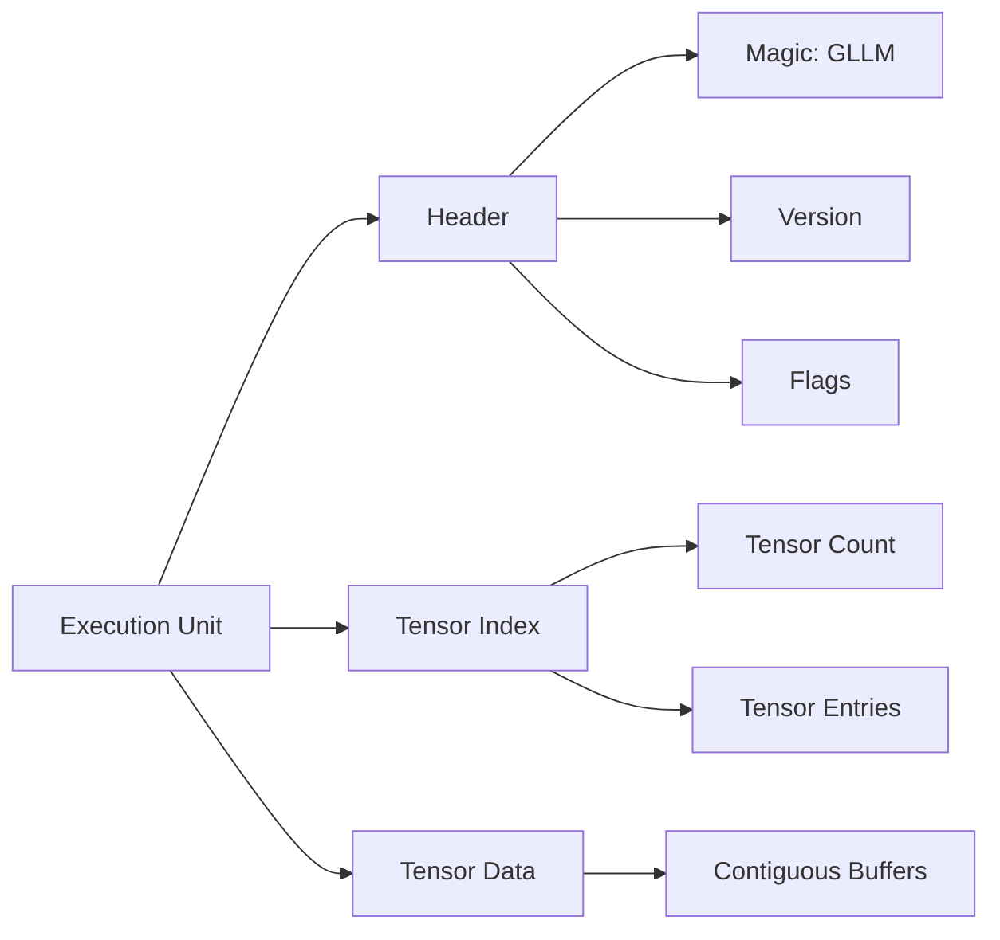

## Layer Files

A layer file is a self-contained binary file with the following structure:

| Offset | Size | Content |
|--------|------|---------|
| 0 | 4 | Magic: `0x474C4C4D` ("GLLM") |
| 4 | 2 | Format version (major, minor) |
| 6 | 2 | Flags (endianness, compression) |
| 8 | 4 | Tensor count |
| 12 | N | Tensor index entries |
| 12 + N | M | Tensor data (aligned to 64 bytes) |

### Tensor Index Entry

| Field | Size | Description |
|-------|------|-------------|
| `name_len` | 2 | Length of tensor name |
| `name` | `name_len` | UTF-8 tensor name |
| `shape_len` | 1 | Number of dimensions |
| `shape` | `shape_len * 4` | Dimension values (uint32) |
| `dtype` | 2 | Data type code |
| `offset` | 8 | Offset to tensor data in file (uint64) |
| `size` | 8 | Size of tensor data in bytes (uint64) |

### Data Type Codes

| Code | Name | Description |
|------|------|-------------|
| 0x0001 | FP32 | 32-bit IEEE 754 float |
| 0x0002 | FP16 | 16-bit IEEE 754 float |
| 0x0003 | BF16 | 16-bit brain float |
| 0x0004 | FP8_E4M3 | 8-bit float (E4M3) |
| 0x0005 | FP8_E5M2 | 8-bit float (E5M2) |
| 0x0010 | Q4_0 | 4-bit quantization, block 32 |
| 0x0011 | Q4_1 | 4-bit quantization, block 32, with min |
| 0x0012 | Q4_K | 4-bit K-quantization |
| 0x0013 | Q4_K_M | 4-bit K-quantization, medium |
| 0x0014 | Q4_K_S | 4-bit K-quantization, small |
| 0x0020 | Q8_0 | 8-bit quantization, block 32 |
| 0x0021 | Q8_K | 8-bit K-quantization |
| 0x0030 | I32 | 32-bit signed integer |

> **Rationale:** The layer file header is fixed-size and parseable in a single read. The tensor index enables the runtime to locate specific tensors without scanning the entire file. The 64-byte alignment ensures optimal DMA transfer to GPU.

## Tensor Organization

### Storage Order

Tensors within a layer file are stored in the order they are accessed during forward pass. For a standard transformer layer, this is:

1. `input_norm.weight`
2. `attn_q.weight`, `attn_q.bias`
3. `attn_k.weight`, `attn_k.bias`
4. `attn_v.weight`, `attn_v.bias`
5. `attn_o.weight`
6. `post_attn_norm.weight`
7. `ffn_gate.weight`
8. `ffn_up.weight`
9. `ffn_down.weight`

> **Rationale:** Sequential storage matches execution order, maximizing cache and prefetch efficiency during memory-mapped loading.

### Quantization Layout

Quantized tensors store scales and zero-points alongside the quantized weights. The layout is:

```
[quantized_weights][scales][zero_points][optional_mins]
```

The exact block size and scale format are defined by the dtype code. The runtime plugin for each dtype knows how to interpret the layout.

## Projectors

A projector is a tensor or set of tensors that maps layer outputs to a different representation space. Common projectors include:

- **Language Modeling Head:** Maps hidden states to vocabulary logits.
- **Multimodal Projector:** Maps vision encoder outputs to the language model's embedding space.
- **Classifier Head:** Maps hidden states to class probabilities.

Projectors are stored in `GLLMProj.gllm` and referenced by the manifest. They follow the same layer file format but use a distinct layer type URI (e.g., `gllm:projector/linear@v1`).

## Metadata

### Model Metadata

Model-level metadata is stored in the manifest `metadata` object. It includes architecture hyperparameters required for correct execution.

Required fields:

| Field | Type | Description |
|-------|------|-------------|
| `vocab_size` | int | Size of the vocabulary |
| `context_length` | int | Maximum sequence length |
| `embedding_length` | int | Hidden dimension size |
| `num_layers` | int | Number of layers in the model |
| `num_heads` | int | Number of attention heads |
| `head_count_kv` | int | Number of key/value heads (for GQA) |

Optional fields:

| Field | Type | Description |
|-------|------|-------------|
| `rope_dims` | int | RoPE dimensionality |
| `rope_freq_base` | float | RoPE frequency base |
| `rope_scaling` | object | RoPE scaling configuration (type, factor) |
| `expert_count` | int | Number of experts (MoE) |
| `expert_used_count` | int | Number of active experts per token |
| `sliding_window` | int | Sliding window attention size |
| `attention_bias` | bool | Whether attention uses bias |

### Custom Metadata

The manifest may contain a `custom_metadata` object for user-defined key-value pairs. These are not interpreted by the runtime but are preserved for tooling and provenance.

## Checksums

### Integrity Model

GLLM uses SHA-256 for all integrity verification. Checksums are applied at three levels:

1. **Per-File Checksum:** Every execution unit file has a SHA-256 checksum in the manifest.
2. **Manifest Checksum:** The manifest itself may be accompanied by a `gllm.json.sha256` file.
3. **Aggregated Checksums:** The optional `checksums.sha256` file contains all file checksums for offline verification.

### Verification Flow

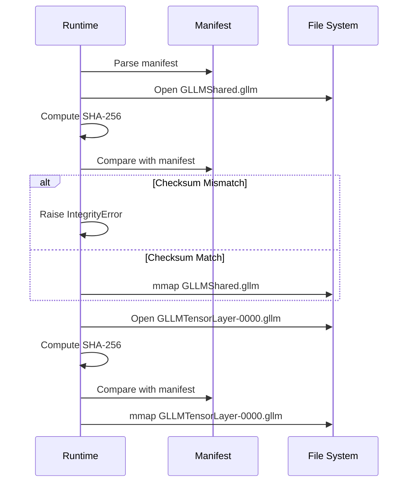

> **Rationale:** Per-file checksums enable the runtime to detect corruption at the granularity of execution units. A corrupted layer file does not invalidate the entire package.

## Versioning

### Format Version

The GLLM format version follows semantic versioning: `MAJOR.MINOR.PATCH`.

- **MAJOR:** Incompatible structural changes (e.g., manifest schema revision, layer file header change).
- **MINOR:** Backward-compatible additions (e.g., new dtype codes, new optional manifest fields).
- **PATCH:** Clarifications and corrections to the specification.

### Version Negotiation

The runtime reads the `gllm_version` field from the manifest. If the runtime supports the major version but not the minor version, it may proceed with a warning. If the major version is unsupported, the runtime must refuse to load the package.

### Layer Type Versioning

Layer type URIs include a version suffix (e.g., `@v1`). The runtime plugin system matches the exact version. A runtime with a `v2` plugin for `gllm:transformer/standard` cannot execute a `v1` layer unless a compatibility shim is registered.

## Extension Points

### Extension URI Scheme

Layer types are identified by URIs of the form:

```
gllm:<category>/<name>@<version>
```

Examples:

- `gllm:transformer/standard@v1`
- `gllm:transformer/moe@v1`
- `gllm:mamba/standard@v1`
- `gllm:projector/linear@v1`
- `gllm:adapter/lora@v1`

### Extension Registration

The manifest lists all extension URIs in the `extensions` array. The runtime loads the corresponding plugin for each URI before executing the package. Plugins are shared libraries or runtime modules that implement:

- Tensor layout parsing for the layer type
- Forward pass execution logic
- Memory allocation strategy for the layer type

```mermaid
graph TD
    A[Manifest] --> B[Extension List]
    B --> C[gllm:transformer/standard@v1]
    B --> D[gllm:mamba/standard@v1]
    C --> E[Plugin Loader]
    D --> E
    E --> F[Runtime Plugin Registry]
    F --> G[Execution Engine]
```

### Custom Layer Types

Users may define custom layer types by registering a new URI and providing a runtime plugin. The GLLM specification does not restrict custom URIs, but recommends the `vendor:category/name@version` convention for third-party extensions.

---

# PART III: Runtime

## Execution Model

GLLM runtime operates on a layer-sequential execution model. For a standard transformer, the execution graph is a linear chain:

```
Input -> Shared.Embedding -> Layer 0 -> Layer 1 -> ... -> Layer N -> Shared.Norm -> Projector -> Output
```

The runtime maintains the following state during execution:

- **KV Cache:** A per-layer cache of key and value tensors, allocated according to the memory model.
- **Activation Buffers:** Temporary buffers for layer outputs, reused across layers.
- **Device Contexts:** GPU streams, CPU thread pools, and synchronization primitives.

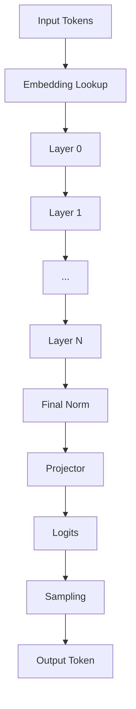

## Sequential Loading

Sequential loading is the core optimization of GLLM. Instead of loading the entire model into memory, the runtime maps layers on demand and unmaps them after execution.

### Loading Sequence

1. Parse manifest.
2. Map shared components (permanent).
3. For each layer in execution order:
   a. Map layer file.
   b. Execute layer.
   c. Unmap layer file (optional, depending on memory pressure).

### Memory Mapping Strategy

The runtime uses `mmap` (POSIX) or `CreateFileMapping` (Windows) to map layer files into the process address space. The operating system's page cache handles the actual disk I/O. The runtime advises the kernel using `madvise(MADV_SEQUENTIAL)` to optimize read-ahead.

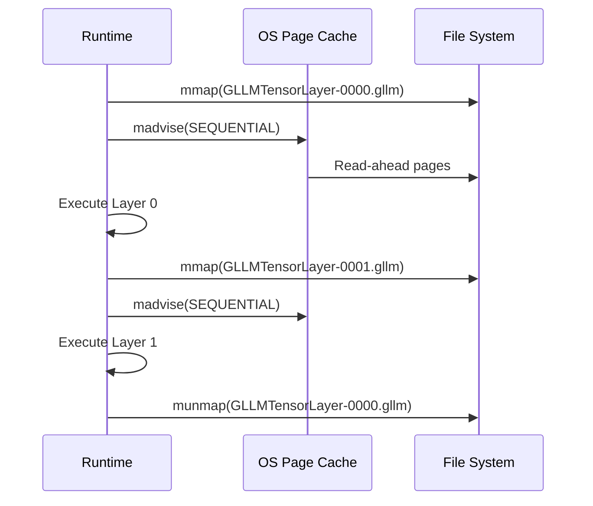

> **Rationale:** Sequential loading reduces the working set size to approximately one layer plus shared components. For a 70B model quantized to Q4, this is ~4GB instead of ~40GB.

## Runtime Scheduler

The runtime scheduler coordinates layer execution, prefetching, and device transfers.

### Scheduler Components

| Component | Responsibility |
|-----------|--------------|
| **Execution Queue** | Ordered list of layers to execute |
| **Prefetch Queue** | Layers scheduled for memory mapping |
| **Device Queue** | Layers assigned to specific devices |
| **Synchronization Barrier** | Ensures layer N-1 completes before layer N starts |

### Scheduler Pipeline

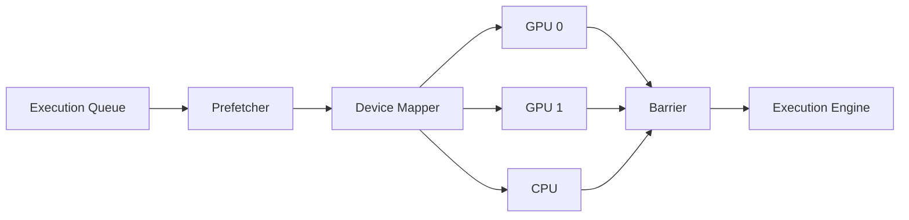

### Prefetch Window

The scheduler maintains a prefetch window of size W. While layer N is executing, layers N+1 through N+W are prefetched into memory. The window size W is determined by:

- Available system memory
- Device transfer bandwidth (for GPU execution)
- Layer execution time (estimated from tensor sizes)

```python
# Pseudocode for prefetch window calculation
def compute_prefetch_window(available_memory, layer_size, bandwidth, layer_time):
    max_layers = available_memory // layer_size
    transfer_time = layer_size / bandwidth
    overlap_ratio = transfer_time / layer_time
    return min(max_layers, int(overlap_ratio) + 2)
```

## Memory Model

### Address Space Layout

The GLLM runtime divides the address space into four regions:

1. **Shared Region:** Permanently mapped shared components.
2. **Layer Region:** Rotating mapping of current and prefetched layers.
3. **KV Cache Region:** Dynamically allocated cache for attention keys and values.
4. **Scratch Region:** Temporary buffers for activations, reused across layers.

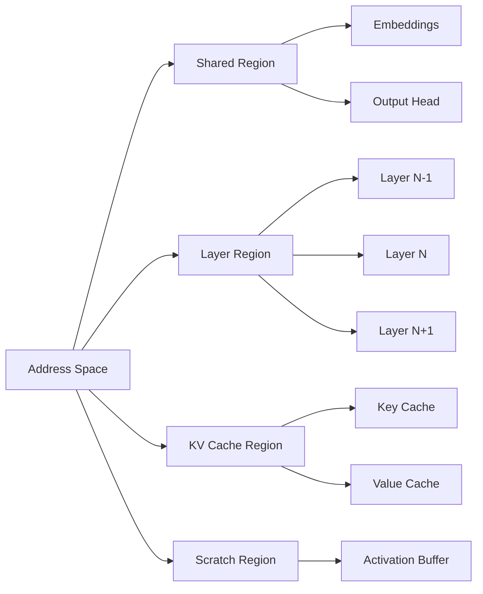

### Memory Alignment

All tensor data in layer files is aligned to 64-byte boundaries. This ensures:

- Cache line alignment for CPU execution
- DMA alignment for GPU transfer
- Vector instruction alignment (AVX-512, NEON)

### Quantization and Memory

Quantized tensors are stored in their native quantized layout. The runtime does not dequantize into FP32 buffers unless required by the execution kernel. For Q4_K quantized layers, the working memory for a single layer is approximately:

```
layer_memory = sum(tensor_size for tensor in layer.tensors)
```

This is typically 1/4 to 1/8 of the FP32 equivalent.

## Memory Lifecycle

### Lifecycle States

An execution unit transitions through the following states:

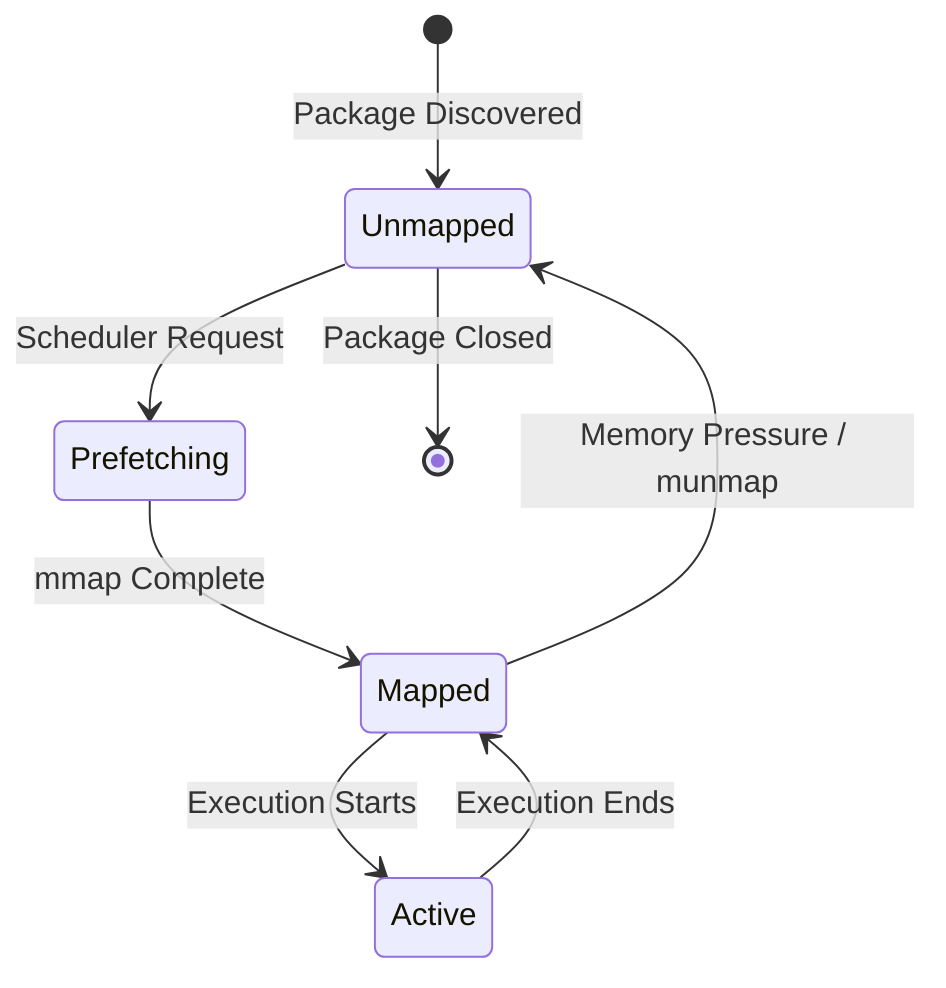

### State Transitions

| Transition | Trigger | Action |
|------------|---------|--------|
| Unmapped -> Prefetching | Scheduler adds layer to prefetch queue | File opened, mmap initiated |
| Prefetching -> Mapped | OS page fault completes | Tensor pointers become valid |
| Mapped -> Active | Execution engine begins layer forward pass | GPU upload initiated (if needed) |
| Active -> Mapped | Layer execution completes | GPU buffers released, CPU mapping retained |
| Mapped -> Unmapped | Memory pressure or scheduler decision | munmap called, pages returned to OS |

## Layer Lifecycle

### Layer Execution Stages

A layer progresses through the following stages during inference:

1. **Load:** Memory map the layer file.
2. **Validate:** Verify checksum.
3. **Upload:** Copy tensors to device memory (GPU).
4. **Execute:** Run the forward pass kernel.
5. **Cache Update:** Append KV tensors to the KV cache.
6. **Release:** Free device memory, optionally unmap host memory.

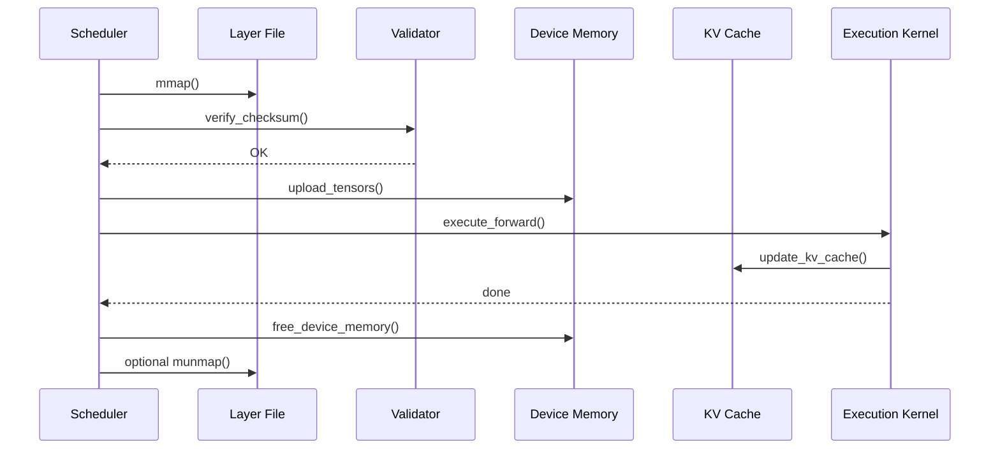

### KV Cache Management

The KV cache is allocated as a contiguous block per layer or as a single large block for all layers. The allocation strategy depends on the execution device:

- **CPU:** Per-layer KV cache, allocated on demand.
- **GPU:** Single large KV cache, pre-allocated to avoid CUDA malloc overhead during inference.

The KV cache size for a layer is:

```
kv_cache_size = 2 * num_kv_heads * head_dim * seq_len * dtype_size
```

Where `seq_len` grows during the generation process. The runtime over-allocates the KV cache to the maximum context length to avoid reallocation.

## Prefetch Strategy

### Adaptive Prefetching

The runtime implements an adaptive prefetcher that adjusts the prefetch window based on real-time measurements:

- **Layer Load Time:** Measured from `mmap` to first tensor access.
- **Layer Execution Time:** Measured from kernel launch to kernel completion.
- **Device Transfer Time:** Measured from host-to-device copy start to finish.

If the measured layer load time exceeds the execution time of the previous layer, the prefetcher increases the window size. If memory pressure is detected, the prefetcher decreases the window size.

### Prefetcher Pseudocode

```rust
struct Prefetcher {
    window_size: usize,
    max_window: usize,
    layer_load_times: Vec<Duration>,
    layer_exec_times: Vec<Duration>,
}

impl Prefetcher {
    fn adjust_window(&mut self) {
        let avg_load = self.layer_load_times.iter().sum() / self.layer_load_times.len();
        let avg_exec = self.layer_exec_times.iter().sum() / self.layer_exec_times.len();

        if avg_load > avg_exec * 1.2 {
            self.window_size = min(self.window_size + 1, self.max_window);
        } else if avg_load < avg_exec * 0.5 {
            self.window_size = max(self.window_size - 1, 1);
        }
    }
}
```

## Device Mapping

### Device Map Specification

The manifest may specify a default device map. The runtime may override this based on available hardware. The device map assigns each layer to a device:

```json
{
  "device_map": {
    "default": "cuda:0",
    "layers": {
      "0-39": "cuda:0",
      "40-79": "cuda:1"
    }
  }
}
```

### Device Map Resolution

The runtime resolves the device map during initialization:

1. Parse manifest device map.
2. Enumerate available devices (CUDA devices, CPU).
3. Validate that assigned devices exist.
4. Compute memory requirements per device.
5. If memory is insufficient, fall back to CPU or raise an error.

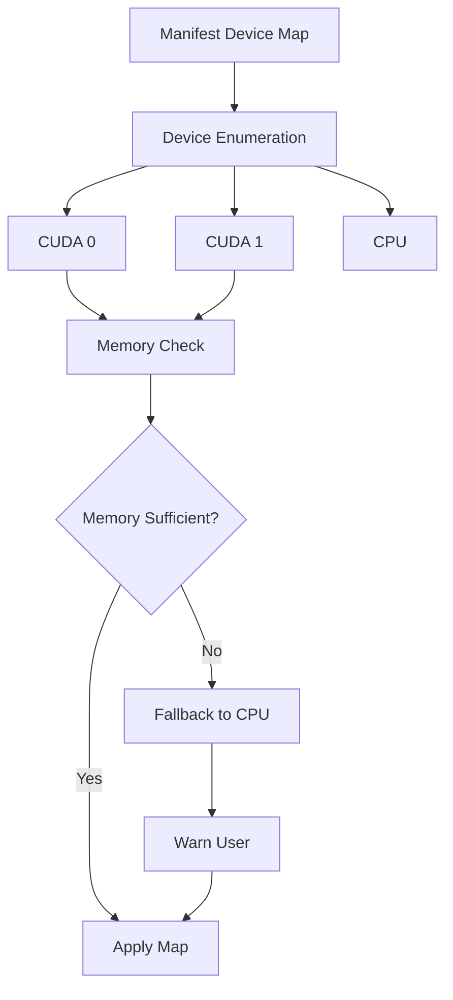

### Cross-Device Execution

For pipeline parallelism across multiple GPUs, the runtime manages inter-device transfers:

- **Layer N on GPU 0** outputs activations.
- **Runtime copies activations to GPU 1** via peer-to-peer or host staging.
- **Layer N+1 on GPU 1** receives the activations.

The runtime overlaps computation and transfer where possible using CUDA streams or equivalent async APIs.

## CPU Runtime

### CPU Execution Strategy

The CPU runtime executes layers using optimized kernels:

- **GEMM:** BLAS (OpenBLAS, MKL) or custom quantized GEMM kernels.
- **Attention:** Custom CPU attention kernels with cache-friendly KV cache traversal.
- **Activation Functions:** Vectorized implementations (AVX-512, NEON).

### Threading Model

The CPU runtime uses a thread pool with one thread per physical core. Layer execution is single-threaded at the layer level (to preserve sequential semantics), but individual kernels may use internal parallelism.

### Memory Mapping on CPU

The CPU runtime relies entirely on OS `mmap` and page cache. No explicit tensor copies are made unless required by alignment or format conversion.

## GPU Runtime

### GPU Execution Strategy

The GPU runtime uploads layer tensors to device memory before execution. The execution strategy depends on available GPU memory:

- **Full Model Fit:** All layers are uploaded once and remain in GPU memory. No sequential loading.
- **Partial Model Fit:** Layers are uploaded on demand and evicted after execution (sequential loading).
- **Single Layer Fit:** Only one layer fits in GPU memory. The runtime uses pinned host memory and async upload/download.

### CUDA Stream Management

The GPU runtime uses three CUDA streams per device:

1. **Compute Stream:** Executes kernels.
2. **H2D Stream:** Uploads layer tensors from host to device.
3. **D2H Stream:** Downloads results (rarely used in inference).


### Kernel Fusion

The GPU runtime fuses operations where possible to reduce kernel launch overhead:

- **Rope + Attention:** Fuses RoPE application with attention score computation.
- **Norm + GEMM:** Fuses layer normalization with the following matrix multiplication.
- **Activation + GEMM:** Fuses SiLU/ReLU with feed-forward GEMMs.

Fusion is implemented in the runtime plugin for each layer type.

## Hybrid Runtime

The hybrid runtime distributes layers across CPU and GPU. This is useful when GPU memory is insufficient for the full model but sufficient for a subset of layers.

### Hybrid Scheduling

1. Assign hot layers (early layers, large layers) to GPU.
2. Assign cold layers to CPU.
3. Transfer activations between CPU and GPU at layer boundaries.

### Transfer Optimization

The hybrid runtime uses pinned host memory for CPU-side buffers to enable async DMA transfers. The runtime overlaps CPU computation of layer N with GPU transfer of layer N+1.

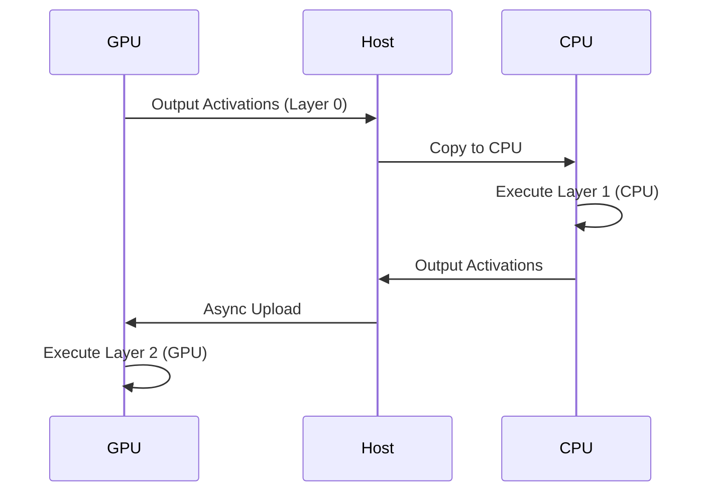

## Distributed Runtime

The distributed runtime supports model parallelism across multiple hosts or processes. It extends the device map to include remote devices.

### Distributed Device Map

```json
{
  "device_map": {
    "layers": {
      "0-19": "rank:0/cuda:0",
      "20-39": "rank:1/cuda:0",
      "40-59": "rank:2/cuda:0",
      "60-79": "rank:3/cuda:0"
    }
  }
}
```

### Communication Backend

The distributed runtime uses NCCL (NVIDIA), RCCL (AMD), or Gloo (CPU) for inter-rank communication. The runtime initializes the communication backend during startup and maintains persistent connections.

### Pipeline Parallelism

In pipeline parallelism, each rank holds a contiguous set of layers. Activations are sent from rank N to rank N+1 using `send`/`recv` operations.

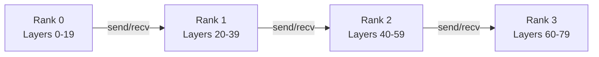

### Tensor Parallelism

In tensor parallelism, individual layers are split across ranks. The runtime supports tensor parallelism for attention and feed-forward layers via all-gather and reduce-scatter operations. Tensor parallelism requires synchronized execution across ranks.

### Failure Recovery

The distributed runtime implements checkpoint-based recovery:

1. **Layer Checkpoints:** Each rank periodically saves its KV cache and activation buffers.
2. **Rank Failure Detection:** Heartbeat monitoring detects failed ranks.
3. **Recovery:** A spare rank loads the checkpoint and resumes execution.

> **Note:** Full failure recovery is a future work item. The current distributed runtime assumes fail-stop behavior with manual restart.

## Failure Recovery

### Failure Modes

| Failure | Detection | Recovery |
|---------|-----------|----------|
| Corrupted layer file | Checksum mismatch | Abort load, report error |
| Missing layer file | File not found | Abort load, report error |
| GPU out of memory | CUDA OOM | Fallback to CPU, or reduce batch size |
| Kernel execution error | CUDA error | Abort inference, report error |
| Distributed rank failure | Heartbeat timeout | Abort distributed execution (future: automatic recovery) |

### Error Handling Strategy

The runtime uses a two-tier error handling strategy:

1. **Fatal Errors:** Corruption, missing files, unsupported versions. These abort execution immediately.
2. **Recoverable Errors:** GPU OOM, transient device errors. These trigger fallback strategies (CPU fallback, reduced batch size, reduced prefetch window).

### Logging and Diagnostics

The runtime provides structured logging at four levels:

- **ERROR:** Fatal or recoverable errors.
- **WARN:** Suboptimal configurations (e.g., CPU fallback, mismatched plugin version).
- **INFO:** Load progress, layer execution timing, memory usage.
- **DEBUG:** Tensor shapes, kernel launch parameters, memory addresses.

---

# PART IV: Converter

## Converter Architecture

The GLLM converter transforms models from source formats (GGUF, Safetensors, PyTorch) into GLLM packages. It is a command-line tool with a pipeline architecture.

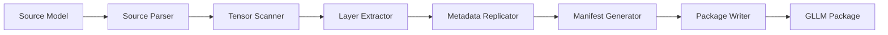

## GGUF Parser

### Parsing Strategy

The GGUF parser reads the GGUF metadata header and tensor index. It maps GGUF tensor names to GLLM layer structures using naming convention heuristics.

### Tensor Name Mapping

GGUF tensor names follow the pattern `blk.N.tensor_name`. The parser extracts the layer index `N` and maps the tensor to the corresponding GLLM layer file.

| GGUF Name | GLLM Layer | GLLM Tensor |
|-----------|------------|-------------|
| `token_embd.weight` | `shared` | `token_embeddings` |
| `output_norm.weight` | `shared` | `output_norm.weight` |
| `output.weight` | `shared` | `output_head.weight` |
| `blk.0.attn_q.weight` | `layer_000` | `attn_q.weight` |
| `blk.0.attn_k.weight` | `layer_000` | `attn_k.weight` |
| `blk.0.ffn_gate.weight` | `layer_000` | `ffn_gate.weight` |

### Metadata Extraction

The GGUF parser extracts the following metadata into the GLLM manifest:

- `general.architecture` -> `architecture`
- `general.name` -> `model_id`
- `llama.context_length` -> `metadata.context_length`
- `llama.embedding_length` -> `metadata.embedding_length`
- `llama.block_count` -> `metadata.num_layers`
- `llama.attention.head_count` -> `metadata.num_heads`
- `llama.attention.head_count_kv` -> `metadata.head_count_kv`
- `llama.rope.freq_base` -> `metadata.rope_freq_base`

## Tensor Scanner

### Scanning Phase

The tensor scanner iterates over all tensors in the source model and collects:

- Tensor name
- Shape
- Data type
- Quantization parameters (if applicable)
- Raw data offset and size

### Quantization Detection

The scanner detects the quantization scheme from the source format:

- **GGUF:** Quantization type is stored in the tensor metadata (`ggml_type`).
- **Safetensors:** Quantization is not native; the scanner requires external metadata or assumes FP16/FP32.
- **PyTorch:** The scanner inspects tensor dtypes and custom quantization attributes.

## Layer Extraction

### Layer Grouping

The layer extractor groups tensors into layers based on naming conventions. For transformer models, the grouping rule is:

```python
def extract_layer(tensor_name, num_layers):
    if tensor_name.startswith("blk."):
        layer_idx = int(tensor_name.split(".")[1])
        return f"layer_{layer_idx:03d}"
    elif tensor_name in SHARED_TENSORS:
        return "shared"
    else:
        return "projector"
```

### Layer File Construction

For each layer, the extractor:

1. Creates a new layer file.
2. Writes the GLLM header.
3. Writes the tensor index.
4. Writes the tensor data in execution order.
5. Computes the layer file checksum.

### Shared Component Extraction

Shared tensors are collected into `GLLMShared.gllm`. The extractor ensures that tied weights (e.g., input and output embeddings) are not duplicated.

## Metadata Replication

### Metadata Mapping

The metadata replicator translates source format metadata into the GLLM manifest schema. It handles:

- **Architecture-specific metadata:** RoPE parameters, attention bias, sliding window.
- **Quantization metadata:** Global quantization type, per-tensor quantization overrides.
- **Tokenizer metadata:** Vocabulary size, special tokens, tokenizer model type.

### Custom Metadata Preservation

The replicator preserves unknown metadata keys in the `custom_metadata` object. This ensures that no information is lost during conversion.

## Manifest Generator

### Manifest Construction

The manifest generator assembles the final `gllm.json` from the extracted layers, shared components, and metadata. It performs the following steps:

1. Set `gllm_version` to the current format version.
2. Set `model_id` from source metadata or user input.
3. Populate `metadata` from the metadata replicator.
4. Add `shared` entry with file path, checksum, and tensor index.
5. Add `layers` array with entries for each layer.
6. Add `projector` entry if present.
7. Collect `extensions` from layer types used.
8. Write `gllm.json`.

### Checksum Computation

The manifest generator computes SHA-256 checksums for all generated files using a streaming hash to minimize memory usage:

```rust
use sha2::{Sha256, Digest};

fn compute_checksum(path: &Path) -> Result<String, io::Error> {
    let mut file = File::open(path)?;
    let mut hasher = Sha256::new();
    let mut buffer = [0u8; 8192];

    loop {
        let n = file.read(&mut buffer)?;
        if n == 0 { break; }
        hasher.update(&buffer[..n]);
    }

    Ok(format!("sha256:{:x}", hasher.finalize()))
}
```

## Validation

### Converter Validation

The converter validates the generated package before completion:

1. **Manifest Schema Validation:** Verify that `gllm.json` conforms to the JSON schema.
2. **Tensor Index Consistency:** Verify that tensor offsets and sizes match the actual file sizes.
3. **Checksum Verification:** Re-compute checksums and verify against manifest entries.
4. **Layer Completeness:** Verify that all layers referenced in the manifest exist as files.
5. **Metadata Completeness:** Verify that required metadata fields are present.

### Validation Pipeline

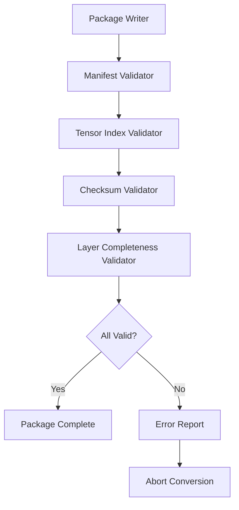

## Error Handling

### Converter Error Types

| Error Code | Description | Recovery |
|------------|-------------|----------|
| `E001` | Unsupported source format | Abort |
| `E002` | Missing required metadata | Abort or prompt user |
| `E003` | Tensor shape mismatch | Abort |
| `E004` | Unknown quantization type | Abort or default to FP16 |
| `E005` | Disk write failure | Abort |
| `E006` | Checksum mismatch during validation | Abort and clean up |

### Error Reporting

The converter reports errors in a structured format:

```json
{
  "error_code": "E004",
  "message": "Unknown quantization type: Q5_K_M",
  "tensor": "blk.0.attn_q.weight",
  "suggestion": "Use --fallback-quantization Q4_K_M or convert to FP16"
}
```

## Compatibility

### Source Format Versions

The converter supports the following source format versions:

| Source Format | Supported Versions | Notes |
|---------------|-------------------|-------|
| GGUF | 3.0+ | Full support for all GGML quantization types |
| Safetensors | All | Requires external metadata for architecture info |
| PyTorch | 1.9+ | Requires `torch.load` compatibility |
| ONNX | 1.10+ | Limited to static transformer graphs |

### Target Format Versions

The converter generates packages conforming to the GLLM format version specified by the `--format-version` flag. The default is the latest stable version.

---

# PART V: Extensions

## Extension System Overview

GLLM extensions are plugins that extend the format and runtime with new layer types, projectors, and metadata schemas. Extensions are identified by URIs and registered in the manifest.

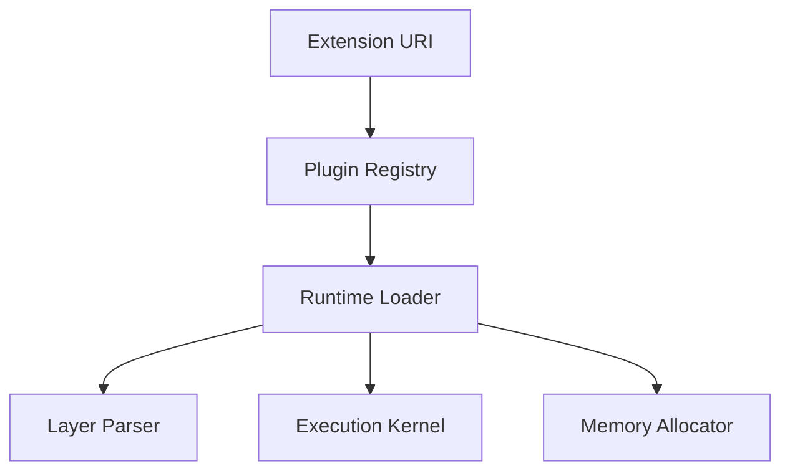

## MLA (Multi-Head Latent Attention)

### MLA Layer Type

MLA is an attention mechanism that compresses key and value states into a latent representation. The GLLM extension for MLA is identified by:

```
gllm:transformer/mla@v1
```

### MLA Tensor Layout

An MLA layer file contains the following tensors:

| Tensor | Shape | Description |
|--------|-------|-------------|
| `input_norm.weight` | [D] | Pre-attention normalization |
| `attn_q.weight` | [D, D] | Query projection |
| `attn_kv_latent.weight` | [D, L] | Key-value latent compression |
| `attn_o.weight` | [D, D] | Output projection |
| `post_attn_norm.weight` | [D] | Post-attention normalization |

Where `L` is the latent dimension, typically `L < D`.

### MLA Runtime Support

The MLA plugin implements:

- Latent compression during the forward pass
- Decompression for KV cache storage (optional)
- Fused MLA kernels for GPU execution

## Mamba

### Mamba Layer Type

Mamba is a state-space model layer. The GLLM extension is:

```
gllm:mamba/standard@v1
```

### Mamba Tensor Layout

| Tensor | Shape | Description |
|--------|-------|-------------|
| `in_proj.weight` | [ED, D] | Input projection (expands to ED) |
| `conv1d.weight` | [ED, K] | 1D convolution weights |
| `x_proj.weight` | [SS, ED] | X projection (delta, B, C) |
| `dt_proj.weight` | [ED, SS] | Delta projection |
| `A_log` | [ED] | Discretized state matrix parameter |
| `D` | [ED] | Skip connection parameter |
| `out_proj.weight` | [D, ED] | Output projection |

Where `E` is the expansion factor, `K` is the convolution kernel size, and `SS` is the state space dimension.

### Mamba State Management

Unlike transformer layers, Mamba layers maintain a recurrent state. The runtime manages this state in the scratch region:

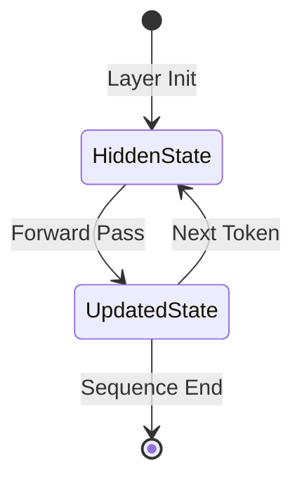

## MoE (Mixture of Experts)

### MoE Layer Type

MoE layers route tokens to a subset of expert feed-forward networks. The GLLM extension is:

```
gllm:transformer/moe@v1
```

### MoE Tensor Layout

| Tensor | Shape | Description |
|--------|-------|-------------|
| `input_norm.weight` | [D] | Pre-MoE normalization |
| `gate.weight` | [N, D] | Router gate projection |
| `expert_0.ffn_gate.weight` | [H, D] | Expert 0 gate projection |
| `expert_0.ffn_up.weight` | [H, D] | Expert 0 up projection |
| `expert_0.ffn_down.weight` | [D, H] | Expert 0 down projection |
| `expert_N.ffn_*.weight` | ... | Expert N projections |

Where `N` is the number of experts and `H` is the expert hidden dimension.

### MoE Execution Strategy

The MoE plugin implements:

- **Top-K Routing:** Selects K experts per token.
- **Expert Parallelism:** Distributes experts across devices (future).
- **Sparse Execution:** Only loads expert weights for the selected experts.

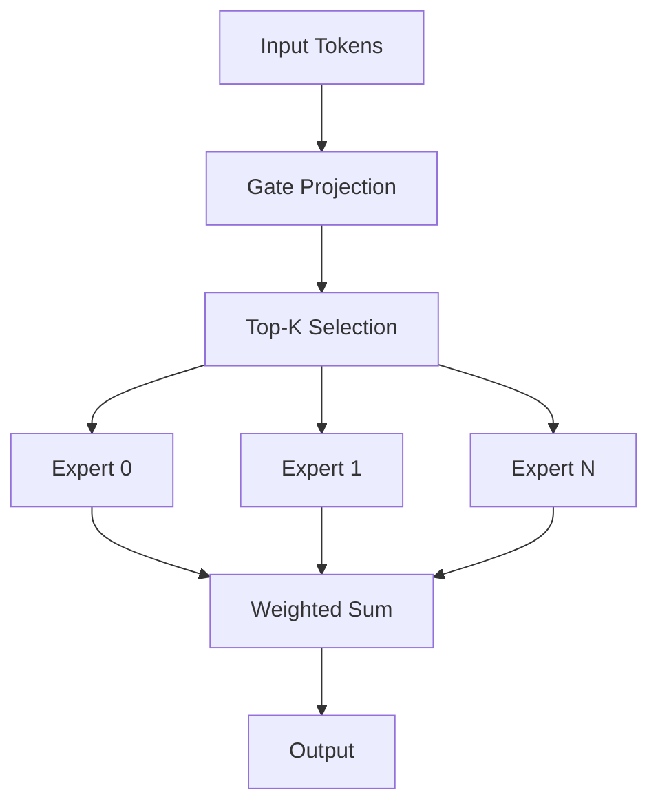

### MoE Memory Optimization

For large MoE models (e.g., 8x22B), loading all expert weights simultaneously is impractical. The MoE plugin supports on-demand expert loading:

1. Load gate weights (permanent).
2. For each token batch:
   a. Compute routing.
   b. Load selected expert weights.
   c. Execute experts.
   d. Unload expert weights.

## Future Architectures

The extension system is designed to accommodate architectures not yet invented. The requirements for a new architecture extension are:

1. Define a URI for the layer type.
2. Specify the tensor layout and naming convention.
3. Implement a runtime plugin with parser, allocator, and execution kernels.
4. Update the converter to recognize the architecture in source formats.

## Plugin System

### Plugin Interface

Runtime plugins implement the following interface (Rust pseudocode):

```rust
trait LayerPlugin {
    fn parse_tensors(&self, index: &TensorIndex) -> Result<LayerSpec, Error>;
    fn allocate_memory(&self, spec: &LayerSpec, device: &Device) -> Result<MemoryPlan, Error>;
    fn execute(&self, inputs: &TensorMap, outputs: &mut TensorMap, ctx: &ExecutionContext) -> Result<(), Error>;
    fn supports_dtype(&self, dtype: DType) -> bool;
}
```

### Plugin Loading

Plugins are loaded dynamically at runtime:

1. The runtime reads the `extensions` array from the manifest.
2. For each URI, the runtime searches the plugin path (default: `/usr/lib/gllm/plugins/`).
3. The runtime loads the shared library and calls the registration function.
4. The plugin registers itself with the runtime's plugin registry.

```rust
#[no_mangle]
pub extern "C" fn gllm_register_plugin(registry: &mut PluginRegistry) {
    registry.register(
        "gllm:transformer/moe@v1",
        Box::new(MoeLayerPlugin::new())
    );
}
```

### Plugin Versioning

Plugins are versioned independently of the GLLM format. The runtime requires an exact version match for layer type URIs. A plugin supporting `v2` of a layer type does not automatically support `v1`.

## Custom Layer Types

Users may define custom layer types for research or proprietary architectures. The process is:

1. Define the layer type URI (e.g., `myorg:custom/fused@v1`).
2. Implement the plugin interface.
3. Convert the model using a custom converter plugin.
4. Reference the custom URI in the manifest.

## Future Metadata

Future versions of GLLM may extend the manifest metadata schema to support:

- **Multi-modal inputs:** Image encoder metadata, audio encoder metadata.
- **Tool use:** Function calling schema, tool definitions.
- **Safety filters:** Content moderation metadata, refusal triggers.
- **Provenance:** Training data fingerprints, license information.

These extensions will be added as optional manifest fields to maintain backward compatibility.

---

# PART VI: Benchmarks

## Benchmark Philosophy

GLLM benchmarks measure the format and runtime from the perspective of inference deployment. All benchmarks are reproducible, documented, and run on standardized hardware configurations.

> **Important:** Benchmarks in this section use illustrative values where actual measured data is unavailable. These values are explicitly marked as estimates or demonstrations. No performance claims are made without verification.

## Memory Benchmarks

### Working Set Size

The working set size is the amount of memory required to execute inference, excluding the KV cache and activation buffers.

**Figure Prompt:** Generate a bar chart comparing working set size for GLLM (sequential loading), GGUF (full mmap), and Safetensors (full load) for a 70B parameter model quantized to Q4_K_M. X-axis: format; Y-axis: working set size in GB. GLLM should show ~4GB, GGUF ~35GB, Safetensors ~35GB.

```python
# Python figure prompt for memory comparison
import matplotlib.pyplot as plt

formats = ["GLLM", "GGUF", "Safetensors"]
working_set = [4.2, 35.0, 35.0]  # Illustrative values only

plt.figure(figsize=(8, 5))
plt.bar(formats, working_set, color=['#2ecc71', '#3498db', '#e74c3c'])
plt.ylabel('Working Set Size (GB)')
plt.title('Memory Working Set: 70B Q4_K_M Model (Illustrative)')
plt.ylim(0, 40)
for i, v in enumerate(working_set):
    plt.text(i, v + 1, f'{v} GB', ha='center')
plt.savefig('memory_working_set.png')
```

### Peak Memory Usage

Peak memory includes the working set, KV cache, and activation buffers.

**Figure Prompt:** Generate a stacked area chart showing memory usage over time during a 4096-token generation. Layers: working set (fluctuating), KV cache (growing), activation buffers (constant). X-axis: token index; Y-axis: memory in GB.

## Runtime Benchmarks

### Tokens Per Second

Throughput is measured as tokens generated per second during autoregressive generation.

**Figure Prompt:** Generate a line chart comparing tokens per second for GLLM and GGUF on a 70B Q4_K_M model across context lengths (512, 1024, 2048, 4096, 8192). X-axis: context length; Y-axis: tokens/second. Two lines: GLLM and GGUF.

> **Note:** Actual throughput depends on hardware (GPU model, CPU cores, RAM bandwidth), quantization scheme, and batch size. The figure above is illustrative.

### Time to First Token

Time to first token (TTFT) measures the latency from input submission to the first output token.

**Figure Prompt:** Generate a bar chart comparing TTFT for GLLM (sequential loading) and GGUF (full load) on a 70B model. X-axis: format; Y-axis: TTFT in seconds. Include error bars for variance.

## Loading Benchmarks

### Cold Start Time

Cold start time is the time from package discovery to the first layer execution.

**Figure Prompt:** Generate a timeline chart showing the loading phases for GLLM: manifest parse (10ms), shared component map (50ms), layer 0 prefetch (200ms), total to first token. Compare with GGUF full map time.

### Layer Load Time

Layer load time is the time from `mmap` initiation to the first tensor access.

**Figure Prompt:** Generate a histogram of layer load times for 80 layers on an NVMe SSD. X-axis: load time in ms; Y-axis: frequency. Show mean and median lines.

## Package Size Benchmarks

### Storage Overhead

GLLM introduces minimal storage overhead compared to the raw tensor data.

| Component | Overhead | Description |
|-----------|----------|-------------|
| Manifest | ~50KB | JSON metadata |
| Layer Headers | ~1KB per layer | Tensor index |
| Checksums | ~64 bytes per file | SHA-256 hex string |
| Alignment Padding | ~0.1% | 64-byte alignment |

Total overhead is typically <0.5% of the total package size.

**Figure Prompt:** Generate a pie chart showing the composition of a GLLM package: tensor data (99.2%), manifest (0.05%), headers (0.4%), alignment padding (0.3%), checksums (0.05%).

## Sequential Loading Benchmarks

### Prefetch Efficiency

Prefetch efficiency measures the overlap between layer loading and layer execution.

**Figure Prompt:** Generate a Gantt chart showing layer execution and layer loading timelines for 10 consecutive layers. Show ideal overlap (loading finishes before execution starts) and suboptimal overlap (execution stalls waiting for load).

### Working Set Fluctuation

Working set fluctuation measures the variance in resident memory during sequential execution.

**Figure Prompt:** Generate a line chart showing resident memory over time for 80 layers. Memory should spike at layer boundaries (two layers mapped simultaneously) and drop between layers. Show average working set as a horizontal line.

## Storage Comparison

### Format Size Comparison

Compare package sizes across formats for the same model.

**Figure Prompt:** Generate a grouped bar chart comparing package sizes for a 70B model: raw FP16 (140GB), Q4_K_M GGUF (39GB), Q4_K_M GLLM (39.1GB), Q4_K_M Safetensors (39GB). X-axis: format; Y-axis: size in GB.

## Benchmark Methodology

### Hardware Configuration

All benchmarks are run on the following standardized configuration:

| Component | Specification |
|-----------|---------------|
| CPU | AMD EPYC 9654 (96 cores) or Intel Xeon w9-3495X |
| GPU | NVIDIA RTX 4090 (24GB) or NVIDIA A100 (80GB) |
| RAM | 512GB DDR5-4800 |
| Storage | Samsung 990 Pro NVMe SSD (2TB) |
| OS | Ubuntu 22.04 LTS |

### Measurement Protocol

1. **Warm-up:** Run 100 tokens of generation before measurement to warm caches.
2. **Isolation:** Run benchmarks on a dedicated machine with no other load.
3. **Repetition:** Run each benchmark 10 times and report the median and standard deviation.
4. **Cold Start:** Reboot the machine between cold-start benchmarks to clear OS page cache.
5. **Instrumentation:** Use `cudaEvent` for GPU timing, `rdtsc` for CPU timing, and `/proc/meminfo` for memory measurement.

### Reporting Format

Benchmark results are reported in the following format:

```json
{
  "benchmark": "tokens_per_second",
  "model": "mensa-rotunda-70b-q4_k_m",
  "hardware": "rtx4090",
  "context_length": 4096,
  "median": 42.5,
  "stddev": 1.2,
  "unit": "tokens/sec",
  "notes": "Illustrative value. Actual measurement pending."
}
```

---

# PART VII: Roadmap

## Current State

GLLM is currently at version 1.0.0-draft. The following components are implemented:

| Component | Status | Notes |
|-----------|--------|-------|
| Manifest Schema | Stable | JSON schema frozen for v1.0 |
| Layer File Format | Stable | Binary format frozen for v1.0 |
| GGUF Converter | Beta | Supports Llama, Mistral, Qwen architectures |
| CPU Runtime | Alpha | Sequential loading, Q4_0, Q8_0, FP16 |
| GPU Runtime | Alpha | CUDA support, sequential loading |
| Checksum System | Stable | SHA-256 per file |
| Extension System | Design | Plugin API defined, no implementations |

## Future Versions

### v1.1 (Target: Q4 2026)

- **Multi-modal support:** Image and audio projector extensions.
- **LoRA adapters:** Adapter layer files and runtime merging.
- **Streaming manifest:** Partial manifest loading for extremely large models.
- **Compression:** Optional ZSTD compression for layer files (trade-off: CPU decompression vs. storage size).

### v1.2 (Target: Q1 2027)

- **Distributed runtime:** Full pipeline and tensor parallelism with automatic recovery.
- **Dynamic quantization:** Runtime quantization type switching (e.g., FP16 for first layer, Q4 for others).
- **Memory-mapped KV cache:** Persistent KV cache across sessions.

### v2.0 (Target: 2028)

- **Format revision:** Potential manifest schema changes based on v1.x learnings.
- **Hardware plugins:** Vendor-specific plugins for TPUs, NPUs, and custom accelerators.
- **Graph optimization:** Layer fusion and kernel autotuning integrated into the runtime.

## Open Questions

The following questions remain unresolved and require community input or implementation experience:

1. **Compression Trade-off:** Should layer files support optional compression? If so, which algorithm (ZSTD, LZ4)? How does this interact with mmap?
2. **KV Cache Format:** Should the KV cache be stored in GLLM format for session persistence? What is the migration strategy for context window changes?
3. **Tokenizer Packaging:** Should the tokenizer be embedded in the GLLM package or referenced externally? Embedding increases package size; external references break portability.
4. **Multi-Package References:** How should the manifest reference external packages (e.g., for pipeline parallelism)? By file path, URL, or content hash?
5. **Security Model:** Should GLLM packages support code signing? What is the threat model for model distribution?

## Known Limitations

1. **Single-Threaded Layer Execution:** The current runtime executes layers sequentially within a single thread. Inter-layer parallelism is not supported.
2. **Limited GPU Kernel Fusion:** Only basic fusion (norm+GEMM) is implemented. Full attention fusion is pending.
3. **No Dynamic Batching:** The runtime processes one sequence at a time. Batch inference requires multiple runtime instances.
4. **Converter Coverage:** The converter only supports GGUF as a primary source. Safetensors and PyTorch support require manual metadata specification.
5. **Windows Support:** The runtime is developed and tested on Linux. Windows support is untested.

## Future Work

### Short Term (6 months)

- Implement MLA, Mamba, and MoE runtime plugins.
- Implement Safetensors and PyTorch converters with automatic architecture detection.
- Add comprehensive benchmark suite with reproducible results.
- Implement Windows mmap and path handling.

### Medium Term (12 months)

- Design and implement the distributed runtime with NCCL integration.
- Implement LoRA adapter loading and runtime merging.
- Add multi-modal projector extensions (CLIP, Whisper).
- Implement dynamic batching and speculative decoding.

### Long Term (24+ months)

- Explore hardware-accelerated checksum verification (GPU SHA-256).
- Investigate persistent memory (Intel Optane, CXL) for layer caching.
- Design v2.0 format based on production experience.
- Standardize GLLM as an open specification with independent implementations.

---

# Appendix

## Glossary

| Term | Definition |
|------|------------|
| **Autoregressive Generation** | The process of generating tokens one at a time, using previously generated tokens as input. |
| **CXL** | Compute Express Link, a high-speed interconnect for memory expansion. |
| **DMA** | Direct Memory Access, a feature that allows hardware to access memory without CPU intervention. |
| **GEMM** | General Matrix Multiply, the core operation in neural network layers. |
| **GQA** | Grouped Query Attention, an attention mechanism that shares key/value heads across query heads. |
| **KV Cache** | A cache of key and value tensors from previous tokens, used to avoid recomputation in attention. |
| **LoRA** | Low-Rank Adaptation, a parameter-efficient fine-tuning method. |
| **Mamba** | A state-space model architecture that uses selective state spaces for sequence modeling. |
| **MLA** | Multi-Head Latent Attention, an attention mechanism with compressed key-value representations. |
| **MoE** | Mixture of Experts, an architecture that routes tokens to specialized sub-networks. |
| **mmap** | Memory mapping, a mechanism that maps files into the process address space. |
| **NCCL** | NVIDIA Collective Communications Library, used for multi-GPU communication. |
| **RoPE** | Rotary Positional Embedding, a positional encoding method used in modern transformers. |
| **TTFT** | Time to First Token, the latency from input to the first generated token. |
| **Working Set** | The set of memory pages actively used by a process. |

## References

1. **GGUF Specification.** GGML Project. https://github.com/ggerganov/ggml/blob/master/docs/gguf.md
2. **Safetensors Format.** Hugging Face. https://huggingface.co/docs/safetensors/index
3. **ONNX Specification.** ONNX Runtime. https://onnx.ai/onnx/intro/
4. **LLaMA Architecture.** Touvron et al., 2023. arXiv:2302.13971.
5. **Mamba.** Gu and Dao, 2023. arXiv:2312.00752.
6. **DeepSeek-V2 MLA.** DeepSeek-AI, 2024. arXiv:2405.04434.
7. **Mixtral 8x7B.** Mistral AI, 2023. arXiv:2401.04088.
8. **Memory Mapping in Linux.** Linux Kernel Documentation. https://www.kernel.org/doc/html/latest/mm/index.html
9. **CUDA Programming Guide.** NVIDIA. https://docs.nvidia.com/cuda/cuda-c-programming-guide/
10. **Zstandard Compression.** Facebook. https://facebook.github.io/zstd/

## Acknowledgements

GLLM was designed by the GwenLand Core Team with input from the open-source inference community. The format draws inspiration from GGUF (Georgi Gerganov), Safetensors (Nicolas Patry), and ONNX. The sequential loading model was influenced by research on memory-bounded inference by Kwon et al. and the vLLM project.

Special thanks to the contributors of llama.cpp, vLLM, and TensorRT-LLM for advancing the state of LLM inference and informing the design requirements of GLLM.

---

# AI Refactoring Instructions

This document is the master architecture reference for the GLLM ecosystem.

When requested, split this document into independent architecture specifications.

## Rules

- Never modify technical meaning.
- Preserve diagrams.
- Preserve terminology.
- Preserve examples.
- Preserve section numbering whenever possible.
- Maintain cross references.
- Every generated document must be self-contained.

## Naming Convention

| Document | Title | Source Sections |
|----------|-------|-----------------|
| **ARTX1** | GLLM Overview | PART I: Introduction, PART II: High-Level Architecture, PART VII: Roadmap (summary), Appendix: Glossary (summary) |
| **ARTX2** | Package Specification | PART II: Package Structure, Manifest, Shared Components, Execution Units, Layer Files, Tensor Organization, Projectors, Checksums, Versioning |
| **ARTX3** | Manifest Specification | PART II: Manifest, Metadata, Versioning, Extension Points |
| **ARTX4** | Layer Specification | PART II: Layer Files, Tensor Organization, Execution Units, PART V: Extensions (MLA, Mamba, MoE, Custom Layer Types) |
| **ARTX5** | Runtime Architecture | PART III: Runtime (Execution Model, Sequential Loading, Runtime Scheduler, CPU Runtime, GPU Runtime, Hybrid Runtime, Failure Recovery) |
| **ARTX6** | Memory Model | PART III: Memory Model, Memory Lifecycle, Layer Lifecycle, Prefetch Strategy |
| **ARTX7** | Converter | PART IV: Converter (GGUF Parser, Tensor Scanner, Layer Extraction, Metadata Replication, Manifest Generator, Validation, Error Handling, Compatibility) |
| **ARTX8** | Extension System | PART V: Extensions (Extension System, Plugin System, Custom Layer Types, Future Metadata), PART II: Extension Points |
| **ARTX9** | Compatibility | PART IV: Compatibility, PART VII: Known Limitations, PART II: Versioning |
| **ARTX10** | Distributed Runtime | PART III: Distributed Runtime, Device Mapping (distributed sections) |
| **ARTX11** | Benchmarks | PART VI: Benchmarks (all sections), Benchmark Methodology |

## Splitting Guidelines

### ARTX1: GLLM Overview

This document provides the entry point for the GLLM ecosystem. It includes:

- Vision, Background, Motivation, Problem Statement
- High-Level Architecture diagram and package structure summary
- Goals and Non-Goals
- Design Philosophy and Core Principles
- Terminology (full glossary)
- Roadmap summary (current state and future versions, condensed)
- Cross-references to all other ARTX documents

### ARTX2: Package Specification

This document defines the physical and logical structure of a GLLM package. It includes:

- Directory layout and archive format
- File naming conventions
- Execution unit definition
- Shared component specification
- Checksum coverage model
- ZIP archive semantics for mmap
- All package-related diagrams

### ARTX3: Manifest Specification

This document is the authoritative reference for `gllm.json`. It includes:

- Complete JSON schema (formal or informal)
- Field definitions for all manifest sections
- Metadata schema (required and optional fields)
- Device map specification
- Extension registry format
- Version negotiation rules
- Manifest examples (full JSON)
- Manifest parsing requirements for runtimes

### ARTX4: Layer Specification

This document defines the binary layer file format and tensor layouts. It includes:

- Layer file header structure (byte-level)
- Tensor index entry format
- Data type code registry
- Quantization layout definitions
- Tensor storage order conventions
- Extension layer types (MLA, Mamba, MoE) with tensor layouts
- Custom layer type guidelines
- All layer-related diagrams

### ARTX5: Runtime Architecture

This document describes the execution engine. It includes:

- Execution model and sequential loading pipeline
- Runtime scheduler design
- CPU runtime kernels and threading model
- GPU runtime streams and kernel fusion
- Hybrid runtime cross-device transfers
- Failure recovery and error handling
- All runtime pipeline diagrams

### ARTX6: Memory Model

This document describes memory management in detail. It includes:

- Address space layout and regions
- Memory alignment requirements
- Memory lifecycle state machine
- Layer lifecycle stages
- Prefetch strategy and adaptive window algorithm
- KV cache allocation strategies
- Quantization and memory footprint calculations
- All memory lifecycle diagrams

### ARTX7: Converter

This document describes the conversion toolchain. It includes:

- Converter pipeline architecture
- GGUF parser implementation details
- Tensor scanner and quantization detection
- Layer extraction and grouping algorithms
- Metadata replication mapping tables
- Manifest generator algorithm
- Validation pipeline and error types
- Error reporting format
- Source format compatibility matrix

### ARTX8: Extension System

This document describes the plugin and extension architecture. It includes:

- Extension URI scheme and registration
- Plugin interface (Rust pseudocode)
- Plugin loading and lifecycle
- Plugin versioning rules
- MLA, Mamba, and MoE extension specifications
- Custom layer type development guide
- Future metadata extension points
- All extension system diagrams

### ARTX9: Compatibility

This document defines compatibility and versioning rules. It includes:

- Format version semantics (MAJOR.MINOR.PATCH)
- Version negotiation protocol
- Layer type version matching
- Source format compatibility matrix
- Known limitations and constraints
- Migration guidelines between format versions
- Backward compatibility guarantees

### ARTX10: Distributed Runtime

This document describes multi-node execution. It includes:

- Distributed device map specification
- Communication backends (NCCL, RCCL, Gloo)
- Pipeline parallelism implementation
- Tensor parallelism implementation
- Rank failure detection and recovery
- Checkpoint-based recovery protocol
- All distributed execution diagrams

### ARTX11: Benchmarks

This document defines the benchmark suite and methodology. It includes:

- Memory benchmark definitions and figure prompts
- Runtime benchmark definitions and figure prompts
- Loading benchmark definitions and figure prompts
- Package size benchmark definitions
- Sequential loading benchmark definitions
- Storage comparison methodology
- Hardware configuration standards
- Measurement protocol and reporting format
- All benchmark figure prompts (Python matplotlib)
- Explicit marking of illustrative vs. measured data

## Cross-Reference Preservation

When splitting, replace internal references with cross-document links:

- "See PART III: Memory Model" -> "See ARTX6: Memory Model, Section 3.2"
- "See Layer Files" -> "See ARTX4: Layer Specification, Section 2.1"
- "See the Manifest" -> "See ARTX3: Manifest Specification, Section 1.1"

Each ARTX document must include a "Related Documents" section listing all other ARTX documents with brief descriptions.

## Technical Equivalence

Every generated ARTX document must remain technically equivalent to the master document. No information may be added, removed, or altered during splitting. If a section is duplicated across multiple ARTX documents (e.g., terminology), it must be identical in all copies.

## Document Templates

Each ARTX document must include:

1. Cover page with document title, version, and date
2. Revision history
3. Table of contents
4. Related documents section
5. Main content (split from master)
6. Appendix (if applicable)
7. Cross-reference index
