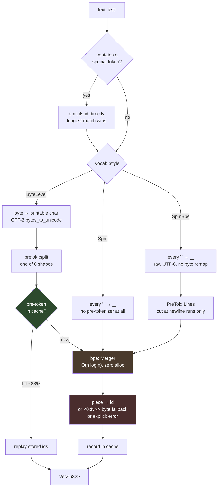
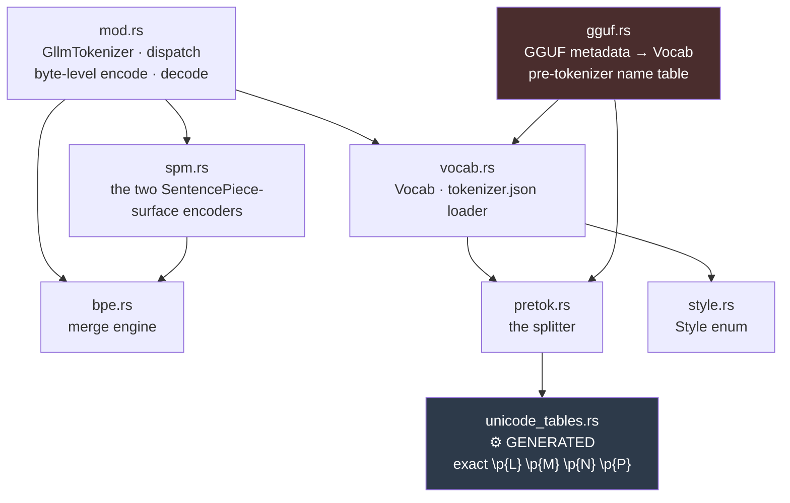
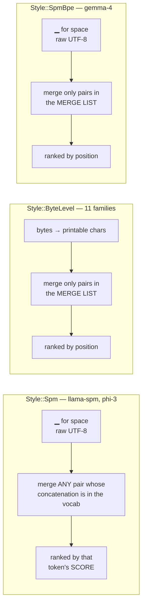
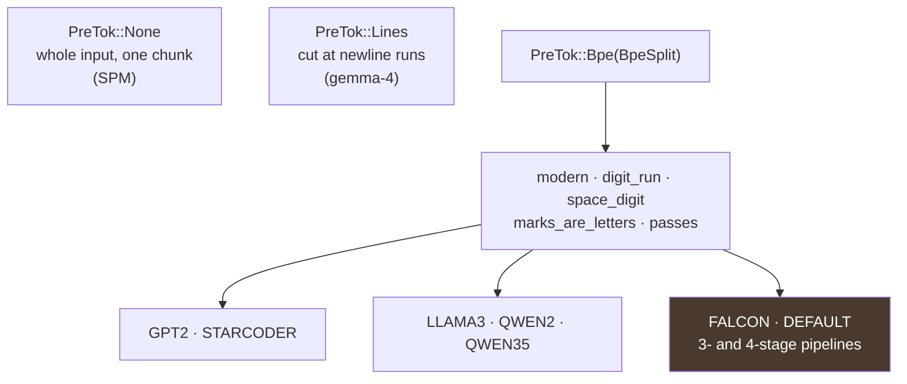
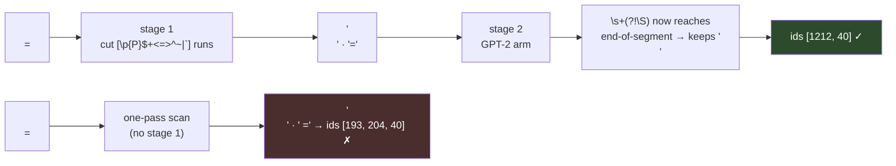
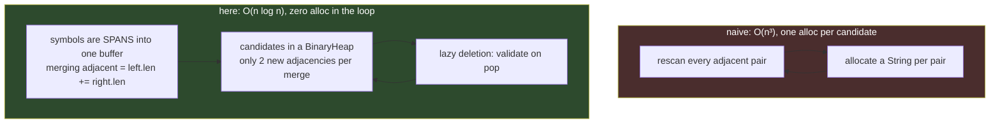
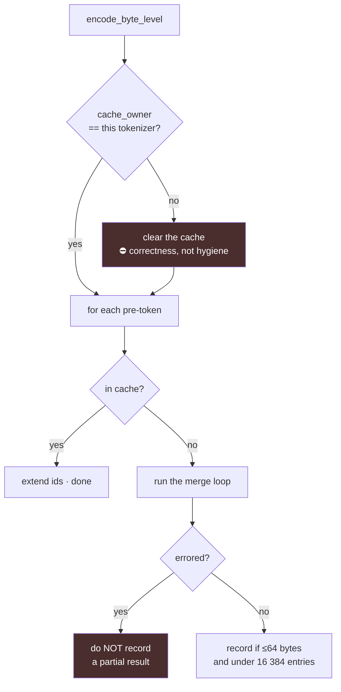

# `glcore::tokenizer`

GwenLand's tokenizer. SentencePiece and byte-level BPE, a zero-allocation merge
engine, exact Unicode character classes, and a pre-token cache.

**14 GGUF vocabulary families verified exact** against llama.cpp's reference
vectors. Anything this module cannot express is **refused at load time** rather
than approximated, because a mis-split changes token ids silently and nothing
downstream can detect it.

> Per-family status and the full history live in
> [`notes/gltokenizer-gguf-support-audit.md`](../../../notes/gltokenizer-gguf-support-audit.md).
> `tests/tokenizer_parity.rs` enforces it — this README is not the source of
> truth for what is supported.

---

## The pipeline



⚠️ The red box is where encoding is *lossless or an error* — never a silent
drop. The earlier implementation dropped unencodable symbols.

---

## Modules



`bpe`, `spm` and `unicode_tables` are `pub(crate)`. `pretok`, `vocab`, `style`
and `gguf` are `pub` because `examples/tokenizer_audit.rs` builds vocabularies
directly — that is how a *refused* family gets probed for how far off it is.

---

## The three styles

They are not variations on one encoder. Each decides token ids differently, and
two of them share a surface form while disagreeing on what ranks a merge.



⛔ **Gemma-4 ships 262 144 scores *and* 514 906 merges.** Only the merges are
used. Running the SPM encoder over it produces different ids and **no error
anywhere** — which is why `SpmBpe` is a named style rather than a flag on
`Spm`.

---

## The pre-tokenizer

Six shapes, not one variant per model. They are parameterised by the axes that
actually differ, because [an earlier table keyed on model *names* was wrong for
13 of 24 entries](../../../notes/gltokenizer-gguf-support-audit.md) — and none
of the wrong rows were reachable by any test.



`Passes` are **pipeline stages, not alternatives**. llama.cpp applies a
pattern's expressions in sequence, each refining what the previous produced, so
an earlier stage changes what a later stage *sees*:



That is why falcon could never be approximated by any single arm, and why it sat
at 44/46 until the pipeline was built.

---

## The merge engine

Standard BPE — repeatedly merge the best-ranked adjacent pair — with the two
costs of the naive formulation removed.



Two things are easy to get wrong here and both are pinned by tests:

* **Merge rules are keyed by `(concatenation, left_len)`,** not concatenation
  alone. A merge list is a list of *pairs*; different splits of one string are
  different rules with different ranks. Measured on llama-bpe: **152 403 of
  280 147 rules lost** to the naive key.
* **Adjacency alone does not detect a stale heap entry.** A merge can widen a
  symbol without unlinking it, so a pair priced as `a|b` still looks adjacent
  after `b` grew into `bc`. Candidates record the lengths they were priced at.

---

## The pre-token cache

Merging is ~97 % of encoding (pre-tokenization ≈ 4.9 ns/byte against ≈ 180
ns/byte for a whole encode). Real text is long-tailed — on 113 KiB of this
repo's prose and Rust source, **3 460 distinct pre-tokens carry 28 624
occurrences** — so the same word is merged to the same ids about eight times
over. A thread-local map replays the result instead.



⛔ **`cache_owner` is load-bearing.** The cache is thread-local, so a thread
that encodes with two different vocabularies would otherwise read the first
one's ids back for the second — plausible output, silently wrong model. Both
tokenizers work perfectly alone, so nothing else in the suite would catch it.
`pretoken_cache_does_not_leak_between_tokenizers` does, and that was **verified
by mutation**: deleting the owner check makes exactly that test fail.

---

## Measured

i3-1115G4, best-of-40, 113 KiB of real repository prose + Rust source.

| | ns/byte | MB/s |
|---|---:|---:|
| pre-tokenizer (gpt-2 / qwen2 / llama-bpe) | 4.8–5.0 | ~205 |
| pre-tokenizer (falcon, 3-stage) | 9.8 | ~102 |
| full encode, cache OFF | 177–186 | 5.4–5.7 |
| **full encode, cold cache** | 99–107 | **9.4–10.1** |
| full encode, warm cache | 51–52 | 19.3–19.7 |

⚠️ **Quote the cold number.** The bench encodes one input 40 times; a warm cache
across those passes answers "how fast is re-encoding a document you have already
seen", which no server does.

⚠️ **The corpus is the measurement.** An earlier bench repeated one sentence to
reach its target size — that scores a ~100 % hit rate and reports a speedup no
real workload reproduces.

⚠️ **The build profile is part of it.** `glcore` carries
`[profile.release.package.glcore] opt-level = 3`. Under the workspace default
`opt-level = "z"` the same scanner runs **3.4× slower**.

⚠️ **This machine cannot resolve small differences.** Best-of-5 gave a 5×
spread across identical runs. If the bench's `spread` column is not near 1.0,
the number beside it means nothing.

---

## ⛔ Traps

Every one of these was a real defect here, not a hypothetical.

1. **Round-trip tests prove nothing.** Nine green tests hid a tokenizer that
   was wrong for *every* vocabulary: two cancelling errors kept
   `decode(encode(x))` perfect. "It produces coherent text" is not evidence.
   Score against reference **data**.
2. **A lookup table keyed on a name is a silent-wrongness factory.** 13 of 24
   pre-tokenizer entries were wrong, and **none were reachable by any test**.
   Key on the property that varies — here, llama.cpp's `regex_exprs` arm.
3. **Two properties on one key can group differently.** `ignore_merges` follows
   llama.cpp's `pre_type`, *not* the regex arm: `dbrx`, `smaug-bpe`, `glm4` and
   `chatglm-bpe` share llama3's pattern but not its flag.
4. **A skipped test looks exactly like a passing one.** The parity harness found
   its corpus by a fixed directory depth; a refactor moved the crate root and it
   reported `ok` in 0.00 s while checking nothing. Set `GLTOK_REQUIRE_CORPUS=1`.
5. ⛔ **You cannot split one input across threads.** The obvious
   parallelisation — cut into chunks, tokenize independently, concatenate —
   needs a split point the segmentation is invariant under, and *right after a
   newline is not one*. `\s+(?!\S)` keeps a whitespace run whole when it reaches
   end-of-input and gives up its last character when it does not, so the seam
   re-segments. Counterexample pinned by
   `pretok::tests::splitting_the_input_changes_the_segmentation`.
   **Inter-request parallelism is unaffected and already works**: `GllmTokenizer`
   is `Sync` and its scratch is thread-local.

---

## Tools

```bash
# Per-family status against the reference corpus, plus probes for refused ones
cargo run -p glcore --example tokenizer_audit --release

# Audit one real model instead of the corpus
cargo run -p glcore --example tokenizer_audit --release -- model.gguf

# Throughput, best-of-40, with the cache A/B in-process
cargo run -p glcore --example tokenizer_bench --release -- model.gguf [corpus]

# Enforce the audit. GLTOK_REQUIRE_CORPUS turns a missing corpus into a failure
GLTOK_REQUIRE_CORPUS=1 cargo test -p glcore --release

# Regenerate the Unicode tables (aborts if its two UCD sources disagree)
python glcore/tools/gen_unicode_tables.py > glcore/src/tokenizer/unicode_tables.rs
```

`GLTOK_VOCAB_DIR` points the audit and parity harness at a llama.cpp `models/`
directory; otherwise they walk up looking for a sibling checkout.
