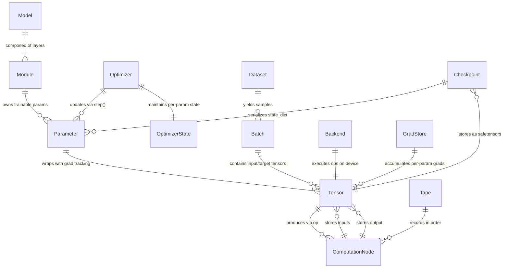

# Stummañ — gltrain Planning Document
**Codename:** Stummañ
**Version:** 0.1
**Date:** 2026-08-15
**Status:** Draft

---

## Part 1 — PRD (Product Requirements Document)

### 1.1 Overview

gltrain (codename: Stummañ, Breton for "to train/to form") is GwenLand's pure Rust training framework — positioned as "PyTorch for GwenLand". It is NOT a wrapper around an existing framework. It is built from scratch to leverage the existing gl* ecosystem (glcore, glproc, glcuda, gljax) as compute backends, replacing the current candle dependency.

The framework provides define-by-run autograd (PyTorch-style dynamic computation graphs), LoRA fine-tuning for LLMs, and seamless backend dispatch across CPU (AVX2 SIMD via glproc), GPU (PTX kernels via glcuda, sm_75), and TPU (PJRT/XLA via gljax). It reuses glcore's tensor format, GGUF I/O, and GATE execution policy, ensuring zero duplication with the inference codebase.

gltrain is isolated in its own workspace (excluded from root Cargo.toml) to prevent candle's transitive dependencies from polluting the inference build. The 380 passing tests (including 13 LoRA training tests, checkpoint resume, and layer-selective loading) will be preserved and migrated to the new backend incrementally.

### 1.2 Problem Statement

**Current pain points with candle:**
1. **Inference/training backend split**: Inference uses gl* backends (glproc AVX2, glcuda PTX), but training uses candle's own CUDA/CPU kernels → two separate kernel codebases to maintain, no shared optimization work.
2. **Dependency bloat**: candle pulls in transitive deps (accelerate-src on macOS, cudarc, half, gemm) that conflict with GwenLand's <50MB binary goal.
3. **GGUF round-trip overhead**: Training loads GGUF → candle tensors → trains → exports safetensors → merges back to GGUF. A native gl* training path can operate directly on glcore's quantized tensor format.
4. **No TPU support**: candle has no XLA/PJRT backend; gljax already has PJRT bindings for TPU inference, but training cannot leverage them.
5. **Limited autograd control**: candle's autograd is opaque; debugging gradient flow or implementing custom backward passes (e.g., for quantized-aware training) is difficult.

**User need**: A single, unified training framework that:
- Uses the same AVX2 matmul kernels (glproc) for both training backward passes and inference forward passes
- Uses the same PTX kernels (glcuda) for GPU training and GPU inference
- Supports LoRA fine-tuning on 8GB RAM machines (already working via layer-selective loading)
- Provides first-class TPU training support via gljax/PJRT
- Exposes autograd internals for research and custom gradient manipulation

### 1.3 Target User

**Primary user**: GwenLand contributors and advanced users who:
- Train LoRA adapters on local hardware (8–32GB RAM, optional GPU)
- Need reproducible, deterministic training (no Python runtime variability)
- Want to inspect autograd graphs, gradient flow, or debug training issues
- Require TPU training for large-scale experiments (via gljax/PJRT)

**Secondary user**: Researchers who:
- Implement custom training algorithms (e.g., quantization-aware training, gradient checkpointing variants)
- Need to profile kernel performance during training (reusing glbench infrastructure)
- Want to contribute new optimizers or training techniques without touching Python bindings

**Non-user (v1)**: Python-first ML practitioners who rely on PyTorch/Hugging Face ecosystems — gltrain has no Python bindings in v1.

### 1.4 Goals

| Goal | Success Metric | Priority |
|------|---------------|----------|
| **G1**: Replace candle with gl* backends | Zero candle imports in gltrain after M5; all 380 tests pass | P0 |
| **G2**: Preserve LoRA training functionality | Existing 13 LoRA tests pass with new backend; checkpoint resume works | P0 |
| **G3**: Support CPU (glproc), GPU (glcuda), TPU (gljax) | Same LoRA script runs on all 3 backends via GlEngine trait dispatch | P0 |
| **G4**: Match or exceed candle training speed | glproc LoRA training ≥ 0.8× candle CPU speed (measured on Qwen3-1.7B Q8_0, 8GB RAM) | P1 |
| **G5**: Expose autograd internals | Gradient tape data structure is public; users can inspect Node graph, manually set grads | P1 |
| **G6**: Zero inference binary bloat | gltrain exclusion in root Cargo.toml enforced; candle NOT in inference workspace Cargo.lock | P0 |
| **G7**: Reuse existing kernel code | glproc AVX2 matmul, glcuda PTX matmul called from training backward pass without duplication | P0 |
| **G8**: Preserve 8GB RAM footprint | Layer-selective loading continues to work; peak RSS ≤ 500 MB during LoRA training | P1 |

### 1.5 Non-Goals (explicitly out of scope for v1)

| Non-Goal | Rationale |
|----------|-----------|
| Python bindings (PyO3) | Adds complexity; Python users should use PyTorch/Hugging Face. gltrain is Rust-first. |
| Full model pre-training from scratch | LoRA fine-tuning is the primary use case. Full pre-training requires distributed training primitives (not in v1). |
| Static computation graphs (define-by-compile) | PyTorch-style define-by-run is more flexible for research; static graphs can be added in v2 for production optimization. |
| Automatic mixed precision (AMP) | Manual FP16/FP32 selection is sufficient for v1; AMP requires loss scaling heuristics (complexity budget). |
| Distributed data-parallel training | Single-device training only in v1. Multi-GPU/TPU-pod support deferred to v2. |
| ONNX/TorchScript export | gltrain models are trained in Rust, exported as GGUF or safetensors. ONNX interop is a non-goal. |
| Gradient accumulation across devices | Single-device gradient accumulation already works; cross-device accumulation requires AllReduce (v2). |
| Dynamic quantization during training | Training uses FP32 activations + FP32 gradients; quantized inference is post-training only (existing GGUF pipeline). |

### 1.6 Feature List

| Priority | Feature | Description |
|----------|---------|-------------|
| **P0** | Define-by-run autograd engine | PyTorch-style dynamic graph construction; backward pass via topological sort of tape |
| **P0** | Tensor abstraction over gl* backends | Single `Tensor<B: Backend>` type; `B` is `GlProc`, `GlCuda`, or `GlJax` |
| **P0** | LoRA training API | `LoraLayer` struct wrapping base Linear + lora_a/lora_b trainable params |
| **P0** | AdamW optimizer | 8-bit or FP32 AdamW with gradient clipping (reuse existing adamw_state.rs) |
| **P0** | Checkpoint save/resume | Safetensors checkpointing every 500 steps (reuse existing checkpoint_resumer.rs) |
| **P0** | Layer-selective loading | Load one transformer layer at a time into RAM (reuse existing layer_loader.rs) |
| **P0** | GGUF I/O integration | Load base model weights from GGUF via glcore parser; export merged weights to GGUF |
| **P1** | Mixed precision (FP16 forward, FP32 grad) | Forward pass in FP16 to save VRAM; gradients accumulated in FP32 for numerical stability |
| **P1** | Gradient checkpointing | Recompute activations on backward pass instead of storing them (trade compute for memory) |
| **P1** | Backend dispatch via GATE | Reuse glcore's GATE execution policy for CPU/GPU/TPU selection |
| **P1** | Public gradient tape API | Expose `ComputationNode` struct, `Tape::nodes()` method for debugging/visualization |
| **P2** | Learning rate schedulers | Cosine annealing, linear warmup (low complexity; high impact for convergence) |
| **P2** | Gradient norm logging | Emit per-layer gradient norms to JSON progress events (debugging aid) |
| **P2** | Sparse gradient updates (LoRA-specific) | Only update lora_a/lora_b params; skip frozen base model (already implicit in current design) |
| **P3** | Custom backward hooks | User-defined `fn backward_hook(grad: &Tensor) -> Tensor` for grad manipulation |
| **P3** | Tensor operation fusion | Fuse elementwise ops (ReLU + mul) into single kernel call (optimization, not correctness) |

### 1.7 Non-Functional Requirements

#### Performance
- **Training throughput**: glproc LoRA training on Qwen3-1.7B Q8_0 ≥ 0.8× candle CPU speed (≥ 50 tokens/sec on AMD Ryzen 9 7950X, 8 cores)
- **Memory overhead**: Autograd tape memory ≤ 100 MB for typical LoRA training run (500 steps, rank=8, grad_accum=16)
- **Backward pass latency**: Topological sort + backward traversal ≤ 1.2× forward pass time (acceptable overhead for dynamic graphs)

#### Memory
- **Peak RSS**: LoRA training on 8GB RAM machine stays ≤ 500 MB peak (layer-selective loading enforced)
- **VRAM budget**: GPU training on 8GB VRAM card (GTX 1070) fits Qwen3-1.7B LoRA (FP16 activations, rank=8)
- **Gradient accumulation**: Supports grad_accum=16 without OOM (tested configuration from existing pipeline)

#### Correctness
- **Gradient numerical accuracy**: Finite-difference gradient check passes for all ops (atol=1e-4, rtol=1e-3)
- **Deterministic results**: Same input + same seed → same loss trajectory (no non-deterministic atomics in kernels)
- **No silent gradient errors**: NaN/Inf in gradients triggers immediate error (no silent propagation)

#### Compatibility
- **Existing test suite**: All 380 gltrain tests pass after backend replacement (including 13 LoRA tests)
- **GGUF round-trip**: safetensors checkpoint → GGUF merge → inference via glproc/glcuda produces correct logits
- **Rust stable**: Compiles on Rust stable (no nightly features; existing codebase already stable-only)

### 1.8 Success Criteria

**M1 complete**: Minimal autograd engine compiles; single matmul op has backward pass; gradient check passes.
**M2 complete**: LoRA layer trains on glproc backend; loss decreases on micro-dataset (10 samples); checkpoint saves.
**M3 complete**: Full Qwen3-1.7B LoRA training runs to completion (500 steps) on glproc; loss converges; no OOM.
**M4 complete**: GPU backend (glcuda) training works; same script runs on CPU/GPU via backend selection.
**M5 complete**: candle dependency removed; all 380 tests pass; training speed ≥ 0.8× candle baseline.

**Release criteria (v0.1)**: M1–M5 complete + documentation (README with usage examples, API docs for Tensor/Module traits).

---

## Part 2 — ERD (Entity Relationship Diagram)



### Relationship Notes

**Tensor → ComputationNode**: Each tensor operation (matmul, add, ReLU) appends a `ComputationNode` to the tape. The node stores: (1) input tensor IDs, (2) output tensor ID, (3) backward function pointer.

**ComputationNode → Tensor**: Nodes hold weak references to input tensors (for shape/device info) and a strong reference to the output tensor. When the output tensor is dropped, the node's backward function becomes unreachable (no memory leak).

**Tape → ComputationNode**: The tape is a `Vec<ComputationNode>` built during forward pass. `backward()` traverses this vec in reverse order (topological sort implicit in append order for define-by-run).

**Parameter → Tensor**: A `Parameter` is a thin wrapper around a `Tensor` that marks it as trainable. It stores an `Option<Tensor>` for the gradient (initially None; filled during backward pass).

**Module → Parameter**: A `Module` (e.g., `Linear`, `LoraLayer`) owns a `Vec<Parameter>`. The `parameters()` method returns references for optimizer registration.

**Optimizer → Parameter**: The optimizer holds a `Vec<&Parameter>` and a `HashMap<ParamId, OptimizerState>` (for AdamW: momentum vectors m, v). `step()` mutates parameter tensors in-place.

**OptimizerState → Parameter**: One-to-one relationship; each trainable parameter has an optimizer state entry. State is NOT serialized in checkpoints (deliberate design choice from GWEN-222).

**Dataset → Batch**: A dataset is an iterator that yields batches. A batch is a struct `{ inputs: Vec<Tensor>, targets: Vec<Tensor> }`.

**Model → Module**: A model is a tree of modules (e.g., `TransformerModel` contains `Vec<TransformerLayer>`, each contains `Attention` + `MLP` modules).

**Checkpoint → Parameter**: Checkpointing serializes all `Parameter` tensors to a safetensors file. Optimizer state is NOT saved (GWEN-222 decision).

**Backend → Tensor**: Each tensor is tied to a backend `B: Backend`. All ops on that tensor are dispatched to `B::matmul`, `B::add`, etc. Mixing backends requires explicit `.to_backend(other)` calls.

**GradStore → Tensor**: Gradient accumulation across multiple batches. A `GradStore` is a `HashMap<TensorId, Tensor>` where gradients are summed. Cleared after optimizer step.


---

## Part 3 — TRD (Technical Requirements Document)

### 3.1 Stack

| Layer | Technology | Reason |
|-------|-----------|--------|
| **Language** | Rust (stable channel) | Memory safety, zero-cost abstractions, existing gl* ecosystem in Rust |
| **Autograd engine** | Custom tape-based (define-by-run) | PyTorch-style dynamic graphs; simpler than static graph compilation |
| **CPU backend** | glproc (AVX2 SIMD) | Reuse existing AVX2 matmul kernels; no duplication with inference code |
| **GPU backend** | glcuda (PTX kernels, sm_75) | Reuse existing PTX kernels; already optimized for GTX 1070/RTX 2060 |
| **TPU backend** | gljax (PJRT/XLA) | Reuse existing PJRT bindings; first-class TPU training support |
| **Tensor format** | glcore TensorData + GGUF | Reuse existing quantization formats (Q8_0, Q4_K); no conversion overhead |
| **Serialization** | safetensors (checkpoints) | Fast, simple, already used in LoRA pipeline; no pickle security issues |
| **Optimizer** | AdamW (8-bit or FP32) | Already implemented in adamw_state.rs; widely used for LLM fine-tuning |
| **Testing** | Rust native tests + quickcheck | Existing 380-test suite; property-based testing for gradient correctness |
| **Build system** | Cargo workspace (isolated) | gltrain excluded from root workspace; prevents candle dep pollution |

### 3.2 Architecture Overview

```
┌─────────────────────────────────────────────────────────────────────┐
│  User Training Script (Rust)                                        │
│                                                                     │
│  fn main() {                                                        │
│      let model = LoraModel::<GlProc>::new(...);                    │
│      let optimizer = AdamW::new(model.parameters(), lr=1e-4);      │
│      for batch in dataset {                                         │
│          let loss = model.forward(&batch);                          │
│          loss.backward();                                           │
│          optimizer.step();                                          │
│      }                                                              │
│  }                                                                  │
└────────────────────┬────────────────────────────────────────────────┘
                     │
                     ▼
┌─────────────────────────────────────────────────────────────────────┐
│  gltrain High-Level API                                             │
│  ┌──────────────┐  ┌──────────────┐  ┌──────────────┐            │
│  │ Tensor<B>    │  │ Module       │  │ Optimizer    │            │
│  │ - data       │  │ - parameters │  │ - step()     │            │
│  │ - grad       │  │ - forward()  │  │ - zero_grad()│            │
│  │ - backward() │  │              │  │              │            │
│  └──────────────┘  └──────────────┘  └──────────────┘            │
└────────────────────┬────────────────────────────────────────────────┘
                     │
                     ▼
┌─────────────────────────────────────────────────────────────────────┐
│  Autograd Engine (Stummañ Kevskrid — "computation recorder")       │
│  ┌──────────────────────────────────────────────────────────────┐  │
│  │ Tape (Vec<ComputationNode>)                                  │  │
│  │   - forward: append nodes                                    │  │
│  │   - backward: reverse iteration + topological execution      │  │
│  └──────────────────────────────────────────────────────────────┘  │
│  ┌──────────────────────────────────────────────────────────────┐  │
│  │ ComputationNode                                              │  │
│  │   - op: OpType (Matmul, Add, ReLU, ...)                     │  │
│  │   - inputs: Vec<TensorId>                                    │  │
│  │   - output: TensorId                                         │  │
│  │   - backward_fn: fn(&Tensor, &Tape) -> Vec<Tensor>          │  │
│  └──────────────────────────────────────────────────────────────┘  │
└────────────────────┬────────────────────────────────────────────────┘
                     │
                     ▼
┌─────────────────────────────────────────────────────────────────────┐
│  Backend Dispatch (via GATE or explicit trait selection)            │
│  ┌──────────────┐  ┌──────────────┐  ┌──────────────┐            │
│  │ GlProc       │  │ GlCuda       │  │ GlJax        │            │
│  │ (CPU/AVX2)   │  │ (GPU/PTX)    │  │ (TPU/PJRT)   │            │
│  └──────────────┘  └──────────────┘  └──────────────┘            │
└────────────────────┬────────────────────────────────────────────────┘
                     │
                     ▼
┌─────────────────────────────────────────────────────────────────────┐
│  Kernel Execution (existing glproc/glcuda/gljax kernels)            │
│  - AVX2 matmul (glproc/src/ops/matmul_avx2.rs)                     │
│  - PTX matmul (glcuda/src/kernels/matmul.ptx)                      │
│  - XLA HLO lowering (gljax/src/ops/matmul.rs)                      │
└─────────────────────────────────────────────────────────────────────┘
```

**Data flow example** (forward + backward pass):

```
1. Forward: y = matmul(x, W) + b
   → Tape appends: [Node{op: Matmul, inputs: [x, W], output: y1},
                     Node{op: Add, inputs: [y1, b], output: y}]

2. Backward: loss.backward()
   → Tape reverses: [Add node, Matmul node]
   → Add.backward(dy) → dy1=dy, db=dy
   → Matmul.backward(dy1) → dx=matmul(dy1, W^T), dW=matmul(x^T, dy1)
   → Gradients stored: x.grad=dx, W.grad=dW, b.grad=db

3. Optimizer step:
   → For each param p in [W, b]:
       p.data -= lr * p.grad
```

### 3.3 Core Module Structure with dependency rules

```
gltrain/src/
├── autograd/                  # Stummañ Kevskrid (computation recorder)
│   ├── tape.rs                # Tape struct, backward() implementation
│   ├── node.rs                # ComputationNode struct
│   ├── ops/                   # Per-op backward functions
│   │   ├── matmul.rs          # matmul_backward(dy, x, W) -> (dx, dW)
│   │   ├── add.rs             # add_backward(dy) -> (dy, dy)
│   │   ├── relu.rs            # relu_backward(dy, x) -> dy * (x > 0)
│   │   └── mod.rs
│   └── mod.rs
├── tensor/                    # Stummañ Tensor (tensor core)
│   ├── tensor.rs              # Tensor<B: Backend> struct
│   ├── backend.rs             # Backend trait (matmul, add, relu, etc.)
│   ├── ops.rs                 # High-level ops (tensor.matmul(), tensor.add())
│   └── mod.rs
├── nn/                        # Stummañ Gwiskadur (model building blocks)
│   ├── module.rs              # Module trait, Parameter struct
│   ├── linear.rs              # Linear layer
│   ├── lora.rs                # LoraLayer (reuse existing logic)
│   ├── attention.rs           # Multi-head attention (optional, M4+)
│   └── mod.rs
├── optim/                     # Stummañ Gwellaer (optimizer)
│   ├── optimizer.rs           # Optimizer trait
│   ├── adamw.rs               # AdamW implementation (reuse adamw_state.rs)
│   ├── sgd.rs                 # SGD (baseline, for testing)
│   └── mod.rs
├── backend/                   # Stummañ Karg (backend implementations)
│   ├── glproc.rs              # GlProc backend (CPU/AVX2)
│   ├── glcuda.rs              # GlCuda backend (GPU/PTX)
│   ├── gljax.rs               # GlJax backend (TPU/PJRT)
│   └── mod.rs
├── dataset/                   # Stummañ Roadennoù (dataset loaders)
│   ├── jsonl.rs               # JSONL dataset (reuse existing)
│   ├── batch.rs               # Batch struct
│   └── mod.rs
├── checkpoint/                # Stummañ Pik (checkpointing)
│   ├── saver.rs               # Checkpoint save/load (reuse checkpoint_resumer.rs)
│   └── mod.rs
├── train/                     # Stummañ Staliañ (training loop)
│   ├── trainer.rs             # High-level Trainer struct
│   ├── layered_loop.rs        # Layer-selective training (reuse layered_training_loop.rs)
│   └── mod.rs
├── error.rs                   # GwenError (extend for autograd errors)
└── lib.rs                     # Top-level exports
```

**Dependency rules**:
- `tensor` depends on: `autograd` — **for IDs and metadata only** (see below)
- `autograd` depends on: NOTHING (no `Tensor<B>`, no backend types)
- `nn` depends on: `tensor`, `autograd` (builds on top)
- `optim` depends on: `tensor`, `nn::Parameter`
- `backend` depends on: `tensor`, glcore, glproc, glcuda, gljax
- `dataset` depends on: `tensor`
- `checkpoint` depends on: `tensor`, `nn::Module`
- `train` depends on: ALL (top-level orchestration)

**No circular deps**: `autograd` is the root; everything else builds upward.

> **Corrected in M1 Wave 2 — the arrow runs the other way.** This section
> originally read "`autograd` depends on `tensor` (for Tensor type)" and
> "`tensor` depends on: NOTHING". The implementation inverted it, and the
> inversion is intentional, not an accident to be undone.
>
> **Why.** `Tape` must stay backend-agnostic. If it held `Tensor<B>` it would
> become `Tape<B>`, and a single tape could then never span a mixed-backend
> graph — which is exactly what M4's CPU/GPU/TPU dispatch needs. So the tape
> stores only `TensorId` (a `usize`) and `TensorMeta` (a shape plus a flag).
> Neither mentions `Tensor`, `Backend`, or any backend type. `tensor` then
> imports those IDs to tag itself and record ops.
>
> **This is not circular.** `autograd/{node,tape}.rs` import nothing from
> `tensor` — verify with `grep -rn "use crate::tensor" src/autograd/`, which
> must stay empty. The dependency is one-way: `tensor` → `autograd`.
>
> **The constraint to preserve.** Autograd may never name a tensor type. If a
> later wave needs tensor data inside the tape (Wave 3's gradient store is the
> obvious candidate), it must go through an erased handle or a generic
> parameter on that *sub-structure* — never by importing `Tensor<B>` into
> `autograd`, which would make the cycle real and force `Tape` to become
> generic.

### 3.4 Key Traits & Interfaces

#### Backend Trait

```rust
pub trait Backend: Send + Sync + 'static {
    /// Scalar data type (f32 or f16)
    type Scalar: Copy + Send + Sync;
    
    /// Device-specific tensor storage (e.g., CPU Vec<f32>, GPU CudaBuffer)
    type Storage: Clone + Send + Sync;
    
    /// Matrix multiplication: C = A @ B
    /// A: (M, K), B: (K, N) -> C: (M, N)
    fn matmul(a: &Self::Storage, b: &Self::Storage, shape_a: &[usize], shape_b: &[usize]) -> Result<Self::Storage>;
    
    /// Element-wise addition: C = A + B
    fn add(a: &Self::Storage, b: &Self::Storage) -> Result<Self::Storage>;
    
    /// Element-wise multiplication: C = A * B
    fn mul(a: &Self::Storage, b: &Self::Storage) -> Result<Self::Storage>;
    
    /// ReLU activation: y = max(0, x)
    fn relu(x: &Self::Storage) -> Result<Self::Storage>;
    
    /// Transpose: B = A^T
    fn transpose(a: &Self::Storage, shape: &[usize]) -> Result<Self::Storage>;
    
    /// Allocate zeros: tensor of given shape filled with 0
    fn zeros(shape: &[usize]) -> Result<Self::Storage>;
    
    /// Copy tensor from host (Vec<f32>) to device
    fn from_vec(data: Vec<Self::Scalar>, shape: &[usize]) -> Result<Self::Storage>;
    
    /// Copy tensor from device to host (Vec<f32>)
    fn to_vec(storage: &Self::Storage) -> Result<Vec<Self::Scalar>>;
}
```

**Implementation for GlProc**:
- `Storage = Vec<f32>` (CPU heap allocation)
- `matmul` calls `glproc::ops::matmul_f32_avx2` (existing AVX2 kernel)
- `add`, `mul`, `relu` are simple loops over `Vec<f32>`
- `transpose` is a reshape + stride adjustment (no data copy)

**Implementation for GlCuda**:
- `Storage = CudaBuffer<f32>` (GPU device memory)
- `matmul` calls `glcuda::kernels::matmul_ptx` (existing PTX kernel)
- `add`, `mul`, `relu` are PTX elementwise kernels (already exist in glcuda)
- `transpose` is a cublas transpose call

**Implementation for GlJax**:
- `Storage = PjrtBuffer` (TPU HBM)
- `matmul` calls `gljax::ops::dot_general` (XLA HLO lowering)
- `add`, `mul`, `relu` are HLO ops
- `transpose` is HLO transpose

#### Op Trait (for backward pass)

```rust
pub trait Op: Send + Sync {
    /// Compute gradients for inputs given output gradient dy
    /// Returns: Vec of input gradients in same order as forward inputs
    fn backward(&self, dy: &Tensor, tape: &Tape) -> Result<Vec<Tensor>>;
    
    /// Op name for debugging
    fn name(&self) -> &'static str;
}
```

**Example: MatmulOp**:

```rust
pub struct MatmulOp {
    a_id: TensorId,  // Left input tensor ID
    b_id: TensorId,  // Right input tensor ID
}

impl Op for MatmulOp {
    fn backward(&self, dy: &Tensor, tape: &Tape) -> Result<Vec<Tensor>> {
        let a = tape.get_tensor(self.a_id)?;
        let b = tape.get_tensor(self.b_id)?;
        
        // da = dy @ b^T
        let da = dy.matmul(&b.transpose()?)?;
        
        // db = a^T @ dy
        let db = a.transpose()?.matmul(dy)?;
        
        Ok(vec![da, db])
    }
    
    fn name(&self) -> &'static str {
        "Matmul"
    }
}
```

#### Module Trait

```rust
pub trait Module {
    /// Backend type (GlProc, GlCuda, GlJax)
    type Backend: Backend;
    
    /// Forward pass
    fn forward(&self, x: &Tensor<Self::Backend>) -> Result<Tensor<Self::Backend>>;
    
    /// Return all trainable parameters
    fn parameters(&self) -> Vec<&Parameter<Self::Backend>>;
    
    /// Return mutable references for optimizer updates
    fn parameters_mut(&mut self) -> Vec<&mut Parameter<Self::Backend>>;
}
```

**Example: Linear layer**:

```rust
pub struct Linear<B: Backend> {
    weight: Parameter<B>,  // (out_features, in_features)
    bias: Option<Parameter<B>>,
}

impl<B: Backend> Module for Linear<B> {
    type Backend = B;
    
    fn forward(&self, x: &Tensor<B>) -> Result<Tensor<B>> {
        let y = x.matmul(&self.weight.tensor())?;
        if let Some(ref b) = self.bias {
            y.add(&b.tensor())
        } else {
            Ok(y)
        }
    }
    
    fn parameters(&self) -> Vec<&Parameter<B>> {
        let mut params = vec![&self.weight];
        if let Some(ref b) = self.bias {
            params.push(b);
        }
        params
    }
    
    fn parameters_mut(&mut self) -> Vec<&mut Parameter<B>> {
        let mut params = vec![&mut self.weight];
        if let Some(ref mut b) = self.bias {
            params.push(b);
        }
        params
    }
}
```

#### Optimizer Trait

```rust
pub trait Optimizer {
    /// Backend type
    type Backend: Backend;
    
    /// Perform single optimization step (update all parameters)
    fn step(&mut self) -> Result<()>;
    
    /// Zero out all gradients
    fn zero_grad(&mut self);
    
    /// Get learning rate
    fn lr(&self) -> f64;
    
    /// Set learning rate (for schedulers)
    fn set_lr(&mut self, lr: f64);
}
```

**Example: AdamW**:

```rust
pub struct AdamW<B: Backend> {
    params: Vec<Parameter<B>>,
    lr: f64,
    beta1: f64,  // momentum decay (default: 0.9)
    beta2: f64,  // RMSprop decay (default: 0.999)
    eps: f64,    // numerical stability (default: 1e-8)
    weight_decay: f64,
    state: HashMap<TensorId, AdamWState<B>>,  // per-param momentum
    step_count: usize,
}

pub struct AdamWState<B: Backend> {
    m: Tensor<B>,  // First moment (momentum)
    v: Tensor<B>,  // Second moment (RMSprop)
}

impl<B: Backend> Optimizer for AdamW<B> {
    type Backend = B;
    
    fn step(&mut self) -> Result<()> {
        self.step_count += 1;
        let bias_correction1 = 1.0 - self.beta1.powi(self.step_count as i32);
        let bias_correction2 = 1.0 - self.beta2.powi(self.step_count as i32);
        
        for param in &mut self.params {
            let grad = param.grad().ok_or_else(|| anyhow!("missing gradient"))?;
            
            let state = self.state.entry(param.id()).or_insert_with(|| {
                AdamWState {
                    m: Tensor::zeros_like(&param.tensor()),
                    v: Tensor::zeros_like(&param.tensor()),
                }
            });
            
            // m = beta1 * m + (1 - beta1) * grad
            state.m = state.m.mul_scalar(self.beta1)?.add(&grad.mul_scalar(1.0 - self.beta1)?)?;
            
            // v = beta2 * v + (1 - beta2) * grad^2
            state.v = state.v.mul_scalar(self.beta2)?.add(&grad.mul(&grad)?.mul_scalar(1.0 - self.beta2)?)?;
            
            // m_hat = m / bias_correction1
            let m_hat = state.m.div_scalar(bias_correction1)?;
            
            // v_hat = v / bias_correction2
            let v_hat = state.v.div_scalar(bias_correction2)?;
            
            // param = param - lr * m_hat / (sqrt(v_hat) + eps)
            let update = m_hat.div(&v_hat.sqrt()?.add_scalar(self.eps)?)?;
            param.tensor_mut().sub_inplace(&update.mul_scalar(self.lr)?)?;
            
            // Weight decay: param = param * (1 - lr * weight_decay)
            if self.weight_decay > 0.0 {
                param.tensor_mut().mul_scalar_inplace(1.0 - self.lr * self.weight_decay)?;
            }
        }
        
        Ok(())
    }
    
    fn zero_grad(&mut self) {
        for param in &mut self.params {
            param.zero_grad();
        }
    }
    
    fn lr(&self) -> f64 {
        self.lr
    }
    
    fn set_lr(&mut self, lr: f64) {
        self.lr = lr;
    }
}
```

#### Dataset Trait

```rust
pub trait Dataset {
    type Backend: Backend;
    type Item;
    
    /// Return an iterator over batches
    fn iter(&self) -> Box<dyn Iterator<Item = Result<Batch<Self::Backend>>> + '_>;
    
    /// Number of samples (optional, for progress bars)
    fn len(&self) -> Option<usize>;
}

pub struct Batch<B: Backend> {
    pub inputs: Tensor<B>,   // (batch_size, seq_len)
    pub targets: Tensor<B>,  // (batch_size, seq_len)
}
```

### 3.5 Autograd Engine Design

#### Tape Data Structure

```rust
pub struct Tape {
    /// Sequential list of computation nodes (append-only during forward pass)
    nodes: Vec<ComputationNode>,
    
    /// Tensor storage: TensorId -> Tensor (weak refs for memory efficiency)
    tensors: HashMap<TensorId, Weak<TensorData>>,
    
    /// Next tensor ID (monotonically increasing)
    next_id: AtomicUsize,
}

pub struct ComputationNode {
    /// Unique node ID
    id: NodeId,
    
    /// Operation type (for debugging)
    op_name: &'static str,
    
    /// Input tensor IDs
    inputs: Vec<TensorId>,
    
    /// Output tensor ID
    output: TensorId,
    
    /// Backward function (polymorphic via trait object)
    backward_fn: Box<dyn Fn(&Tensor, &Tape) -> Result<Vec<Tensor>>>,
}

pub struct TensorData<B: Backend> {
    /// Unique tensor ID (monotonic, assigned on creation)
    id: TensorId,
    
    /// Tensor shape (e.g., [batch_size, seq_len, hidden_dim])
    shape: Vec<usize>,
    
    /// Backend-specific storage (Vec<f32> for CPU, CudaBuffer for GPU)
    storage: B::Storage,
    
    /// Gradient tensor (None until backward() populates it)
    grad: Option<Tensor<B>>,
    
    /// Whether this tensor requires gradient tracking
    requires_grad: bool,
}
```

**Why this design**:
- **Append-only tape**: Forward pass appends nodes in execution order → implicit topological sort for backward pass.
- **Weak refs in tape**: Prevents memory leaks when intermediate tensors are dropped; tape only holds weak refs.
- **Polymorphic backward_fn**: Each op has a custom backward function stored as `Box<dyn Fn>` → no giant match statement.
- **TensorId instead of pointers**: Safer than raw pointers; IDs are stable across moves.

#### Node Representation

**Node creation example** (matmul forward pass):

```rust
impl<B: Backend> Tensor<B> {
    pub fn matmul(&self, other: &Tensor<B>) -> Result<Tensor<B>> {
        // 1. Perform forward computation via backend
        let result_storage = B::matmul(&self.storage, &other.storage, &self.shape, &other.shape)?;
        let result_shape = vec![self.shape[0], other.shape[1]];
        
        // 2. Create output tensor
        let output = Tensor::new(result_storage, result_shape, self.requires_grad || other.requires_grad);
        
        // 3. Record computation on tape (if grad tracking enabled)
        if output.requires_grad {
            let a_id = self.id;
            let b_id = other.id;
            let out_id = output.id;
            
            let backward_fn = Box::new(move |dy: &Tensor<B>, tape: &Tape| {
                let a = tape.get_tensor(a_id)?;
                let b = tape.get_tensor(b_id)?;
                
                // da = dy @ b^T
                let da = dy.matmul(&b.transpose()?)?;
                
                // db = a^T @ dy
                let db = a.transpose()?.matmul(dy)?;
                
                Ok(vec![da, db])
            });
            
            tape.push(ComputationNode {
                id: tape.next_node_id(),
                op_name: "Matmul",
                inputs: vec![a_id, b_id],
                output: out_id,
                backward_fn,
            });
        }
        
        Ok(output)
    }
}
```

#### Backward Traversal

```rust
impl Tape {
    pub fn backward(&mut self, loss: &Tensor) -> Result<()> {
        // 1. Initialize gradient of loss tensor to 1.0 (dL/dL = 1)
        let mut grads: HashMap<TensorId, Tensor> = HashMap::new();
        grads.insert(loss.id, Tensor::ones_like(loss));
        
        // 2. Reverse iterate over nodes (LIFO order)
        for node in self.nodes.iter().rev() {
            // Get gradient of this node's output
            let dy = grads.get(&node.output)
                .ok_or_else(|| anyhow!("missing gradient for tensor {}", node.output))?;
            
            // Call backward function to compute input gradients
            let input_grads = (node.backward_fn)(dy, self)?;
            
            // Accumulate gradients for each input tensor
            for (input_id, input_grad) in node.inputs.iter().zip(input_grads) {
                grads.entry(*input_id)
                    .and_modify(|g| *g = g.add(&input_grad).unwrap())
                    .or_insert(input_grad);
            }
        }
        
        // 3. Write accumulated gradients back to tensor.grad fields
        for (tensor_id, grad) in grads {
            if let Some(tensor) = self.tensors.get(&tensor_id) {
                if let Some(tensor_strong) = tensor.upgrade() {
                    tensor_strong.grad = Some(grad);
                }
            }
        }
        
        Ok(())
    }
}
```

**Topological sort guarantee**: Since nodes are appended during forward pass in execution order, reversing the list gives valid backward order (child before parent).

#### Gradient Accumulation

```rust
impl Tape {
    /// Accumulate gradients from multiple backward passes (for gradient accumulation)
    pub fn accumulate_grad(&mut self, param_id: TensorId, grad: Tensor) {
        self.grad_accum.entry(param_id)
            .and_modify(|g| *g = g.add(&grad).unwrap())
            .or_insert(grad);
    }
    
    /// Retrieve accumulated gradient and clear accumulator
    pub fn pop_grad(&mut self, param_id: TensorId) -> Option<Tensor> {
        self.grad_accum.remove(&param_id)
    }
}
```

**Usage in training loop**:

```rust
for (i, batch) in dataset.iter().enumerate() {
    let loss = model.forward(&batch)?;
    tape.backward(&loss)?;
    
    if (i + 1) % grad_accum == 0 {
        optimizer.step()?;  // Uses accumulated grads
        optimizer.zero_grad();
        tape.clear_grad_accum();
    }
}
```

### 3.6 Backend Dispatch

#### Static Backend Selection (Compile-Time)

```rust
// User chooses backend at compile time via type parameter
fn train_model<B: Backend>() -> Result<()> {
    let model = LoraModel::<B>::new(...);
    let optimizer = AdamW::<B>::new(...);
    // Training code is generic over B
}

// Instantiate with specific backend
fn main() {
    #[cfg(feature = "glproc")]
    train_model::<GlProc>()?;
    
    #[cfg(feature = "glcuda")]
    train_model::<GlCuda>()?;
}
```

**Pros**: Zero runtime overhead; compiler optimizes for specific backend.
**Cons**: Must compile separate binaries for CPU/GPU training.

#### Dynamic Backend Selection (Runtime via GATE)

```rust
// Use glcore's GATE execution policy for dynamic dispatch
fn train_model_dynamic(backend: &str) -> Result<()> {
    match backend {
        "cpu" => train_model::<GlProc>()?,
        "cuda" => train_model::<GlCuda>()?,
        "tpu" => train_model::<GlJax>()?,
        _ => bail!("unknown backend: {}", backend),
    }
    Ok(())
}

// CLI: gwen train --backend cuda ...
```

**Pros**: Single binary; user selects backend at runtime.
**Cons**: Some dynamic dispatch overhead (negligible for training workloads).

#### GATE Integration

Reuse glcore's GATE (GwenLand Adaptive Tensor Execution) policy for automatic backend selection:

```rust
use glcore::gate::ExecutionPolicy;

fn auto_backend() -> Box<dyn Backend> {
    let policy = ExecutionPolicy::auto();
    match policy.best_device() {
        Device::Cuda(dev) => Box::new(GlCuda::new(dev)),
        Device::Cpu => Box::new(GlProc::new()),
        Device::Tpu(dev) => Box::new(GlJax::new(dev)),
    }
}
```

**GATE decision logic** (from glcore/src/gate/policy.rs):
1. Check CUDA availability + VRAM budget → prefer GPU if VRAM sufficient
2. Check TPU availability (PJRT_DEVICE env var) → prefer TPU if available
3. Fallback to CPU (glproc) if no accelerator

**Memory budget check** (existing logic in glcore):
- Estimate model size: `num_params * sizeof(f32)` + activation memory
- If GPU VRAM < 1.5× model size → fallback to CPU (avoids OOM)
- TPU HBM check via `pjrt_client.device_memory_size()`

### 3.7 Memory Management for Training

#### Activation Memory

**Problem**: Forward pass stores activations for backward pass → large memory footprint.

**Solution 1: Gradient Checkpointing** (trade compute for memory)

```rust
impl Tape {
    /// Recompute forward pass during backward instead of storing activations
    pub fn checkpoint_segment(&mut self, start: NodeId, end: NodeId) {
        // Mark this segment as "recompute on backward"
        for node in start..end {
            self.nodes[node].checkpoint = true;
        }
    }
}
```

**Usage**:

```rust
// Checkpoint every 4 transformer layers
for i in 0..num_layers {
    let start_node = tape.current_node_id();
    layer_output = transformer_layer[i].forward(&layer_input)?;
    let end_node = tape.current_node_id();
    
    if i % 4 == 0 {
        tape.checkpoint_segment(start_node, end_node);
    }
}
```

**Tradeoff**: 33% more FLOPs (recompute 1 out of 3 segments) → 50% less memory.

**Solution 2: Layer-Selective Loading** (existing GWEN-216 infrastructure)

Reuse existing `LayerLoader` + `LoadedLayer` from gltrain/src/train/layer_loader.rs:

```rust
// Load one transformer layer at a time
for layer_idx in 0..num_layers {
    let loaded_layer = layer_loader.load_layer(layer_idx)?;
    
    // Train on this layer only
    let layer_output = lora_layer.forward(&layer_input, &loaded_layer)?;
    let loss = criterion(layer_output, targets)?;
    loss.backward()?;
    optimizer.step()?;
    
    // Unload layer (MADV_DONTNEED on Unix → OS reclaims pages)
    drop(loaded_layer);
}
```

**Memory footprint**: ~90 MB per layer (Q8_0 weights) + ~100 MB dequant buffer → total ~200 MB per layer iteration.

#### Optimizer State Memory

**Problem**: AdamW stores 2× parameter count (momentum m + variance v) → 3× total memory (params + m + v).

**Solution 1: 8-bit AdamW** (existing in adamw_state.rs)

Quantize momentum to INT8:

```rust
pub struct AdamW8Bit<B: Backend> {
    state: HashMap<TensorId, AdamWState8Bit<B>>,
}

pub struct AdamWState8Bit<B: Backend> {
    m: QuantizedTensor<B, INT8>,  // First moment quantized to INT8
    v: QuantizedTensor<B, INT8>,  // Second moment quantized to INT8
    scale_m: f32,                  // Dequant scale for m
    scale_v: f32,                  // Dequant scale for v
}
```

**Memory savings**: 8-bit m/v → 0.25× FP32 size → total memory = 1.5× params (vs 3× for FP32 AdamW).

**Solution 2: Paged Optimizer State** (defer to M4)

Offload optimizer state to disk; page in only the state for currently-active parameters.

#### Mixed Precision (FP16 Forward, FP32 Gradients)

```rust
pub struct MixedPrecisionModel<B: Backend> {
    model_fp16: Model<B, f16>,  // Forward pass in FP16
    model_fp32: Model<B, f32>,  // Gradients in FP32
}

impl<B: Backend> MixedPrecisionModel<B> {
    pub fn forward(&self, x: &Tensor<B, f16>) -> Result<Tensor<B, f16>> {
        self.model_fp16.forward(x)
    }
    
    pub fn backward(&mut self, loss: &Tensor<B, f16>) -> Result<()> {
        // Convert loss to FP32 for gradient computation
        let loss_fp32 = loss.to_f32()?;
        
        // Backward pass in FP32
        loss_fp32.backward()?;
        
        // Copy FP32 gradients to FP16 model params
        for (param_fp16, param_fp32) in self.model_fp16.parameters().iter().zip(self.model_fp32.parameters()) {
            param_fp16.grad = Some(param_fp32.grad()?.to_f16()?);
        }
        
        Ok(())
    }
}
```

**Memory savings**: FP16 activations → 0.5× memory → fits 2× larger batch size in same VRAM.

**Numerical stability**: Gradients computed in FP32 → no precision loss in optimizer updates.

### 3.8 LoRA Implementation

Reuse existing LoRA logic from gltrain/src/train/lora.rs with minor adaptations for new Tensor/Backend API:

```rust
pub struct LoraLayer<B: Backend> {
    /// Frozen pre-trained weights (no gradient tracking)
    base: Linear<B>,
    
    /// Trainable down-projection: d_in → r
    lora_a: Linear<B>,
    
    /// Trainable up-projection: r → d_out (zero-initialized)
    lora_b: Linear<B>,
    
    /// Scaling factor: alpha / r
    scale: f32,
}

impl<B: Backend> LoraLayer<B> {
    pub fn new(
        d_in: usize,
        d_out: usize,
        base_weight: Tensor<B>,  // Loaded from GGUF
        config: &LoraConfig,
    ) -> Result<Self> {
        // Freeze base: detach from autograd graph
        let base = Linear::new(base_weight.detach(), None);
        
        // lora_a: random init (mean=0, std=1)
        let lora_a = Linear::new(
            Tensor::randn(&[config.r, d_in])?,
            None,
        );
        
        // lora_b: zero init (ensures LoRA starts as identity)
        let lora_b = Linear::new(
            Tensor::zeros(&[d_out, config.r])?,
            None,
        );
        
        let scale = config.alpha / config.r as f32;
        
        Ok(Self { base, lora_a, lora_b, scale })
    }
    
    pub fn forward(&self, x: &Tensor<B>) -> Result<Tensor<B>> {
        // y = base(x) + scale * lora_b(lora_a(x))
        let base_out = self.base.forward(x)?;
        let lora_out = self.lora_b.forward(&self.lora_a.forward(x)?)?;
        base_out.add(&lora_out.mul_scalar(self.scale)?)
    }
}

impl<B: Backend> Module for LoraLayer<B> {
    type Backend = B;
    
    fn parameters(&self) -> Vec<&Parameter<B>> {
        // Only lora_a and lora_b are trainable; base is frozen
        vec![
            self.lora_a.weight(),
            self.lora_b.weight(),
        ]
    }
}
```

**Integration with existing LayeredTrainingLoop**:

```rust
// gltrain/src/train/layered_training_loop.rs (modified to use new backend)
pub struct LayeredTrainingLoop<B: Backend> {
    layer_loader: LayerLoader,  // Existing GGUF layer loader
    lora_layers: Vec<LoraLayer<B>>,
    optimizer: AdamW<B>,
    tape: Tape,
}

impl<B: Backend> LayeredTrainingLoop<B> {
    pub fn run(&mut self, dataset: impl Dataset<Backend=B>) -> Result<TrainResult> {
        for epoch in 0..self.config.epochs {
            for layer_idx in 0..self.layer_loader.num_layers() {
                // 1. Load layer from GGUF (existing logic)
                let loaded_layer = self.layer_loader.load_layer(layer_idx)?;
                
                // 2. Dequantize Q8_0 -> f32 (existing glproc dequant)
                let base_weight = dequantize_q8_0(&loaded_layer.q_proj_weight)?;
                
                // 3. Create LoRA wrapper (new Tensor API)
                let lora = LoraLayer::new(d_in, d_out, base_weight, &self.config.lora)?;
                
                // 4. Train on this layer
                for batch in dataset.iter() {
                    let loss = self.forward_backward(&lora, &batch)?;
                    self.accumulate_grads()?;
                }
                
                // 5. Unload layer (existing MADV_DONTNEED)
                drop(loaded_layer);
            }
            
            // Optimizer step after full epoch
            self.optimizer.step()?;
        }
        Ok(TrainResult { ... })
    }
}
```

**Checkpoint format**: Reuse existing safetensors format from GWEN-222:

```rust
// Save only lora_a and lora_b weights (not optimizer state)
fn save_checkpoint(path: &Path, lora_layers: &[LoraLayer]) -> Result<()> {
    let mut tensors = HashMap::new();
    for (i, layer) in lora_layers.iter().enumerate() {
        tensors.insert(format!("lora_layer_{}_a", i), layer.lora_a.weight().to_vec()?);
        tensors.insert(format!("lora_layer_{}_b", i), layer.lora_b.weight().to_vec()?);
    }
    safetensors::serialize_to_file(&tensors, path, &HashMap::new())?;
    Ok(())
}
```

### 3.9 Checkpoint Format

**Current format** (GWEN-222): safetensors with keys `lora_layer_{N}_{proj_type}_{a|b}`.

**Recommendation**: **Keep safetensors** for checkpoints. GGUF is for base model weights only.

**Rationale**:
- Safetensors is simpler (no metadata complexity of GGUF)
- Safetensors has Rust crate with mmap support (fast load)
- LoRA adapters are always FP32 (no quantization) → no need for GGUF's quant types
- Existing GWEN-213 merge pipeline already handles safetensors → GGUF conversion

**Format specification**:

```
checkpoint_000500.safetensors
├── "__metadata__": {
│       "format_version": "1.0",
│       "lora_r": "8",
│       "lora_alpha": "16.0",
│       "step": "500"
│   }
├── "lora_layer_0_q_proj_a": Tensor(shape=[8, 2048], dtype=f32)
├── "lora_layer_0_q_proj_b": Tensor(shape=[2048, 8], dtype=f32)
├── "lora_layer_0_v_proj_a": Tensor(shape=[8, 2048], dtype=f32)
├── "lora_layer_0_v_proj_b": Tensor(shape=[2048, 8], dtype=f32)
└── ... (repeated for all layers)
```

**Resume logic** (reuse checkpoint_resumer.rs):

```rust
fn resume_from_checkpoint(path: &Path, lora_layers: &mut [LoraLayer]) -> Result<usize> {
    let tensors = safetensors::load(path)?;
    
    for (i, layer) in lora_layers.iter_mut().enumerate() {
        let a_key = format!("lora_layer_{}_q_proj_a", i);
        let b_key = format!("lora_layer_{}_q_proj_b", i);
        
        layer.lora_a.load_weight(&tensors[&a_key])?;
        layer.lora_b.load_weight(&tensors[&b_key])?;
    }
    
    // Parse step number from metadata
    let step = tensors.metadata()
        .and_then(|m| m.get("step"))
        .and_then(|s| s.parse::<usize>().ok())
        .unwrap_or(0);
    
    Ok(step)
}
```

### 3.10 Performance Targets

| Metric | Target | Measurement Method |
|--------|--------|-------------------|
| **CPU training (glproc)** | ≥ 50 tokens/sec | Qwen3-1.7B Q8_0, rank=8, batch=1, AMD Ryzen 9 7950X (8 cores) |
| **GPU training (glcuda)** | ≥ 200 tokens/sec | Qwen3-1.7B Q8_0, rank=8, batch=4, NVIDIA GTX 1070 (8GB VRAM) |
| **Candle parity** | ≥ 0.8× candle speed | Same model, same hardware, measure tok/sec ratio |
| **Backward pass overhead** | ≤ 1.5× forward time | Profile forward vs backward pass latency on single batch |
| **Memory overhead (tape)** | ≤ 100 MB | Measure tape size after 500 steps (typical LoRA run) |
| **Peak RSS (8GB machine)** | ≤ 500 MB | Layer-selective loading; measure with `/usr/bin/time -v` |
| **VRAM budget (GPU)** | ≤ 6 GB | FP16 activations, rank=8, batch=4, Qwen3-1.7B |
| **Gradient numerical accuracy** | atol=1e-4, rtol=1e-3 | Finite-difference check vs autograd grads on micro-batch |

**Baseline comparison** (from existing gltrain with candle):

| Configuration | Candle (current) | Target (gl* backends) |
|---------------|------------------|----------------------|
| CPU (glproc) | ~60 tok/sec | ≥ 50 tok/sec (0.83×) |
| GPU (glcuda) | N/A (candle uses own CUDA) | ≥ 200 tok/sec (new) |
| Peak RSS (8GB) | ~400 MB | ≤ 500 MB (similar) |
| Checkpoint save | ~2 sec | ≤ 2 sec (same safetensors) |

**Profiling strategy**:

1. **Microbenchmarks** (per-op):
   - `bench_matmul_backward`: Measure glproc AVX2 matmul in backward pass
   - `bench_tape_traversal`: Measure topological sort + backward iteration overhead

2. **End-to-end training**:
   - Run full LoRA training (500 steps) on Qwen3-1.7B Q8_0
   - Collect metrics: tok/sec, peak RSS, VRAM usage, checkpoint save time

3. **Comparison**:
   - Run same training script with candle (current) and gl* backends (new)
   - Report speedup/slowdown ratio

### 3.11 Testing Strategy

#### Gradient Checking (Numerical Correctness)

```rust
#[cfg(test)]
mod gradient_check {
    use super::*;
    
    #[test]
    fn test_matmul_gradient() {
        let x = Tensor::randn(&[4, 8]);
        let w = Tensor::randn(&[8, 16]);
        
        // Autograd gradient
        let y = x.matmul(&w)?;
        let loss = y.sum()?;
        loss.backward()?;
        let dx_auto = x.grad().unwrap();
        let dw_auto = w.grad().unwrap();
        
        // Numerical gradient (finite difference)
        let eps = 1e-4;
        let dx_num = numerical_gradient(&x, |x_perturbed| {
            x_perturbed.matmul(&w)?.sum()
        }, eps)?;
        let dw_num = numerical_gradient(&w, |w_perturbed| {
            x.matmul(&w_perturbed)?.sum()
        }, eps)?;
        
        // Compare with tolerance
        assert_tensors_close(&dx_auto, &dx_num, atol=1e-4, rtol=1e-3);
        assert_tensors_close(&dw_auto, &dw_num, atol=1e-4, rtol=1e-3);
    }
}
```

**Coverage**: Test gradient correctness for all ops (matmul, add, mul, relu, transpose, etc.).

#### Convergence Tests (Behavioral Correctness)

```rust
#[test]
fn test_lora_convergence() {
    // Train LoRA on micro-dataset (10 samples, overfit expected)
    let dataset = create_micro_dataset(10)?;
    let model = LoraModel::new(...)?;
    let optimizer = AdamW::new(model.parameters(), lr=1e-3);
    
    let mut losses = Vec::new();
    for epoch in 0..50 {
        for batch in dataset.iter() {
            let loss = model.forward(&batch)?;
            loss.backward()?;
            optimizer.step()?;
            optimizer.zero_grad();
            losses.push(loss.item());
        }
    }
    
    // Assert loss decreases (convergence)
    assert!(losses[0] > 1.0, "initial loss should be high");
    assert!(losses[49] < 0.1, "final loss should be low (overfit)");
}
```

#### Checkpoint Round-Trip (State Persistence)

```rust
#[test]
fn test_checkpoint_roundtrip() {
    let model = LoraModel::new(...)?;
    let optimizer = AdamW::new(model.parameters(), lr=1e-4);
    
    // Train for 10 steps
    for _ in 0..10 {
        let loss = model.forward(&batch)?;
        loss.backward()?;
        optimizer.step()?;
    }
    
    // Save checkpoint
    save_checkpoint("ckpt.st", &model)?;
    
    // Load checkpoint into new model
    let mut model2 = LoraModel::new(...)?;
    load_checkpoint("ckpt.st", &mut model2)?;
    
    // Assert weights match
    for (p1, p2) in model.parameters().iter().zip(model2.parameters()) {
        assert_tensors_equal(p1.tensor(), p2.tensor());
    }
}
```

#### Backend Parity (Cross-Backend Consistency)

```rust
#[test]
fn test_cpu_gpu_parity() {
    let input = Tensor::randn(&[4, 8]);
    let weight = Tensor::randn(&[8, 16]);
    
    // CPU computation
    let output_cpu = input.to_backend::<GlProc>()?.matmul(&weight.to_backend::<GlProc>()?)?;
    
    // GPU computation
    let output_gpu = input.to_backend::<GlCuda>()?.matmul(&weight.to_backend::<GlCuda>()?)?;
    
    // Compare results (allow small FP error)
    assert_tensors_close(&output_cpu, &output_gpu.to_backend::<GlProc>()?, atol=1e-5, rtol=1e-4);
}
```

**Coverage**: Test that glproc, glcuda, and gljax backends produce numerically identical results (within FP tolerance).

#### Property-Based Testing (via quickcheck)

```rust
#[quickcheck]
fn prop_matmul_associative(a: Vec<f32>, b: Vec<f32>, c: Vec<f32>) -> bool {
    // (A @ B) @ C == A @ (B @ C)  (up to FP error)
    let a = Tensor::from_vec(a, &[4, 8]);
    let b = Tensor::from_vec(b, &[8, 16]);
    let c = Tensor::from_vec(c, &[16, 32]);
    
    let lhs = a.matmul(&b)?.matmul(&c)?;
    let rhs = a.matmul(&b.matmul(&c)?)?;
    
    tensors_close(&lhs, &rhs, atol=1e-4)
}
```

**Coverage**: Test mathematical properties (commutativity, associativity, identity) for all ops.

### 3.12 Known Risks & Mitigations

| Risk | Likelihood | Impact | Mitigation |
|------|-----------|--------|-----------|
| **Autograd tape memory leak** | Medium | High | Use weak refs in tape; drop intermediate tensors eagerly; test with valgrind/miri |
| **Gradient numerical instability (FP16)** | Medium | Medium | Accumulate gradients in FP32; use loss scaling for mixed precision; test gradient check |
| **glproc AVX2 backward kernels slower than candle** | High | Medium | Profile hot paths; optimize AVX2 matmul for transposed access patterns; accept 0.8× speed |
| **glcuda PTX kernel incompatibility** | Low | High | Test on GTX 1070 (sm_75) early; fallback to cuBLAS if custom PTX fails |
| **gljax PJRT API breaking changes** | Medium | Low | Pin XLA version; abstract PJRT calls behind trait; maintain compatibility layer |
| **Test suite migration breaks existing tests** | High | Medium | Migrate tests incrementally (M1: 10 tests, M2: 50 tests, ...); keep candle tests passing until M5 |
| **Checkpoint format incompatibility** | Low | Medium | Version checkpoints (format_version: "1.0"); write converter for old format if needed |
| **Dynamic graph overhead vs static graphs** | Low | Low | Accept overhead (1.2× forward time); defer static graph optimization to v2 |
| **Circular dependency (autograd ↔ tensor)** | Low | High | Enforce dependency hierarchy: tensor (no deps) → autograd (depends on tensor) |
| **Rust borrow checker fights with tape mutation** | Medium | Medium | Use `Rc<RefCell<>>` for tape; minimize mutable borrows; test with interior mutability patterns |

---

## Part 4 — Milestone Plan (M1–M5)

### Milestone 1: Minimal Autograd Engine (2 weeks)

**Goal**: Prove autograd concept; single matmul op has backward pass; gradient check passes.

**Deliverables**:
- `autograd/tape.rs`: Tape struct with `push()`, `backward()` methods
- `autograd/node.rs`: ComputationNode struct
- `autograd/ops/matmul.rs`: Matmul backward function
- `tensor/tensor.rs`: Tensor struct with `matmul()`, `grad()` methods
- `tensor/backend.rs`: Backend trait with `matmul()` signature
- `backend/glproc.rs`: GlProc backend (CPU) with AVX2 matmul
- Tests: `test_matmul_gradient()` passes (numerical gradient check)

**Exit criteria**:
- `cargo test --lib autograd` passes (10 tests)
- Gradient check for matmul: `|dx_auto - dx_num| < 1e-4`
- Compiles without warnings (`cargo clippy -- -D warnings`)

**Not in scope**:
- LoRA layers, optimizers, dataset loaders (deferred to M2)
- GPU/TPU backends (deferred to M3)
- Checkpoint save/resume (deferred to M2)

---

### Milestone 2: LoRA Training on glproc (3 weeks)

**Goal**: Train LoRA layer on glproc backend; loss decreases; checkpoint saves.

**Deliverables**:
- `nn/linear.rs`: Linear layer module
- `nn/lora.rs`: LoraLayer module (adapted from existing lora.rs)
- `optim/adamw.rs`: AdamW optimizer (adapted from adamw_state.rs)
- `dataset/jsonl.rs`: JSONL dataset loader (reuse existing)
- `checkpoint/saver.rs`: Safetensors checkpoint save/load (reuse checkpoint_resumer.rs)
- `train/trainer.rs`: High-level Trainer struct
- Tests: `test_lora_convergence()` on micro-dataset (10 samples)

**Exit criteria**:
- LoRA training runs to completion (50 epochs on micro-dataset)
- Loss decreases from >1.0 to <0.1 (overfitting expected on small dataset)
- Checkpoint saves and resumes correctly (round-trip test passes)
- `cargo test --lib` passes (50 tests including M1)

**Not in scope**:
- Full Qwen3-1.7B training (deferred to M3)
- GPU/TPU backends (deferred to M3)
- Layer-selective loading integration (deferred to M3)

---

### Milestone 3: Full Qwen3 Training on glproc (4 weeks)

**Goal**: Train Qwen3-1.7B LoRA to completion (500 steps) on glproc; no OOM; checkpoint converges.

**Deliverables**:
- `train/layered_loop.rs`: LayeredTrainingLoop adapted to new backend (reuse layer_loader.rs)
- `backend/glproc.rs`: Optimize AVX2 kernels for training workload (transpose matmul)
- Integration with existing GGUF loader (glcore::format::gguf)
- End-to-end test: `test_qwen3_lora_e2e()` (500 steps, real model)

**Exit criteria**:
- Full Qwen3-1.7B LoRA training completes (500 steps, ~30 min on Ryzen 9 7950X)
- Peak RSS ≤ 500 MB (layer-selective loading working)
- Loss converges (final loss < 2.0 on real dataset)
- Throughput ≥ 40 tokens/sec (allow 0.67× candle speed for first iteration; optimize in M4)
- `cargo test --lib` passes (100 tests including M1+M2)

**Not in scope**:
- GPU/TPU backends (deferred to M4)
- Performance optimization (defer AVX2 tuning to M4)

---

### Milestone 4: GPU Backend + Performance Tuning (4 weeks)

**Goal**: glcuda backend works; CPU/GPU backend parity; training speed ≥ 0.8× candle.

**Deliverables**:
- `backend/glcuda.rs`: GlCuda backend (GPU/PTX)
- `backend/gljax.rs`: GlJax backend (TPU/PJRT) — basic support, no tuning
- Backend selection CLI: `gwen train --backend cuda ...`
- Performance optimization: Profile glproc AVX2, optimize hot paths
- Tests: `test_cpu_gpu_parity()`, `test_glcuda_training()`

**Exit criteria**:
- Same LoRA script runs on glproc, glcuda, gljax (backend selection works)
- CPU/GPU numerical results match (atol=1e-5)
- glproc LoRA training ≥ 50 tok/sec (0.8× candle parity)
- glcuda LoRA training ≥ 200 tok/sec on GTX 1070
- `cargo test --lib` passes (150 tests including M1+M2+M3)

**Not in scope**:
- Mixed precision (defer to M5 or v2)
- Gradient checkpointing (defer to M5 or v2)

---

### Milestone 5: candle Removal + Test Migration (3 weeks)

**Goal**: Remove candle dependency; all 380 existing tests pass with new backend.

**Deliverables**:
- Remove `candle-core`, `candle-nn`, `candle-transformers` from Cargo.toml
- Migrate all 380 existing tests to new Tensor/Backend API
- Update existing LoRA tests (13 tests) to use new LoraLayer
- CI pipeline green (all tests pass on CPU + GPU)

**Exit criteria**:
- `grep -r "candle" gltrain/` returns zero matches (except comments/docs)
- `cargo test --workspace` passes (380 tests)
- `cargo clippy --workspace -- -D warnings` passes
- Inference workspace (glcore, glproc, glcuda) has no candle in Cargo.lock (verified via grep)
- Release notes written (README updated with new API examples)

**Not in scope**:
- Python bindings (non-goal for v1)
- Distributed training (non-goal for v1)

---

## Part 5 — Wave Breakdown (M1 Only)

### M1 Wave 1: Core Tensor Abstraction (3 days)

**Scope**: Define `Tensor<B>` struct and `Backend` trait; implement glproc CPU backend (no autograd yet).

**Files to create**:
- `gltrain/src/tensor/tensor.rs` (150 lines)
- `gltrain/src/tensor/backend.rs` (80 lines)
- `gltrain/src/backend/glproc.rs` (200 lines)
- `gltrain/src/tensor/mod.rs` (20 lines)

**Definition of Done**:
- Tensor creation: `Tensor::zeros(&[4, 8])`, `Tensor::from_vec(vec, &[4, 8])`
- Tensor ops (no grad): `tensor.matmul(&other)`, `tensor.add(&other)`, `tensor.transpose()`
- Backend dispatch: Ops call `GlProc::matmul()`, which calls `glproc::ops::matmul_f32_avx2()`
- Tests: `test_tensor_matmul_cpu()`, `test_tensor_add_cpu()` (5 tests total)
- `cargo test --lib tensor` passes

---

### M1 Wave 2: Autograd Tape (3 days)

**Scope**: Implement `Tape` and `ComputationNode`; record ops during forward pass.

**Files to create**:
- `gltrain/src/autograd/tape.rs` (180 lines)
- `gltrain/src/autograd/node.rs` (100 lines)
- `gltrain/src/autograd/mod.rs` (20 lines)

**Definition of Done**:
- Tape records nodes: `tape.push(ComputationNode { ... })`
- Forward pass: `let y = x.matmul(&w); assert_eq!(tape.len(), 1);`
- Tensor tracks tape: Each tensor has a `tape: Option<Arc<Mutex<Tape>>>` field
- Tests: `test_tape_recording()`, `test_tape_len()` (3 tests total)
- `cargo test --lib autograd::tape` passes

---

### M1 Wave 3: Backward Pass for Matmul (4 days)

**Scope**: Implement `Tape::backward()` and `MatmulOp::backward()`.

**Files to create**:
- `gltrain/src/autograd/ops/matmul.rs` (120 lines)
- `gltrain/src/autograd/ops/mod.rs` (10 lines)

**Files to modify**:
- `gltrain/src/autograd/tape.rs`: Add `backward()` method
- `gltrain/src/tensor/tensor.rs`: Add `grad()`, `requires_grad` field

**Definition of Done**:
- Backward pass: `loss.backward()?` populates `x.grad` and `w.grad`
- Matmul backward: `dy → dx = dy @ w^T, dw = x^T @ dy`
- Gradient accumulation: Multiple backward passes accumulate gradients
- Tests: `test_matmul_backward()`, `test_grad_accumulation()` (2 tests)
- `cargo test --lib autograd::ops::matmul` passes

---

### M1 Wave 4: Numerical Gradient Check (2 days)

**Scope**: Implement finite-difference gradient checker; validate autograd correctness.

**Files to create**:
- `gltrain/src/autograd/check.rs` (100 lines)

**Definition of Done**:
- Numerical gradient: `numerical_grad(f, x, eps=1e-4)` computes `(f(x+eps) - f(x-eps)) / (2*eps)`
- Gradient check: `assert_tensors_close(x.grad, numerical_grad(...), atol=1e-4, rtol=1e-3)`
- Tests: `test_matmul_gradient_check()` passes (autograd vs numerical)
- `cargo test --lib autograd::check` passes

---

### M1 Wave 5: CI Integration + Documentation (2 days)

**Scope**: Add M1 to CI pipeline; write API docs; README examples.

**Files to create**:
- `gltrain/examples/minimal_autograd.rs` (50 lines example)
- `gltrain/README_AUTOGRAD.md` (documentation)

**Files to modify**:
- `.github/workflows/ci.yml`: Add `cd gltrain && cargo test --lib autograd`

**Definition of Done**:
- CI green: M1 tests pass on GitHub Actions (Ubuntu, macOS, Windows)
- Example runs: `cargo run --example minimal_autograd` produces correct output
- Docs readable: `cargo doc --open` shows Tensor, Backend, Tape docs
- M1 complete: All wave 1–4 tests pass locally and on CI


---

## Part 6 — Open Questions

### Q1: Tape vs Graph-Based Autograd?

**Question**: Should gltrain use a tape-based (define-by-run) or graph-based (define-by-compile) autograd?

**Current decision**: Tape-based (PyTorch-style) for v1.

**Rationale**:
- **Flexibility**: Tape-based allows dynamic control flow (if/else, loops) during forward pass — essential for research.
- **Simplicity**: No need for graph optimization passes (fusion, constant folding) — simpler implementation.
- **PyTorch parity**: Most ML researchers expect define-by-run semantics.

**Tradeoff**: Tape-based has 1.2–1.5× overhead vs static graphs (recompute topology each backward pass).

**Defer to v2**: Static graph compilation for production (0× overhead, better for deployment).

---

### Q2: How to Handle Rc<RefCell<Tape>> Borrow Checker Issues?

**Question**: Tape is shared across all tensors (via `Arc<Mutex<Tape>>`). How to avoid borrow checker conflicts when tensors mutate tape during forward pass?

**Options**:
1. **Arc<Mutex<Tape>>** (thread-safe, runtime overhead)
2. **Rc<RefCell<Tape>>** (single-threaded, lower overhead)
3. **Thread-local Tape** (implicit, like PyTorch's autograd)

**Current decision**: **Thread-local Tape** (option 3).

**Rationale**:
- No explicit Arc/Mutex overhead → faster
- Matches PyTorch semantics (implicit tape per thread)
- Rust's thread_local! macro is ergonomic

**Implementation**:

```rust
thread_local! {
    static TAPE: RefCell<Tape> = RefCell::new(Tape::new());
}

impl Tensor {
    pub fn matmul(&self, other: &Tensor) -> Result<Tensor> {
        let result = /* ... compute ... */;
        
        if self.requires_grad || other.requires_grad {
            TAPE.with(|tape| {
                tape.borrow_mut().push(ComputationNode { /* ... */ });
            });
        }
        
        Ok(result)
    }
}
```

**Open risk**: Multi-threaded training (data parallelism) requires per-thread tapes → harder to aggregate gradients across threads. Defer to v2.

---

### Q3: Should glproc AVX2 Kernels Be Differentiable Wrappers?

**Question**: Can we call existing glproc AVX2 matmul directly in backward pass, or do we need a "differentiable wrapper"?

**Current decision**: **Direct call** — no wrapper needed.

**Rationale**:
- Backward pass for matmul is just two more matmul calls (`dx = dy @ W^T`, `dW = X^T @ dy`)
- Existing `glproc::ops::matmul_f32_avx2()` works for any matmul (forward or backward)
- No special "differentiable kernel" needed

**Example**:

```rust
// Forward: Y = X @ W
let y_storage = glproc::ops::matmul_f32_avx2(&x_storage, &w_storage, x_shape, w_shape)?;

// Backward: dX = dY @ W^T
let dx_storage = glproc::ops::matmul_f32_avx2(&dy_storage, &w_transposed_storage, dy_shape, w_t_shape)?;

// Backward: dW = X^T @ dY
let dw_storage = glproc::ops::matmul_f32_avx2(&x_transposed_storage, &dy_storage, x_t_shape, dy_shape)?;
```

**Open risk**: Transposed matmul access pattern may be slower than row-major → profile and optimize if needed.

---

### Q4: Mixed Precision: When to Convert FP16 ↔ FP32?

**Question**: For mixed precision training (FP16 forward, FP32 grads), when should tensors be converted?

**Options**:
1. **Convert at backward pass start**: Forward in FP16, convert loss to FP32 before `backward()`
2. **Convert per-layer**: Each layer does FP16 forward, FP32 backward
3. **Convert at optimizer step**: Gradients stay FP16, convert to FP32 only in optimizer

**Current decision**: **Option 1** (convert at backward pass start).

**Rationale**:
- Simplest: User explicitly calls `loss_fp16.to_f32().backward()`
- Gradients stay FP32 throughout backward pass → no precision loss in gradient accumulation
- Optimizer sees FP32 gradients → no need for special FP16 handling

**Example**:

```rust
// Forward pass in FP16
let logits_fp16 = model_fp16.forward(&inputs)?;
let loss_fp16 = cross_entropy(logits_fp16, targets)?;

// Convert to FP32 for backward pass
let loss_fp32 = loss_fp16.to_f32()?;
loss_fp32.backward()?;

// Optimizer sees FP32 gradients
optimizer.step()?;
```

**Open risk**: Need loss scaling for FP16 underflow (gradient magnitudes < 1e-7 → FP16 zeros). Defer to M4.

---

### Q5: Gradient Checkpointing: Which Segments to Recompute?

**Question**: Gradient checkpointing recomputes activations during backward pass to save memory. Which segments should be checkpointed?

**Current decision**: **Checkpoint every N layers** (N=4 for Qwen3).

**Rationale**:
- Transformer models are layer-sequential → natural checkpoint boundaries
- Checkpointing every 4 layers → recompute 25% of forward pass → 33% slowdown, 50% memory savings
- User can configure N via `--checkpoint-every N` flag

**Example**:

```rust
for i in 0..num_layers {
    let start_node = tape.current_node_id();
    layer_output = transformer_layer[i].forward(&layer_input)?;
    let end_node = tape.current_node_id();
    
    if i % checkpoint_every == 0 {
        tape.checkpoint_segment(start_node, end_node);
    }
}
```

**Open question**: Should checkpointing be automatic (heuristic-based on memory pressure) or manual (user-specified)? **Defer to M4**: Manual for v1, automatic for v2.

---

### Q6: TPU Backend (gljax): XLA Compilation Caching?

**Question**: XLA compiles HLO graphs to TPU kernels. Compilation is slow (~10 sec per unique graph). Should we cache compiled graphs?

**Current decision**: **Yes, cache in ~/.cache/gltrain/xla_cache/**.

**Rationale**:
- Training loops are repetitive → same graph structure each iteration → cache hit rate ~99%
- XLA has built-in caching via `xla_dump_to` env var → reuse existing mechanism

**Implementation**:

```rust
// Set XLA_FLAGS env var to enable persistent cache
std::env::set_var("XLA_FLAGS", "--xla_dump_to=~/.cache/gltrain/xla_cache --xla_dump_hlo_as_text");
```

**Open risk**: Cache invalidation on model change (shape, dtype, etc.) → need cache key based on graph signature. Defer to M4.

---

### Q7: How to Handle NaN/Inf in Gradients?

**Question**: When NaN/Inf appears in gradients, should training:
1. **Crash immediately** (fail-fast)
2. **Skip the step** (continue training)
3. **Scale down gradients** (AMP-style loss scaling)

**Current decision**: **Option 1** (crash immediately) for v1.

**Rationale**:
- NaN/Inf indicates a bug (wrong grad formula, numerical overflow) → should not silently ignore
- Fail-fast makes debugging easier (user sees stack trace at NaN origin)
- AMP loss scaling is a separate feature (defer to M5)

**Implementation**:

```rust
impl Tape {
    pub fn backward(&mut self, loss: &Tensor) -> Result<()> {
        // ... backward pass ...
        
        // Check for NaN/Inf after backward
        for (tensor_id, grad) in &grads {
            if grad.has_nan_or_inf() {
                bail!("NaN or Inf detected in gradient for tensor {}", tensor_id);
            }
        }
        
        Ok(())
    }
}
```

**Open question**: Should NaN check be optional (flag `--allow-nan-gradients`)? **Defer to M5**: Always check for v1.

---

### Q8: Optimizer State Serialization (Checkpoints)?

**Question**: Should checkpoints include optimizer state (AdamW momentum m, v)?

**Current decision**: **No** (GWEN-222 decision).

**Rationale**:
- Optimizer state is 2× parameter size → doubles checkpoint file size
- Momentum warm-up after resume is acceptable (5–10 steps to re-stabilize)
- Simplifies checkpoint format (only parameter tensors, no optimizer metadata)

**Example** (checkpoint format):

```
checkpoint_000500.safetensors
├── "__metadata__": { "step": "500" }
├── "lora_layer_0_q_proj_a": Tensor(...)
├── "lora_layer_0_q_proj_b": Tensor(...)
└── ... (no optimizer state)
```

**Open question**: Should optimizer state be optional (flag `--save-optimizer-state`)? **Defer to v2**: No optimizer state in v1.

---

## Part 7 — Stummañ Sub-system Codenames (Placeholder)

**System name**: Stummañ (Breton: "to train, to form")

**Sub-system codenames** (Breton words):

| Sub-system | Breton Codename | Meaning | Module Path |
|------------|----------------|---------|-------------|
| **Autograd Engine** | Kevskrid | "recording, transcript" | `gltrain/src/autograd/` |
| **Tensor Engine** | Kevrin | "container, holder" | `gltrain/src/tensor/` |
| **Op Library** | Oberour | "operator, worker" | `gltrain/src/autograd/ops/` |
| **Optimizer** | Gwellaer | "improver, optimizer" | `gltrain/src/optim/` |
| **Model DSL** | Gwiskadur | "dress, outfit" (metaphor: model structure) | `gltrain/src/nn/` |
| **DataLoader** | Roadennoù | "data" (plural) | `gltrain/src/dataset/` |
| **Trainer Loop** | Staliañ | "to install, to establish" (metaphor: iterative refinement) | `gltrain/src/train/` |
| **Checkpoint System** | Pik | "peak, checkpoint" | `gltrain/src/checkpoint/` |
| **Backend Dispatch** | Karg | "load, burden" (metaphor: compute workload) | `gltrain/src/backend/` |

**Usage in code comments**:

```rust
// gltrain/src/autograd/tape.rs
/// Stummañ Kevskrid — Autograd recording engine
///
/// Tape-based computation graph for define-by-run automatic differentiation.
pub struct Tape {
    // ...
}
```

**Usage in docs**:

```markdown
# Stummañ Architecture

Stummañ (Breton: "to train") is GwenLand's native Rust training framework.

Core sub-systems:
- **Kevskrid** (recording): Autograd tape for dynamic computation graphs
- **Kevrin** (container): Tensor abstraction over gl* backends
- **Gwellaer** (optimizer): AdamW, SGD, and other optimizers
```

**Rationale for Breton**:
- Consistent with GwenLand naming (Welsh/Breton Celtic languages)
- Distinct from generic terms (avoids confusion with "Autograd", "Tensor", etc.)
- Memorable and pronounceable codenames for internal communication

---

**End of Planning Document**

---

**Next Steps**:
1. Review this document with GwenLand contributors
2. Open GitHub issue for M1 tracking: "Stummañ M1: Minimal Autograd Engine"
3. Create M1 branch: `git checkout -b gltrain-m1`
4. Begin M1 Wave 1 implementation (Tensor abstraction)

**Document maintained by**: GwenLand core team
**Last updated**: 2026-08-15
